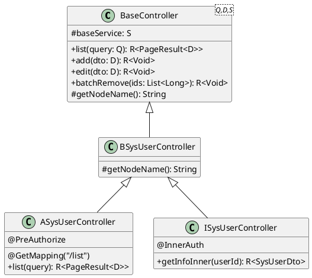

# AIB 架构完整实施指南

## 📖 文档说明

本文档是 han Cloud 项目 A/I/B 三层控制器架构的**生产就绪完整方案**，所有内容均为最终可用版本，无需额外升级或优化。

---

## 目录

- [1. 架构概述](#1-架构概述)
- [2. 三层架构设计](#2-三层架构设计)
- [3. 快速实施](#3-快速实施)
- [4. POJO 设计方案](#4-pojo-设计方案)
- [5. 安全防护体系](#5-安全防护体系)
- [6. 性能优化方案](#6-性能优化方案)
- [7. 分场景部署指南](#7-分场景部署指南)
- [8. 开发工具链](#8-开发工具链)
- [9. 快速参考](#9-快速参考)

---

## 1. 架构概述

### 1.1 核心思想

**"基类下沉通用逻辑，子类分层定义门面"**

通过 A（Admin）、I（Inner）、B（Base）三层结构的继承体系，实现权限控制、路由分配与业务逻辑的彻底解耦。

### 1.2 核心优势

| 优势 | 说明 |
|------|------|
| **代码零冗余** | 所有 CRUD 模板方法在 BaseController 中实现，子类只需一行 super 调用 |
| **安全隔离** | 内部接口(Inner)与外部接口(Admin)路由天然隔离，防止内网接口意外暴露 |
| **高度一致性** | 整个项目的返回结构、分页逻辑、异常处理完全统一 |
| **开发效率** | 新模块开发只需"定义领域对象 → 继承基类 → 声明权限"三步完成 |

### 1.3 适用场景

| 场景 | 适用性 | 说明 |
|------|--------|------|
| **标准 CRUD 模块** | ⭐⭐⭐⭐⭐ | 用户、角色、部门等标准管理模块 |
| **树形结构模块** | ⭐⭐⭐⭐⭐ | 继承 TreeController，支持树形CRUD |
| **复杂业务模块** | ⭐⭐⭐ | 需要多Service协同时，B层直接注入多个Service |
| **只读日志模块** | ⭐⭐⭐⭐ | 只暴露list和export方法 |

---

## 2. 三层架构设计

### 2.1 分层定义

| 层级 | 全称 | 作用域 | 核心职责 | 路由前缀 |
| :--- | :--- | :--- | :--- | :--- |
| **B** | **Base** | 业务基类 | 定义"能做什么"，持有 Service，实现通用 CRUD 逻辑 | 无 |
| **A** | **Admin** | 管理端 | 定义"谁能调"，处理 UI 请求、权限校验、审计日志 | `/admin` |
| **I** | **Inner** | 内部调用 | 面向微服务 RPC（HttpExchange），服务间通信，免UI权限 | `/inner` |

### 2.2 B 层 (Base Controller) - 业务基类

**职责**：承载模块的核心业务逻辑流转。

**特点**：
- 继承通用的 `BaseController` 或 `TreeController`
- 通过泛型绑定具体的 `Query`、`Dto` 和 `Service`
- **不标注** `@RestController`，不暴露接口
- **不进行** 权限校验和日志记录

**标准模板**：

```java
package com.han.system.controller.base;

import com.han.common.web.controller.BaseController;
import com.han.system.domain.query.SysUserQuery;
import com.han.system.domain.dto.SysUserDto;
import com.han.system.service.ISysUserService;

/**
 * 用户管理业务基类
 * 
 * <p><b>核心方法实现位置：</b>
 * <ul>
 *   <li>list/add/edit/delete → {@link com.han.common.web.controller.BaseController}
 *   <li>数据权限过滤 → {@link com.han.common.service.impl.BaseServiceImpl#selectListScope}
 *   <li>多租户注入 → {@link com.han.common.tenant.aspect.TenantLineInterceptor}
 * </ul>
 * 
 * @see BaseController 基础CRUD模板
 * @see ISysUserService 业务服务层
 * @author han Team
 */
public class BSysUserController extends BaseController<SysUserQuery, SysUserDto, ISysUserService> {
    
    @Override
    protected String getNodeName() {
        return "用户管理";
    }
}
```

### 2.3 A 层 (Admin Controller) - 管理端接口

**职责**：面向 UI 管理系统，处理 HTTP 请求。

**特点**：
- 继承 `B` 层
- 标注 `@RestController("唯一Bean名称")` 和 `@RequestMapping("/admin/xxx")`
- 标注管理端专属权限 `@AdminAuth`
- 在具体方法上添加 `@PreAuthorize` 和 `@Log`

**标准模板**：

```java
package com.han.system.controller.admin;

import com.han.common.core.domain.R;
import com.han.common.security.annotation.AdminAuth;
import com.han.common.log.annotation.OperLog;
import com.han.common.core.enums.BusinessType;
import com.han.system.controller.base.BSysUserController;
import org.springframework.security.access.prepost.PreAuthorize;
import org.springframework.web.bind.annotation.*;

import java.util.List;

/**
 * 用户管理 - 管理端接口
 * 
 * @author han Team
 */
@AdminAuth
@RestController("adminSysUserController")  // 必须指定唯一Bean名称
@RequestMapping("/admin/user")
public class ASysUserController extends BSysUserController {
    
    @Override
    @GetMapping("/list")
    @PreAuthorize("@ss.hasAuthority(@Auth.SYS_USER_LIST)")
    @OperLog(title = "用户管理", businessType = BusinessType.QUERY)
    public R<PageResult<SysUserDto>> list(SysUserQuery query) {
        return super.list(query);
    }
    
    @Override
    @PostMapping("/add")
    @PreAuthorize("@ss.hasAuthority(@Auth.SYS_USER_ADD)")
    @OperLog(title = "用户管理", businessType = BusinessType.INSERT)
    public R<Void> add(@RequestBody SysUserDto dto) {
        return super.add(dto);
    }
    
    @Override
    @PostMapping("/edit")
    @PreAuthorize("@ss.hasAuthority(@Auth.SYS_USER_EDIT)")
    @OperLog(title = "用户管理", businessType = BusinessType.UPDATE)
    public R<Void> edit(@RequestBody SysUserDto dto) {
        return super.edit(dto);
    }
    
    @Override
    @PostMapping("/remove")
    @PreAuthorize("@ss.hasAuthority(@Auth.SYS_USER_DELETE)")
    @OperLog(title = "用户管理", businessType = BusinessType.DELETE)
    public R<Void> batchRemove(@RequestBody List<Long> ids) {
        return super.batchRemove(ids);
    }
}
```

### 2.4 I 层 (Inner Controller) - 内部调用接口

**职责**：面向微服务内部 RPC 调用（HttpExchange）。

**特点**：
- 继承 `B` 层
- 标注 `@RequestMapping("/inner/xxx")`
- 标注内部认证注解 `@InnerAuth`
- 通常不记录业务审计日志，追求高性能

**标准模板**：

```java
package com.han.system.controller.inner;

import com.han.common.core.domain.R;
import com.han.common.security.annotation.InnerAuth;
import com.han.system.controller.base.BSysUserController;
import org.springframework.web.bind.annotation.*;

import java.util.List;

/**
 * 用户管理 - 内部调用接口
 * 
 * @author han Team
 */
@RestController("innerSysUserController")
@RequestMapping("/inner/user")
public class ISysUserController extends BSysUserController {
    
    /**
     * 根据 ID 查询用户信息（内部调用）
     */
    @GetMapping("/{id}")
    @InnerAuth
    public R<SysUserDto> getInfoInner(@PathVariable Long id) {
        return R.ok(baseService.selectById(id));
    }
    
    /**
     * 批量查询用户信息（内部调用）
     */
    @PostMapping("/batch")
    @InnerAuth
    public R<List<SysUserDto>> listByIds(@RequestBody List<Long> ids) {
        return R.ok(baseService.selectByIds(ids));
    }
}
```

---

## 3. 快速实施

### 3.1 新增业务模块完整流程

以**商品管理模块**为例，演示完整实施步骤：

#### 步骤 1：定义领域对象

```java
// 1. PO - 数据库实体
@Data
@TableName("product")
public class ProductPo extends BaseEntity {
    private Long id;
    private String name;
    private BigDecimal price;
    private Long categoryId;
}

// 2. DTO - 数据传输对象（扩展显示字段）
@Data
public class ProductDto {
    @JsonUnwrapped
    private ProductPo base;
    
    // 扩展字段
    private String categoryName;
    private Integer stock;
}

// 3. Query - 查询对象（扩展查询条件）
@Data
public class ProductQuery {
    @JsonUnwrapped
    private ProductPo base;
    
    // 查询专属字段
    private BigDecimal minPrice;
    private BigDecimal maxPrice;
    private Date beginTime;
    private Date endTime;
    
    // 提供便捷方法访问PO字段
    public String getName() { return base.getName(); }
    public void setName(String name) { base.setName(name); }
}
```

#### 步骤 2：编写服务层

```java
// Service 接口
public interface IProductService extends IBaseService<ProductQuery, ProductDto> {
}

// Service 实现
@Service
public class ProductServiceImpl extends BaseServiceImpl<ProductMapper, ProductPo, ProductQuery, ProductDto> 
    implements IProductService {
    // 基础 CRUD 已在 BaseServiceImpl 中实现
}
```

#### 步骤 3：创建 Controller 体系

```java
// 1. B 层
public class BProductController extends BaseController<ProductQuery, ProductDto, IProductService> {
    @Override
    protected String getNodeName() { return "商品管理"; }
}

// 2. A 层
@AdminAuth
@RestController("adminProductController")
@RequestMapping("/admin/product")
public class AProductController extends BProductController {
    
    @Override
    @GetMapping("/list")
    @PreAuthorize("@ss.hasAuthority(@Auth.PRODUCT_LIST)")
    @OperLog(title = "商品管理", businessType = BusinessType.QUERY)
    public R<PageResult<ProductDto>> list(ProductQuery query) {
        return super.list(query);
    }
    
    // ... 其他方法
}

// 3. I 层
@RestController("innerProductController")
@RequestMapping("/inner/product")
public class IProductController extends BProductController {
    
    @GetMapping("/{id}")
    @InnerAuth
    public R<ProductDto> getInfoInner(@PathVariable Long id) {
        return R.ok(baseService.selectById(id));
    }
}
```

---

## 4. POJO 设计方案

### 4.1 设计原则

**采用组合模式代替继承**，彻底隔离查询字段与持久化字段：

```java
// ❌ 不推荐：Query 继承 PO
public class SysUserQuery extends SysUserPo {
    private Date beginTime;
    // 继承了PO的所有字段，包括敏感字段
}

// ✅ 推荐：Query 组合 PO
public class SysUserQuery {
    @JsonUnwrapped
    private SysUserPo base;
    
    // 查询专属字段
    private Date beginTime;
    private Date endTime;
}
```

### 4.2 完整示例

```java
// 1. PO - 持久化对象
@Data
@TableName("sys_user")
public class SysUserPo extends BaseEntity {
    private Long id;
    private String userName;
    private String password;  // 敏感字段
    private String salt;      // 敏感字段
    private String email;
    private Long deptId;
}

// 2. DTO - 数据传输对象
@Data
public class SysUserDto {
    @JsonUnwrapped
    private SysUserPo base;
    
    // 扩展字段（关联数据）
    private String deptName;
    private List<String> roleNames;
    
    // 隐藏敏感字段
    @JsonIgnore
    public String getPassword() { return null; }
    
    @JsonIgnore
    public String getSalt() { return null; }
    
    // 提供便捷访问方法
    public Long getId() { return base.getId(); }
    public String getUserName() { return base.getUserName(); }
    public void setUserName(String userName) { base.setUserName(userName); }
}

// 3. Query - 查询对象
@Data
public class SysUserQuery {
    @JsonUnwrapped
    private SysUserPo base;
    
    // 查询专属字段
    private Date beginTime;
    private Date endTime;
    private List<Long> deptIds;  // 数据权限
    
    // 隐藏敏感字段
    @JsonIgnore
    @ApiModelProperty(hidden = true)
    public String getPassword() { return null; }
    
    @JsonIgnore
    @ApiModelProperty(hidden = true)
    public String getSalt() { return null; }
    
    // 提供便捷访问方法
    public String getUserName() { return base.getUserName(); }
    public void setUserName(String userName) { base.setUserName(userName); }
}
```

### 4.3 优势对比

| 维度 | 继承模式 | 组合模式（推荐） |
|------|---------|----------------|
| **敏感字段隔离** | ❌ 需要手动@JsonIgnore每个字段 | ✅ 精准控制暴露字段 |
| **职责清晰** | ❌ Query包含PO的持久化契约 | ✅ 查询与持久化彻底分离 |
| **扩展性** | ❌ 字段名冲突风险 | ✅ 无冲突风险 |
| **序列化** | ❌ 易出现字段映射混乱 | ✅ @JsonUnwrapped自动展开 |

---

## 5. 安全防护体系

### 5.1 启动时权限校验（自动生效）

**实现机制**：应用启动时自动扫描所有 Admin 控制器，检查是否缺少权限注解。

**核心组件**：
- `PermissionCheckPostProcessor` - 权限校验后置处理器
- `@PermissionExempt` - 权限豁免注解

**启动日志**：

```
✅ 权限校验通过！共检查 15 个 Admin 控制器，78 个方法
⚠️ [权限豁免] Controller: ASysUserController, Method: publicInfo, Reason: 公开接口，供前端未登录状态调用
```

**使用示例**：

```java
@AdminAuth
@RestController("adminSysUserController")
@RequestMapping("/admin/user")
public class ASysUserController extends BSysUserController {
    
    // ✅ 正确：有 @PreAuthorize
    @Override
    @GetMapping("/list")
    @PreAuthorize("@ss.hasAuthority(@Auth.SYS_USER_LIST)")
    public R<PageResult<SysUserDto>> list(SysUserQuery query) {
        return super.list(query);
    }
    
    // ✅ 正确：使用 @PermissionExempt 豁免
    @GetMapping("/public/info")
    @PermissionExempt("公开接口，供前端未登录状态调用")
    public R<SysUserDto> publicInfo() {
        return R.ok(baseService.getPublicInfo());
    }
    
    // ❌ 错误：缺少权限注解 - 应用启动时会报错并阻止启动
    // @Override
    // @GetMapping("/list")
    // public R<PageResult<SysUserDto>> list(SysUserQuery query) {
    //     return super.list(query);
    // }
}
```

### 5.2 Bean 命名规范（强制）

**规则**：所有 A 层和 I 层控制器必须指定唯一的 Bean 名称。

```java
// ✅ 正确
@RestController("adminSysUserController")
public class ASysUserController { }

@RestController("innerSysUserController")
public class ISysUserController { }

// ❌ 错误：会导致 Bean 名称冲突
@RestController  // 缺少名称
public class ASysUserController { }
```

### 5.3 请求上下文管理

**实现**：使用 `TransmittableThreadLocal` 支持异步场景。

```java
@Data
public class RequestContext {
    private Long tenantId;
    private Long userId;
    private String userName;
    private Set<String> permissions;
    private DataScopeType dataScopeType;
    private Set<Long> deptIds;  // 数据权限：可见部门
    
    private static final TransmittableThreadLocal<RequestContext> CONTEXT = 
        new TransmittableThreadLocal<>();
    
    public static RequestContext get() {
        return CONTEXT.get();
    }
    
    public static void set(RequestContext context) {
        CONTEXT.set(context);
    }
    
    public static void clear() {
        CONTEXT.remove();
    }
}
```

---

## 6. 性能优化方案

### 6.1 事件驱动解耦

**场景**：跨模块操作解耦，避免Service层循环依赖。

```java
// 在 BaseController 发布事件
public abstract class BaseController<Q, D, S> {
    
    private final ApplicationEventPublisher eventPublisher;
    
    public R<Void> batchRemove(List<Long> ids) {
        int result = baseService.deleteByIds(ids);
        
        // 发布删除事件
        eventPublisher.publishEvent(
            new EntityDeletedEvent<>(this, ids, getDClass())
        );
        
        return toAjax(result);
    }
}

// 其他模块监听事件
@Component
@RequiredArgsConstructor
public class UserDeleteListener {
    
    private final ISysRoleService roleService;
    
    @EventListener
    @Async  // 支持异步处理
    public void onUserDeleted(EntityDeletedEvent<SysUserDto> event) {
        // 自动清理该用户的权限数据
        roleService.deleteUserRoleByUserIds(event.getIds());
    }
}
```

### 6.2 指标监控

**实现**：在 BaseController 中自动埋点。

```java
public abstract class BaseController<Q, D, S> {
    
    private final MeterRegistry meterRegistry;
    
    public R<PageResult<D>> list(Q query) {
        Timer.Sample sample = Timer.start(meterRegistry);
        String moduleName = getNodeName();
        
        try {
            startPage();
            List<D> result = baseService.selectListScope(query);
            
            // 记录成功指标
            meterRegistry.counter("controller.request.success",
                "module", moduleName,
                "method", "list"
            ).increment();
            
            return getDataTable(result);
            
        } catch (Exception e) {
            // 记录失败指标
            meterRegistry.counter("controller.request.error",
                "module", moduleName,
                "method", "list",
                "exception", e.getClass().getSimpleName()
            ).increment();
            throw e;
            
        } finally {
            // 记录耗时
            sample.stop(Timer.builder("controller.request.duration")
                .tag("module", moduleName)
                .tag("method", "list")
                .register(meterRegistry));
        }
    }
}
```

---

## 7. 分场景部署指南

### 7.1 小型部署（个人开发/演示）

**硬件要求**：2核4GB

**中间件组合**：
- PostgreSQL 18.1
- Redis 7
- Nacos 3.1

**启用模块**：
```
✅ Gateway
✅ Auth
✅ System
✅ Job (JobFlow)
❌ Tenant (可选)
❌ Workflow (可选)
❌ RabbitMQ (不需要)
```

**配置优化**：

```yaml
# application-small.yml
spring:
  datasource:
    hikari:
      maximum-pool-size: 5  # 减少连接池
  
  redis:
    lettuce:
      pool:
        max-active: 5
  
  jobflow:
    thread-pool-size: 5  # 减少线程数
```

**启动命令**：

```bash
docker-compose -f docker-compose-small.yml up -d
```

### 7.2 中型部署（团队开发/测试环境）

**硬件要求**：4核8GB

**中间件组合**：
- PostgreSQL 18.1
- Redis 7
- Nacos 3.1
- RabbitMQ 3.x

**启用模块**：
```
✅ Gateway
✅ Auth
✅ System
✅ Tenant
✅ Workflow
✅ Job
✅ Open
✅ Gen
✅ File
```

**配置优化**：

```yaml
# application-medium.yml
spring:
  datasource:
    hikari:
      maximum-pool-size: 10
  
  redis:
    lettuce:
      pool:
        max-active: 10
  
  jobflow:
    thread-pool-size: 10
    cluster-mode: true
  
  rabbitmq:
    host: localhost
    port: 5672
```

**启动命令**：

```bash
docker-compose up -d
```

### 7.3 大型部署（生产环境）

**硬件要求**：8核16GB+

**中间件组合**：
- PostgreSQL 18.1（主从）
- Redis 7（集群）
- Nacos 3.1（集群）
- RabbitMQ 3.x（集群）
- Kafka 3.x
- Elasticsearch 8.x

**部署方式**：Kubernetes

**配置优化**：

```yaml
# application-large.yml
spring:
  datasource:
    hikari:
      maximum-pool-size: 20
      minimum-idle: 10
  
  redis:
    cluster:
      nodes:
        - redis-node-1:6379
        - redis-node-2:6379
        - redis-node-3:6379
  
  jobflow:
    thread-pool-size: 20
    cluster-mode: true
  
  kafka:
    bootstrap-servers: kafka-1:9092,kafka-2:9092,kafka-3:9092
```

**K8s部署**：

```bash
kubectl apply -f k8s/namespace.yaml
kubectl apply -f k8s/configmap.yaml
kubectl apply -f k8s/deployment.yaml
kubectl apply -f k8s/service.yaml
kubectl apply -f k8s/ingress.yaml
```

---

## 8. 开发工具链

### 8.1 IDEA 必装插件

| 插件名称 | 用途 |
|---------|------|
| **Lombok** | 简化 POJO 代码 |
| **MapStruct Support** | MapStruct 语法支持和导航 |
| **Maven Helper** | Maven 依赖分析和冲突解决 |
| **Alibaba Java Coding Guidelines** | 阿里巴巴代码规范检查 |
| **RestfulTool** | 快速查找 Controller 接口 |
| **MyBatisX** | MyBatis XML 和 Mapper 互跳 |

### 8.2 架构可视化

**PlantUML 继承关系图**：



### 8.3 代码生成器

**使用方式**：

```bash
# 1. 访问代码生成器
http://localhost:8080/admin/gen

# 2. 选择表，点击生成
# 3. 自动生成 A/I/B 三层结构 + Service + Mapper
```

**生成内容**：
- ✅ PO / DTO / Query
- ✅ Mapper.java + Mapper.xml
- ✅ Service 接口 + 实现
- ✅ B / A / I 三层 Controller
- ✅ 权限常量
- ✅ 单元测试

---

## 9. 快速参考

### 9.1 分层对比表

| 分类 | B 层 | A 层 | I 层 |
|------|------|------|------|
| **命名** | BSysUserController | ASysUserController | ISysUserController |
| **@RestController** | ❌ 禁止 | ✅ 必须 | ✅ 必须 |
| **Bean 名称** | 无需 | adminSysUserController | innerSysUserController |
| **路由前缀** | 无 | /admin/user | /inner/user |
| **权限注解** | 无 | @AdminAuth + @PreAuthorize | @InnerAuth |
| **日志记录** | 无 | @OperLog | 无 |
| **调用者** | 子类 | 前端 UI | 其他微服务 |
| **返回类型** | R<T> | R<T> | R<T> |

### 9.2 常见错误速查

| 错误现象 | 原因 | 解决方案 |
|----------|------|----------|
| **Bean 创建失败** | ASysUserController 和 ISysUserController Bean 名冲突 | 添加 @RestController("adminXxx") 指定名称 |
| **接口全公开** | A 层方法缺少 @PreAuthorize | 应用启动时会自动检查并报错 |
| **Swagger 暴露敏感字段** | Query 组合PO时未隐藏 | 在 Query 中用 @JsonIgnore 隐藏 |
| **找不到代码实现** | 方法在 BaseController 中 | Ctrl+点击向上跳转，查看 B 层 JavaDoc |
| **内部调用报错** | I 层缺少 @InnerAuth | 添加 @InnerAuth 注解 |

### 9.3 核心类位置

| 类名 | 路径 | 职责 |
|------|------|------|
| **BaseController** | han-common-web | 通用 CRUD 模板基类 |
| **TreeController** | han-common-web | 树形结构专用基类 |
| **BaseServiceImpl** | han-common-mybatis | Service 层通用实现 |
| **TenantLineInterceptor** | han-common-tenant | 多租户数据隔离拦截器 |
| **RequestContext** | han-common-security | 请求上下文管理 |
| **PermissionCheckPostProcessor** | han-common-security | 权限校验后置处理器 |

### 9.4 学习路径

**新手入门（2-3天）**：
1. 阅读第 1-2 章，理解 A/I/B 核心概念
2. 阅读第 3 章，跟随快速实施指南练习
3. 实战：创建一个完整模块

**进阶开发（1周）**：
4. 深入阅读第 4 章 POJO 设计方案
5. 学习第 5 章安全防护体系
6. 配置第 6 章性能优化方案

**架构师（长期）**：
7. 根据业务场景选择第 7 章部署方案
8. 使用第 8 章工具链提升效率
9. 建立架构守护体系

---

**© han Cloud Team - AIB 架构生产实施指南**
