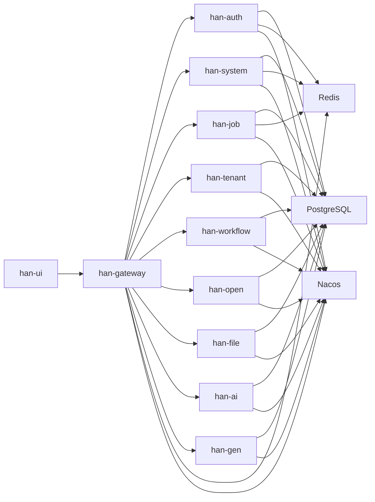

# 产品与架构总览

本手册吸收并收口了归档区中的以下关键材料：

- `docs/archive/2026/分析/AIB架构完整实施指南.md`
- `docs/archive/2026/分析/项目对接文档.md`
- `docs/archive/2026/分析/capability-matrix.md`
- `docs/archive/2026/分析/从零到最终效果.md`

正式口径以本手册为准，归档文档只作为历史来源与专项补充。

## 1. 产品定位

han Cloud 是一个按 `small / medium / full` 三档组织的企业级微服务平台，覆盖：

- 核心后台
- 多租户
- 工作流
- 开放平台与单点登录
- 文件与对象存储
- 代码生成
- AI 增强能力

平台当前采用前后端分离架构：

- 前端：`han-ui`
- 网关：`han-gateway`
- 认证：`han-auth`
- 核心系统：`han-system`
- 增量业务：`tenant / workflow / open / file`
- 完整能力：`ai / gen`

## 2. 三档能力矩阵

### 2.1 三档概览

| 档位 | 核心模块 | 入口端口 | 说明 |
| --- | --- | --- | --- |
| `small` | gateway、auth、system、job | UI `3100`，gateway `19090` | 核心后台、通知、任务调度、监控 |
| `medium` | `small` + tenant、workflow、open、file | UI `3200`，gateway `29090` | 多租户、工作流、开放平台、OSS |
| `full` | `medium` + ai、gen | UI `3000`，gateway `9090` | AI 与代码生成完整能力 |

### 2.2 模块矩阵

| 模块 | small | medium | full |
| --- | --- | --- | --- |
| gateway | 是 | 是 | 是 |
| auth | 是 | 是 | 是 |
| system | 是 | 是 | 是 |
| job | 是 | 是 | 是 |
| tenant | 否 | 是 | 是 |
| workflow | 否 | 是 | 是 |
| open | 否 | 是 | 是 |
| file | 否 | 是 | 是 |
| ai | 否 | 否 | 是 |
| gen | 否 | 否 | 是 |

说明：

- `medium` 继承 `small`
- `full` 继承 `medium`
- 前端菜单和页面展示必须以 `/system/runtime/capabilities` 的结果为准

## 3. 当前能力口径

- `small`
  - 登录
  - 系统管理
  - 日志监控
  - 通知中心
  - 任务调度
  - JobFlow 监控
- `medium`
  - 在 `small` 基础上增加租户、工作流、开放平台、OSS
- `full`
  - 在 `medium` 基础上增加代码生成与 AI

## 4. A/I/B 分层架构口径

本节吸收了 `AIB架构完整实施指南` 的核心内容，但只保留与当前仓库一致、可执行的正式口径。

### 4.1 当前正式定义

| 层级 | 含义 | 职责 | 当前口径 |
| --- | --- | --- | --- |
| `B` | Base Controller | 下沉通用业务流转，不直接暴露接口 | 不标 `@RestController` |
| `A` | Admin Controller | 面向管理端 UI，请求鉴权、权限控制、操作留痕 | `@AdminAuth` + `@PreAuthorize` |
| `I` | Inner Controller | 面向服务间调用的内部接口 | `@InnerAuth` |

### 4.2 当前仓库落地情况

- `han-system` 已落地 `controller/base`、`controller/admin`、`controller/inner`
- 其他模块仍有历史控制器写法，不要求为了文档统一强行重写现有全部路由
- 新增模块或大改模块时，优先采用 A/I/B 结构

### 4.3 新模块必须遵守的规则

- `B` 层不直接暴露 HTTP 接口
- `A` 层公开方法必须显式声明权限控制
- `I` 层公开方法必须显式声明内部鉴权
- `A` / `I` 层控制器应使用唯一 Bean 名称，避免同名冲突
- 新模块应优先通过继承或下沉方式复用通用 CRUD 流程，不得把通用逻辑散回多个控制器

### 4.4 路由口径

归档 AIB 文档中的 `/admin/*`、`/inner/*` 是理想分层示意，不等于当前仓库所有模块都必须改成该前缀。

当前正式要求是：

- 兼容现有已发布路径，不为“文档整齐”强改线上接口
- 管理端控制器保持当前业务前缀，例如 `/system/user`、`/open/app`
- 内部接口保持 `/inner/*` 风格，供 `@HttpExchange` 客户端调用

## 5. 开放平台与对接能力

本节吸收了 `项目对接文档.md` 的主要内容，并按当前仓库实现修正为正式口径。

### 5.1 当前支持的对接能力

- OAuth2 授权码模式
- OAuth2 授权码 + PKCE
- Client Credentials
- SSO 单点登录
- OpenID Connect 用户信息查询

### 5.2 当前兼容端点

| 能力 | 正式端点 | 兼容端点 |
| --- | --- | --- |
| OAuth2 | `/oauth2/*` | `/open/oauth2/*` |
| SSO | `/sso/*` | `/open/sso/*` |
| 开放平台应用管理 | `/open/app/*` | 无 |

### 5.3 当前实现说明

- `han-open` 同时兼容 `/oauth2` 与 `/open/oauth2`
- `han-open` 同时兼容 `/sso` 与 `/open/sso`
- 管理台上的应用创建、编辑、启停、重置密钥统一由 `/open/app/*` 提供
- 对外接入文档和第三方调用示例必须同时说明“正式路径”和“兼容路径”

## 6. 系统拓扑

## 7. 模块职责

### 7.1 核心模块

- `han-gateway`：统一网关与外部入口
- `han-auth`：认证、登录、验证码、鉴权
- `han-system`：系统管理、运行时能力、通知、监控
- `han-job`：任务调度与 JobFlow 监控

### 7.2 增量模块

- `han-tenant`：多租户能力
- `han-workflow`：流程定义、实例、待办、已办
- `han-open`：开放平台与 OAuth2 / SSO
- `han-file`：文件与 OSS
- `han-ai`：模型、知识库、Prompt、MCP、应用、对话
- `han-gen`：代码生成

## 8. 运行时能力接口

运行时能力接口：`/system/runtime/capabilities`

用途：

- 让前端根据后端真实能力降级展示
- 让测试与部署确认当前 tier
- 让页面守卫判断功能是否应展示

必查字段：

- `tier`
- `enabledModules`
- `optionalServices`

验证要求：

- `small` 必须返回 `tier=small`
- `medium` 必须返回 `tier=medium`
- `full` 必须返回 `tier=full`

## 9. AI 边界

- `AI Graph`：未开发
- `Embed Chat`：未开发
- `pdf/docx` 自动解析：部分开发，当前仅支持上传，不自动解析

## 10. 总结

Han 当前的正式架构认知口径是：

- 三档能力以 `small / medium / full` 为主视图
- 当前真实实现与历史设计稿并存时，以“仓库当前实现 + 本手册”作为正式口径
- A/I/B 是当前架构演进方向，也是新模块优先采用的控制器模式
- 开放平台对接必须写清兼容路径，不能只沿用历史单一路径说明
