# 产品与架构总览

## 1. 产品定位

han Cloud 是一个按 `small / medium / full` 三档组织的企业级微服务平台，覆盖核心后台、多租户、工作流、开放平台、文件服务、代码生成和 AI 增强能力。

## 2. 三档能力矩阵

### 2.1 三档概览

| 档位 | 核心模块 | 入口端口 | 说明 |
| --- | --- | --- | --- |
| `small` | gateway、auth、system、job | UI `3100`，gateway `19090` | 核心后台、通知、任务调度、监控 |
| `medium` | `small` + tenant、workflow、open、file | UI `3200`，gateway `29090` | 多租户、工作流、开放平台、OSS |
| `full` | `medium` + ai、gen | UI `3000`，gateway `9090` | AI 与代码生成完整能力 |

### 2.2 模块矩阵

| 模块 | small | medium | full |
| --- | --- | --- | --- |
| gateway | 是 | 是 | 是 |
| auth | 是 | 是 | 是 |
| system | 是 | 是 | 是 |
| job | 是 | 是 | 是 |
| tenant | 否 | 是 | 是 |
| workflow | 否 | 是 | 是 |
| open | 否 | 是 | 是 |
| file | 否 | 是 | 是 |
| ai | 否 | 否 | 是 |
| gen | 否 | 否 | 是 |

说明：

- `medium` 继承 `small`
- `full` 继承 `medium`
- 前端页面、菜单和登录页必须以 `/system/runtime/capabilities` 的结果为准

## 3. 当前能力口径

- `small`：登录、系统管理、日志监控、通知中心、任务调度、JobFlow
- `medium`：在 `small` 基础上增加租户、工作流、开放平台、OSS
- `full`：在 `medium` 基础上增加代码生成与 AI

## 4. AI 边界

- `AI Graph`：未开发
- `Embed Chat`：未开发
- `pdf/docx` 自动解析：部分开发，当前仅支持上传，不自动解析

## 5. 系统拓扑

```mermaid
flowchart LR
  UI["han-ui"] --> GW["han-gateway"]
  GW --> AUTH["han-auth"]
  GW --> SYS["han-system"]
  GW --> JOB["han-job"]
  GW --> TENANT["han-tenant"]
  GW --> WF["han-workflow"]
  GW --> OPEN["han-open"]
  GW --> FILE["han-file"]
  GW --> AI["han-ai"]
  GW --> GEN["han-gen"]
  AUTH --> PG["PostgreSQL"]
  SYS --> PG
  JOB --> PG
  TENANT --> PG
  WF --> PG
  OPEN --> PG
  FILE --> PG
  AI --> PG
  GEN --> PG
  GW --> REDIS["Redis"]
  AUTH --> REDIS
  SYS --> REDIS
  JOB --> REDIS
  GW --> NACOS["Nacos"]
  AUTH --> NACOS
  SYS --> NACOS
  JOB --> NACOS
  TENANT --> NACOS
  WF --> NACOS
  OPEN --> NACOS
  FILE --> NACOS
  AI --> NACOS
  GEN --> NACOS
```

## 6. 模块职责

### 6.1 核心模块

- `han-gateway`：统一网关与外部入口
- `han-auth`：认证、登录、验证码、鉴权
- `han-system`：系统管理、运行时能力、通知、监控
- `han-job`：任务调度与 JobFlow 监控

### 6.2 增量模块

- `han-tenant`：多租户能力
- `han-workflow`：流程定义、实例、待办、已办
- `han-open`：开放平台与 OAuth2 / SSO
- `han-file`：文件与 OSS
- `han-ai`：模型、知识库、Prompt、MCP、应用、对话
- `han-gen`：代码生成

## 7. 运行时能力接口

运行时能力接口：`/system/runtime/capabilities`

用途：

- 让前端根据后端真实能力降级展示
- 让测试与部署确认当前 tier
- 让页面守卫判断功能是否应展示

必查字段：

- `tier`
- `enabledModules`
- `optionalServices`

验证要求：

- `small` 必须返回 `tier=small`
- `medium` 必须返回 `tier=medium`
- `full` 必须返回 `tier=full`

## 8. 总结

Han 的正式认知口径是：

- `small`：核心后台
- `medium`：标准业务联调
- `full`：完整能力与 AI 联调

任何新功能、新文档、新部署说明都必须先落回这一套三档口径，再进入正式入口。
