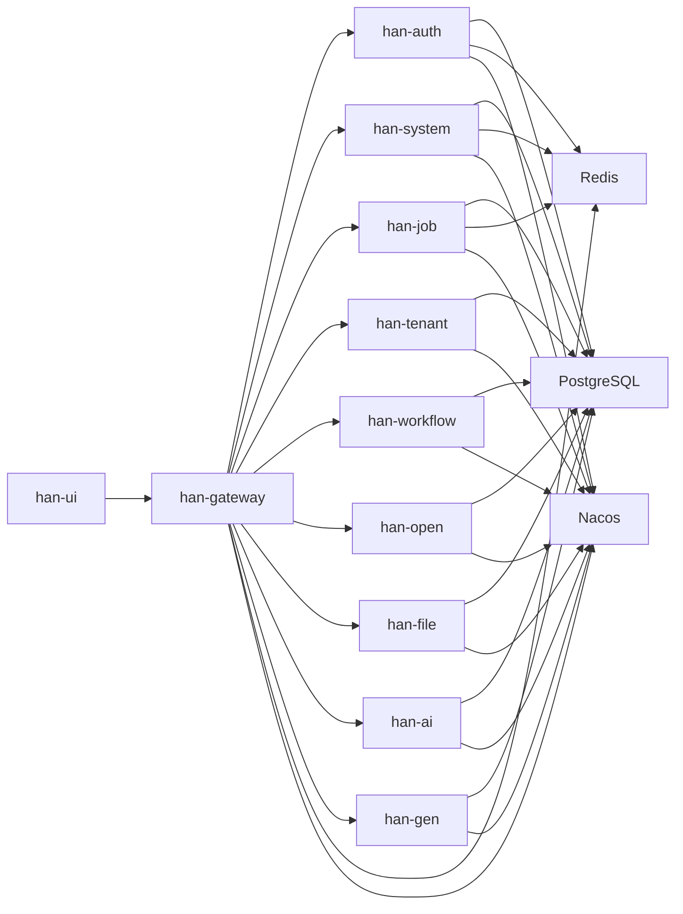

# 系统拓扑

## 拓扑总览

```mermaid
flowchart LR
  UI["han-ui"] --> GW["han-gateway"]
  GW --> AUTH["han-auth"]
  GW --> SYS["han-system"]
  GW --> JOB["han-job"]
  GW --> TENANT["han-tenant"]
  GW --> WF["han-workflow"]
  GW --> OPEN["han-open"]
  GW --> FILE["han-file"]
  GW --> AI["han-ai"]
  GW --> GEN["han-gen"]
  AUTH --> PG["PostgreSQL"]
  SYS --> PG
  JOB --> PG
  TENANT --> PG
  WF --> PG
  OPEN --> PG
  FILE --> PG
  AI --> PG
  GEN --> PG
  GW --> REDIS["Redis"]
  AUTH --> REDIS
  SYS --> REDIS
  JOB --> REDIS
  GW --> NACOS["Nacos"]
  AUTH --> NACOS
  SYS --> NACOS
  JOB --> NACOS
  TENANT --> NACOS
  WF --> NACOS
  OPEN --> NACOS
  FILE --> NACOS
  AI --> NACOS
  GEN --> NACOS
```

## 运行原则

- 网关统一对外
- 运行时能力由 `system` 提供 `/system/runtime/capabilities`
- Nacos 负责注册与配置
- PostgreSQL 是主数据库
- Redis 负责缓存与分布式协作
