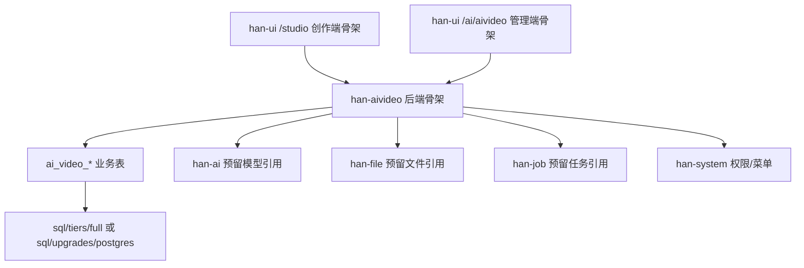

# Han MVP 0 开发方案确认稿

版本：v0.1  
状态：待 BOSS 确认后进入 Han 代码实现  
更新时间：2026-05-21  
代码仓库：`D:\code\Han`  
规划资产目录：`D:\code\AIVideo`  
当前阶段：开发前方案确认，不直接写代码

## 1. 本阶段目标

MVP 0 只做 Han 底座接入和页面/接口/SQL 骨架，不接真实火山生成闭环。

目标：
- 在 `D:\code\Han` 新增短剧业务模块 `han-aivideo`。
- 在 `han-ui` 新增客户创作端 `/studio` 页面骨架。
- 在 Han 管理端 AI 菜单下新增 `/ai/aivideo/tasks`、`/ai/aivideo/tasks/:taskId`、`/ai/aivideo/settings` 页面骨架。
- 按 Han 规则准备 AIVideo 第一版数据库表 SQL。
- 建立最小后端接口骨架，保证后续 MVP 1 能接项目、原文、流程状态。
- 不直接调用火山 API，不写完整 API Key，不实现真实图片/视频生成。

## 2. 已确认输入

| 项 | 结论 |
| --- | --- |
| 第一版开发仓库 | `D:\code\Han` |
| 规划资产沉淀 | `D:\code\AIVideo` |
| 前端工程 | `han-ui` |
| 创作端入口 | `/studio`，默认项目列表，不做营销首页 |
| 工作台布局 | 左流程、中结果、右参数 |
| 人物/场景/分镜 | 第一版合并在工作台，不拆详情页 |
| 管理端第一版 | 任务监管、任务详情、基础配置 |
| 视频第一版 | 单镜头/选中镜头，不做整剧批量生成 |
| 联调环境 | Han 95 环境 |
| 本阶段性质 | 开发方案确认，确认后才写 Han 代码 |

## 3. Han 规则约束

必须遵守：
- 后端：Java 21、Spring Boot、Spring Cloud、Maven。
- 前端：Vue 3、TypeScript、Vite。
- 数据库：PostgreSQL。
- 服务治理和配置：Nacos。
- JSON：Jackson，禁止新增 Gson、Fastjson、Fastjson2。
- 跨模块调用：优先 `@HttpExchange`，禁止新增 Feign。
- 转换层：MapStruct 或 Converter 收口。
- 控制器：遵守 A/I/B 分层，B 层不暴露 REST，A 层显式权限，I 层显式内部鉴权。
- SQL：只进入 `sql/tiers/{small,medium,full}` 或 `sql/upgrades/postgres/`。
- 密钥：完整 API Key、数据库密码、Redis 密码不进入 Git。
- 前端：不直接调用火山 API，不保存或展示完整 API Key。

## 4. 推荐分支方案

推荐从 `master` 新建短期开发分支：

```text
feature/aivideo-mvp0
```

原则：
- `master` 仍是 Han 唯一长期分支。
- MVP 0 完成并验证后合并回 `master`。
- 合并后删除临时分支。
- 95 发布仍只能从 `master` 产出。

回滚：
- 未合并前：删除或重置临时分支。
- 合并后未发布：通过 revert 对应提交回滚。
- 已发布：先关闭菜单/路由入口，再回滚代码和 SQL。

## 5. MVP 0 总体结构



## 6. 预计改动范围

### 6.1 Han 后端

| 范围 | 预计路径 | 改动 |
| --- | --- | --- |
| Maven 模块 | `D:\code\Han\han-modules\pom.xml` | 增加 `han-aivideo` 模块引用 |
| 新业务模块 | `D:\code\Han\han-modules\han-aivideo` | 新增模块目录、POM、启动类、基础包结构 |
| 控制器 | `han-aivideo\src\main\java\com\han\aivideo\controller` | 新增 `admin`、`base`，预留 `inner` |
| 领域对象 | `han-aivideo\src\main\java\com\han\aivideo\domain` | 新增 PO、DTO、Query、VO 骨架 |
| 转换器 | `han-aivideo\src\main\java\com\han\aivideo\converter` | 新增 Converter 或 MapStruct 骨架 |
| Mapper | `han-aivideo\src\main\java\com\han\aivideo\mapper` | 新增 Mapper 骨架 |
| Service | `han-aivideo\src\main\java\com\han\aivideo\service` | 新增项目、文档、任务、配置 Service 骨架 |
| 枚举 | `han-aivideo\src\main\java\com\han\aivideo\enums` | 新增阶段、状态、任务类型枚举 |

MVP 0 后端只做骨架和最小接口，不做真实 AI 生成。

### 6.2 Han 前端

| 范围 | 预计路径 | 改动 |
| --- | --- | --- |
| 路由 | `D:\code\Han\han-ui\src\router\index.ts` | 增加 `/studio` 和 `/ai/aivideo/*` 路由 |
| 创作端视图 | `D:\code\Han\han-ui\src\views\studio` | 新增项目列表、新建项目、工作台骨架 |
| 管理端视图 | `D:\code\Han\han-ui\src\views\ai\aivideo` | 新增任务监管、任务详情、基础配置骨架 |
| API 封装 | `D:\code\Han\han-ui\src\api\aivideo` | 新增创作端和管理端 API 方法骨架 |
| 类型定义 | `D:\code\Han\han-ui\src\types` 或视图内类型 | 新增最小 TS 类型 |

前端原则：
- `/studio` 使用轻量独立创作端布局或在现有布局中隐藏后台菜单。
- 第一版页面要可访问、可回显空状态、可显示“待接入”状态。
- 不调用火山，不写死模型能力。
- 不提交 `dist`、`node_modules` 或 Playwright 输出。

### 6.3 SQL

| 范围 | 预计路径 | 改动 |
| --- | --- | --- |
| 初始化 SQL | `D:\code\Han\sql\tiers\full\full-init.sql` | 新增 `ai_video_*` 表结构，或确认采用升级脚本 |
| 升级 SQL | `D:\code\Han\sql\upgrades\postgres\` | 已部署环境优先新增升级脚本 |
| SQL 说明 | `D:\code\Han\sql\README.md` | 说明 AIVideo 表落位和 tier 范围 |

建议：
- 第一版只进 `full` tier。
- 如果 BOSS 要保护已部署环境，优先新增 `sql/upgrades/postgres/20260521_aivideo_mvp0.sql`，再评估是否同步 full 初始化。
- `small`、`medium` 第一版不放 AIVideo 表。

### 6.4 Han 文档

| 范围 | 预计路径 | 改动 |
| --- | --- | --- |
| AI 短剧手册 | `D:\code\Han\docs\08-AI短剧开发手册.md` | MVP 0 实现后补实现结果和验证 |
| 文档索引 | `D:\code\Han\docs\index.md` | 如手册结构变动则同步 |
| 测试记录 | `D:\code\Han\docs\04-测试与验收手册.md` 或 08 手册 | 如发生验证结果，补记录 |

## 7. MVP 0 后端最小接口

建议 MVP 0 只提供空数据或最小可用数据接口，保证前端骨架能联动。

创作端：

```text
GET  /aivideo/studio/project/list
GET  /aivideo/studio/project/{projectId}
POST /aivideo/studio/project
POST /aivideo/studio/project/edit
POST /aivideo/studio/document/save
```

管理端：

```text
GET  /aivideo/admin/task/list
GET  /aivideo/admin/task/{taskId}
GET  /aivideo/admin/setting
POST /aivideo/admin/setting/edit
```

接口前缀待最终确认：
- 方案 A：`/aivideo/*`，短剧业务独立，避免和 `han-ai` 混淆。
- 方案 B：`/ai/aivideo/*`，和前端菜单路径一致。

推荐：后端用 `/aivideo/*`，前端路由用 `/ai/aivideo/*` 管理端页面路径。这样能区分“业务接口”和“页面菜单”。

## 8. MVP 0 前端页面

### 8.1 创作端

| 页面 | 路由 | MVP 0 内容 |
| --- | --- | --- |
| 创作端首页 | `/studio` | 重定向 `/studio/projects` |
| 项目列表 | `/studio/projects` | 列表、筛选、新建按钮、空状态 |
| 新建项目 | `/studio/projects/create` | 基础表单、原文输入占位、保存草稿 |
| 创作工作台 | `/studio/projects/:id/workbench` | 三栏布局、流程状态、占位内容 |

### 8.2 管理端

| 页面 | 路由 | MVP 0 内容 |
| --- | --- | --- |
| 任务监管 | `/ai/aivideo/tasks` | 任务表格、筛选、详情入口 |
| 任务详情 | `/ai/aivideo/tasks/:taskId` | 输入、输出、参数、错误占位 |
| 基础配置 | `/ai/aivideo/settings` | 默认模型、比例、候选数、预览模式配置表单 |

## 9. SQL 表落地范围

MVP 0 建议先落以下 10 张表的结构：

| 表 | MVP 0 用途 |
| --- | --- |
| `ai_video_project` | 项目列表和项目详情 |
| `ai_video_source_document` | 原文保存 |
| `ai_video_content_version` | 润色/剧本/提取结果版本预留 |
| `ai_video_character` | 人物资产预留 |
| `ai_video_scene` | 场景资产预留 |
| `ai_video_shot` | 分镜资产预留 |
| `ai_video_media_asset` | 图片/视频资产预留 |
| `ai_video_generation_task` | 文本/图片/视频生成任务记录 |
| `ai_video_review_record` | 每一步人工确认记录 |
| `ai_video_project_setting` | 项目级配置快照 |

MVP 0 不落完整 Prompt 初始数据，默认 Prompt 模板可在 MVP 1 前单独确认。

## 10. Han 反哺判断

| 项 | 是否反哺 Han | 目标模块 | MVP 0 处理 |
| --- | --- | --- | --- |
| `han-aivideo` 模块 | 否 | 短剧专用 | 新建业务模块 |
| `/studio` 创作端布局 | 待确认 | `han-ui` | 先短剧内使用 |
| 任务详情页面模式 | 可反哺 | `han-ui` | 先短剧内使用 |
| 候选图选择组件 | 可反哺 | `han-ui` | MVP 2 再抽 |
| 火山模型客户端 | 是 | `han-ai` | MVP 1/2/3 分阶段做 |
| 视频任务轮询 | 是 | `han-job` | MVP 3 再确认 |
| 媒体预览 | 是 | `han-file` / `han-ui` | MVP 2/3 再确认 |

MVP 0 原则：
- 先搭短剧业务骨架。
- 通用能力只记录反哺候选，不静默抽公共组件。
- 不把短剧私有 Prompt、客户原文或业务策略放进 Han 通用模块。

## 11. 执行顺序建议

1. 确认本方案。
2. 在 `D:\code\Han` 从 `master` 新建 `feature/aivideo-mvp0`。
3. 检查工作区现有未提交改动，避免覆盖 BOSS 变更。
4. 新增 `han-aivideo` 空模块并接入 Maven。
5. 新增后端包结构、启动类、基础 Controller/Service/Mapper/Domain 骨架。
6. 新增或准备 SQL 表结构。
7. 新增前端 `/studio` 路由和页面骨架。
8. 新增管理端 `/ai/aivideo/tasks`、详情、settings 页面骨架。
9. 补 API 封装和最小接口联调。
10. 执行后端编译、前端构建、页面访问验证。
11. 更新 Han 08 手册、AIVideo 进度表和验证记录。

## 12. 验证计划

### 12.1 后端

建议命令：

```powershell
mvn -gs settings.workspace.xml -DskipTests compile
```

最低通过标准：
- `han-modules` 能识别 `han-aivideo` 模块。
- 受影响模块编译通过。
- 不新增禁止依赖。
- A/I/B 包结构符合规则。

### 12.2 前端

建议命令：

```powershell
cd han-ui
pnpm build
```

最低通过标准：
- 路由构建通过。
- `/studio/projects`、`/studio/projects/create`、`/studio/projects/:id/workbench` 有页面骨架。
- `/ai/aivideo/tasks`、`/ai/aivideo/tasks/:taskId`、`/ai/aivideo/settings` 有页面骨架。
- 页面不出现明显 TypeScript 或构建错误。

### 12.3 SQL

检查项：
- SQL 放在 Han 正式入口。
- 表名统一 `ai_video_`。
- 包含 `tenant_id`、创建/更新字段、软删除字段。
- 不写密钥、不写测试账号。

### 12.4 权限和页面边界

检查项：
- 普通用户入口是 `/studio`。
- 普通用户不暴露 Han 后台管理菜单。
- 管理端页面需要对应权限码。
- API Key 不返回前端。

## 13. 风险

| 风险 | 影响 | 处理 |
| --- | --- | --- |
| 本机 Java/Maven 环境未修复 | 后端编译可能失败 | 优先记录失败证据；必要时用 95 或修本机环境 |
| Han 现有路由是静态路由 | `/studio` 独立布局需小心接入 | 先做最小路由，不改登录主流程 |
| SQL 初始化和升级路径选择不当 | 影响部署或已部署环境 | 先确认使用 full-init、upgrade 还是两者都维护 |
| 新模块依赖选择过多 | 增加编译和部署风险 | MVP 0 只用最小依赖 |
| 管理端权限码未预置 | 菜单可见或接口访问不一致 | MVP 0 标注权限码，SQL 是否预置需确认 |
| 任务详情字段过早绑定火山结果 | 后续模型返回变化导致返工 | MVP 0 只做通用任务字段和 JSON 参数快照 |

## 14. 回滚方案

未合并前：
- 删除 `feature/aivideo-mvp0` 或撤销该分支改动。

已合并但未发布：
- revert MVP 0 对应提交。
- 移除 `han-modules/pom.xml` 中的 `han-aivideo` 模块引用。
- 移除 `/studio` 和 `/ai/aivideo/*` 路由。
- 回滚 SQL 变更或删除升级脚本。

已发布：
- 先通过菜单/权限隐藏 `/studio` 和 `/ai/aivideo/*`。
- 停用 `han-aivideo` 服务或从部署配置移除。
- 回滚数据库新增表前先确认是否已有业务数据；有数据时先备份再处理。

## 15. 本方案仍需 BOSS 最终确认

请确认以下 7 点后，才进入 Han 代码实现：

1. 是否按 `feature/aivideo-mvp0` 新建短期开发分支。
2. 是否允许新增 `han-modules/han-aivideo` 模块。
3. 后端接口前缀是否采用 `/aivideo/*`。
4. SQL 是否第一版只进入 `full` tier，并同步准备 upgrade 脚本。
5. 管理端权限码是否使用 `ai:aivideo:*`。
6. MVP 0 是否只做骨架和最小接口，不接真实火山 API。
7. 是否允许我下一步进入 `D:\code\Han` 执行 MVP 0 代码实现。
