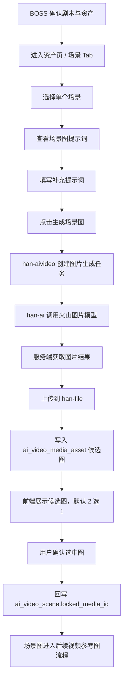
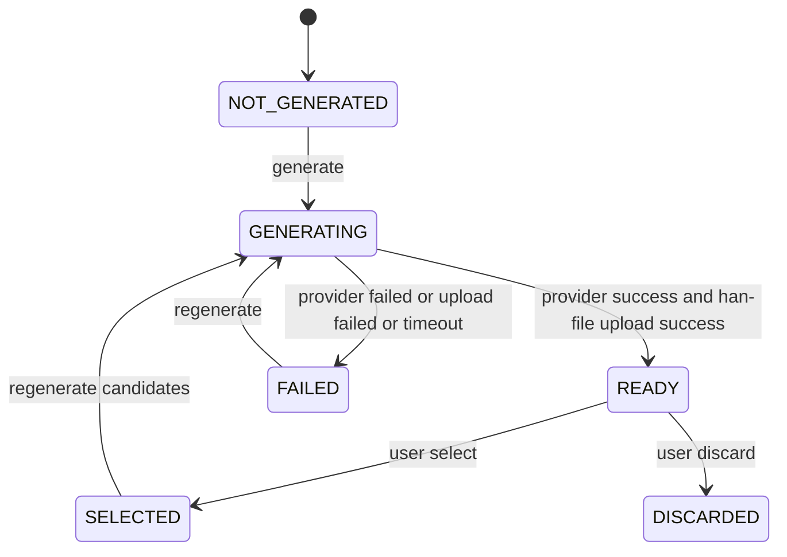

# MVP2 场景图生成设计确认稿

版本：v0.2
状态：BOSS 已确认设计口径；开发方案待确认
更新时间：2026-05-26
适用底座：`D:\code\Han`
当前阶段：设计已确认，正在进入开发方案拆解；未进入代码开发

## 1. 本轮任务分流

| 项 | 结论 |
| --- | --- |
| 任务类型 | 明确需求后的设计确认与开发方案拆解 |
| 当前角色 | 规划角色 |
| 是否写代码 | 否 |
| 是否改 SQL | 否 |
| 是否发布部署 | 否 |
| 是否需要 BOSS 再确认 | 是，开发方案确认后才进入 MVP2 实现 |

## 2. BOSS 已确认口径

| 决策项 | 结论 |
| --- | --- |
| MVP2 第一段范围 | 只做单场景生成候选图并从候选图里选 1 张 |
| 场景图主体 | 默认强制纯场景、无人，不允许出现人物 |
| 图片候选数 | 第一版限制 1 到 4，默认 2 |
| 图片模型配置 | 继续通过 Han 的 AI 模型配置页录入，`model_type = IMAGE` |
| 文本和图片是否同 Key | 可以复用同一个火山方舟 API Key，但必须在图片模型连通测试里确认权限没有限制到单一文本模型或接入点 |
| 场景图 Prompt 模板落位 | 采用长期可发展的独立字段方案：新增 `scene_image_prompt_template_id` 到 `ai_video_project_setting` |
| 图片结果归档 | 必须上传到 `han-file`，第一版不做“只保存火山 URL 快照”的兜底 |
| 开发节奏 | 先出 MVP2 场景图生成开发方案确认稿，确认后再写代码 |

## 3. 目标

MVP2 第一段只做“场景图生成闭环”：让已经提取并确认的场景资产，可以基于场景 Prompt 调用火山图片模型生成候选图，用户从候选图里选择一张作为该场景的锁定场景图。

交付目标：
- 在 `/studio/projects/:id/workbench` 的“资产 > 场景”里增加场景图生成入口。
- 每个场景支持查看本次场景图提示词、补充提示词、生成候选图、选择确认、重新生成。
- 默认候选数使用项目参数 `imageCandidateCount`，默认 2 张，允许 1 到 4 张。
- 场景图默认纯场景、无人，优先服务后续图生视频参考图。
- 生成结果必须上传到 `han-file`，再写入 `ai_video_media_asset`。
- 选中结果回写 `ai_video_scene.locked_media_id`。

## 4. 非目标

本轮暂不做：
- 不做角色图生成。
- 不做分镜关键帧生成。
- 不做整剧批量出图。
- 不做视频生成。
- 不做人物一致性训练或角色 LoRA。
- 不做前端直连火山 API。
- 不把完整 API Key 写入 Git、文档、前端或普通日志。

## 5. 设计依据

已确认业务依据：
- BOSS 已确认“文字资产生成没有问题，下一步进入场景图生成”。
- 当前 MVP1 已完成原文、润色、剧本、人物 / 场景 / 分镜提取与确认。
- 当前场景资产已有 `sceneName`、`atmosphere`、`visualFeatures`、`negativeElements`、`promptText`、`lockedMediaId` 等字段。
- 当前项目设置已有 `imageModelId`、`imageCandidateCount`、`defaultRatio`、`defaultResolution`。

火山官方能力依据：
- 火山方舟文档包含图片生成 API、图片生成流式响应、Seedream 提示词指南、Seedream 助力 Seedance 图生视频最佳实践。
- 火山方舟推理接口使用 API Key 鉴权，API Key 权限可按模型或接入点控制；因此文本成功不代表图片必然成功，图片模型必须单独做连通测试。
- 火山图片能力以 Seedream 系列为主要候选；图片结果可作为后续 Seedance / 视频生成参考图。
- 由于模型、地域、接入点和返回结构会随控制台配置变化，具体请求字段以开发时真实模型连通测试为准。

参考链接：
- `https://www.volcengine.com/docs/82379/1263279`
- `https://www.volcengine.com/docs/82379/1541523?lang=zh`
- `https://www.volcengine.com/docs/82379/1824137?lang=zh`
- `https://www.volcengine.com/docs/82379/1829186?lang=zh`
- `https://www.volcengine.com/docs/82379/1951250?lang=zh`
- `https://www.volcengine.com/docs/82379/1520757?lang=zh`

## 6. 总体流程



## 7. 页面设计

### 7.1 场景表格增强

在现有“资产 > 场景”表格中增加：

| 区域 | 新增内容 |
| --- | --- |
| 场景列 | 场景名、氛围、视觉特征继续保留 |
| 场景图列 | 显示已选场景图缩略图；没有则显示“未生成” |
| 状态列 | 场景确认状态 + 图片状态，如 `未生成`、`生成中`、`待选择`、`已选定`、`失败` |
| 操作列 | `提示词`、`生成图`、`候选图`、`确认场景` |

交互要求：
- 未确认的场景允许预览提示词，但生成图按钮建议禁用或二次提示。
- 已选图后再次点击生成图，应提示“会新增候选，不覆盖已选图”。
- 同一场景生成中时，该场景的生成按钮禁用，防止重复任务。
- 不同场景可并行生成；第一版也可以限制为前端单任务，降低并发风险。

### 7.2 候选图区

候选图建议使用抽屉或弹窗：

| 模块 | 内容 |
| --- | --- |
| 左侧 | 场景摘要：场景名、氛围、视觉特征、禁用元素 |
| 中间 | 候选图网格，默认 2 张，最多 4 张 |
| 右侧 | 本次 Prompt、参数、模型、分辨率、生成时间、错误信息 |

按钮：
- `选择此图`
- `重新生成`
- `废弃`
- `查看原图`

### 7.3 参数面板增强

右侧参数面板保持三栏工作台结构，不新增独立页面。新增或放开：
- 图片模型：展示当前项目 `imageModelId` 对应模型名。
- 图片候选数：默认 2，第一版允许 1 到 4。
- 画幅：沿用项目画幅，默认 `9:16`。
- 清晰度：沿用 `defaultResolution`，当前默认 `720p`。
- 补充提示词：继续复用当前 `customPrompt` 交互，本次生成写入任务快照。

## 8. Prompt 设计

### 8.1 Prompt 来源

本次场景图 Prompt 由四段合成：

1. 固定系统约束：电影级纯净场景、无人、无角色、无人影、无多余主体。
2. 场景资产字段：`sceneName`、`timeDesc`、`weather`、`atmosphere`、`visualFeatures`、`colorTone`、`props`、`negativeElements`、`promptText`。
3. 项目参数：画幅、清晰度、目标平台、默认风格。
4. 用户补充提示词：仅影响本次生成，不污染默认模板。

### 8.2 默认模板落位

新增一条 `ai_prompt_template`：

| 字段 | 建议 |
| --- | --- |
| `template_name` | `AI短剧场景图生成` |
| `category` | `aivideo_image` |
| `built_in` | `1` |
| `status` | `0` |
| 变量 | `projectName`、`targetPlatform`、`ratio`、`resolution`、`style`、`sceneName`、`timeDesc`、`weather`、`atmosphere`、`visualFeatures`、`colorTone`、`props`、`negativeElements`、`scenePromptText` |

BOSS 已确认采用方案 A：

| 方案 | 说明 | 结论 |
| --- | --- | --- |
| A | 新增 `scene_image_prompt_template_id` 到 `ai_video_project_setting` | 采用，结构清晰，适合长期扩展 |
| B | 模板 ID 临时放入 `params_json` | 不采用，仅作为历史备选 |

## 9. 后端接口草案

沿用当前 `/aivideo/studio/*` 风格。

### 9.1 场景图提示词预览

```text
POST /aivideo/studio/media/scene/prompt-preview
```

Body：
- `projectId`
- `sceneId`
- `customPrompt`

返回：
- `systemPrompt`
- `userPrompt`
- `effectivePrompt`
- `modelId`
- `modelName`
- `ratio`
- `resolution`

### 9.2 生成场景图

```text
POST /aivideo/studio/media/scene/generate/stream
```

Body：
- `projectId`
- `sceneId`
- `candidateCount`
- `customPrompt`
- `modelId`
- `ratio`
- `resolution`

设计：
- 后端创建 `ai_video_generation_task`，`taskType = SCENE_IMAGE`，`bizType = SCENE`，`bizId = sceneId`。
- 如果火山图片接口支持流式输出，则透传为 SSE。
- 如果火山图片接口同步返回，则后端转换为 SSE 的 `meta -> candidate -> upload -> done` 事件，避免前端普通 POST 超时。
- 如果火山图片接口异步任务明显耗时，则 SSE 先返回任务状态，后端轮询或后续交给 `han-job`。
- 图片生成成功但上传 `han-file` 失败时，本次候选图不能进入 `READY`。

### 9.3 查询候选图

```text
GET /aivideo/studio/media/list
```

Query：
- `projectId`
- `assetType=SCENE_IMAGE`
- `bizType=SCENE`
- `bizId=sceneId`

返回：
- `mediaId`
- `fileId`
- `fileUrl`
- `thumbnailUrl`
- `candidateNo`
- `selected`
- `assetStatus`
- `promptText`
- `paramsJson`
- `taskId`
- `createTime`

### 9.4 选择候选图

```text
POST /aivideo/studio/media/select
```

Body：
- `projectId`
- `mediaId`
- `bizType=SCENE`
- `bizId=sceneId`
- `comment`

处理：
- 校验媒体资产属于当前项目、当前场景、当前用户可访问。
- 同一 `SCENE + sceneId + SCENE_IMAGE` 下其他候选 `selected = '0'`。
- 当前媒体 `selected = '1'`，`assetStatus = SELECTED`。
- 回写 `ai_video_scene.locked_media_id = mediaId`。
- 写入 `ai_video_review_record`。

### 9.5 废弃候选图

```text
POST /aivideo/studio/media/discard
```

Body：
- `projectId`
- `mediaId`
- `comment`

第一版可暂缓；如果不做废弃，前端只展示候选与选中。

## 10. 数据落位

### 10.1 复用现有表

优先复用已存在的 `ai_video_media_asset`，不新增候选表。

| 字段 | 场景图写法 |
| --- | --- |
| `asset_type` | `SCENE_IMAGE` |
| `biz_type` | `SCENE` |
| `biz_id` | `scene_id` |
| `file_id` | 必须关联 `sys_file.id`；上传失败时不进入 `READY` |
| `file_url` | `han-file` 返回的访问 URL 快照 |
| `prompt_text` | 本次实际 Prompt |
| `negative_prompt` | 本次负面 Prompt |
| `model_id` | 图片模型 ID |
| `task_id` | 生成任务 ID |
| `params_json` | `ratio`、`resolution`、`seed`、`candidateCount`、`provider`、`endpoint` 等 |
| `candidate_no` | 默认 1、2，支持 1 到 4 |
| `selected` | 是否选中 |
| `asset_status` | `GENERATING`、`READY`、`SELECTED`、`FAILED`、`DISCARDED` |

### 10.2 需要补的代码对象

后续实现时需要新增或补齐：
- `AiVideoMediaAssetPo`
- `AiVideoMediaAssetMapper`
- `AivideoMediaService`
- `AivideoSceneImageGenerateDto`
- `AivideoMediaSelectDto`
- `AivideoMediaAssetVo`

### 10.3 SQL 影响

第一版确认需要：
- 不新增媒体候选表。
- 复用 `ai_video_media_asset`。
- `ai_model.model_type` 直接存 `IMAGE`，当前字段无约束。
- 新增 `ai_video_project_setting.scene_image_prompt_template_id`。
- 新增默认 Prompt 模板，写入 `sql/tiers/full/full-init.sql` 和 `sql/upgrades/postgres/*`。
- 图片候选数默认值改为 2；新建项目默认 2，已有项目是否批量改为 2 在开发方案里单独列出确认点。

## 11. 模块边界

| 模块 | 职责 |
| --- | --- |
| `han-ui` | 场景表格、提示词预览、SSE 生成、候选图选择、错误展示 |
| `han-aivideo` | 场景图业务编排、任务创建、Prompt 合成、媒体资产落库、确认记录 |
| `han-ai` | 火山图片模型客户端、模型配置、凭据解析、供应商错误脱敏 |
| `han-file` | 图片归档、文件 URL、缩略图能力；MVP2 必须走归档，不做 URL-only 兜底 |
| `han-job` | 本轮暂不强依赖；如果火山图片任务异步耗时明显，再接任务轮询 |

反哺 Han：
- `han-ai` 的图片模型客户端是通用能力，可反哺 Han。
- `han-file` 服务端归档外部生成文件的能力可沉淀为通用工具。
- `han-ui` 的候选图选择器可沉淀为通用组件。
- 短剧场景图业务规则不反哺为 Han 通用规则。

## 12. 状态流转



说明：
- `SELECTED` 后重新生成只新增候选，不清空已选图。
- 只有用户点击“选择此图”才回写 `locked_media_id`。
- 页面刷新后必须能根据 `locked_media_id` 找回已选图。

## 13. 防重复与并发

必须继续保留当前修过的防重逻辑：
- 同一按钮点击后立即进入 loading。
- 同一场景生成中，禁用该场景生成按钮。
- 同一候选图选择中，禁用该候选图按钮。
- 后端对同一 `projectId + sceneId + taskType=SCENE_IMAGE + RUNNING` 做幂等检查。
- 不同场景的确认 / 选择请求不能被误判为重复提交。

## 14. 验收清单

### 14.1 本地验证

- `han-aivideo` Maven 编译通过。
- `han-ai` Maven 编译通过。
- `han-ui pnpm build` 通过。
- SQL 结构检查通过。
- 图片模型 `model_type = IMAGE` 真实连通测试通过，并明确 Key 来源、模型标识、Base URL、权限状态。
- Prompt 预览接口返回 200，且包含场景名、纯场景、无人、画幅、补充提示词。
- 场景图生成 SSE 返回 `meta`、候选图、`upload`、`done`。
- 生成图片成功上传到 `han-file`。
- 候选图写入 `ai_video_media_asset`。
- 选择候选图后，`ai_video_scene.locked_media_id` 被回写。
- 重复点击同一场景生成按钮不会创建多个并发任务。
- 不同场景选择候选图不会被误判重复提交。

### 14.2 双机验证

- GitHub Actions 打出 `han-ai`、`han-aivideo`、`han-ui` 镜像。
- `tengx2` 容器 healthy。
- 公网 `/studio/projects/:id/workbench` 访问 200。
- 使用 BOSS 页面测试：对一个场景生成默认 2 张候选图，选择 1 张，刷新后仍显示已选图。
- API Key、模型配置和错误日志均不泄露完整密钥。

## 15. 风险与回滚

| 风险 | 影响 | 应对 |
| --- | --- | --- |
| 文本和图片使用同一 Key 但权限受限 | 文本可用，图片调用失败 | 图片模型必须单独连通测试；失败时提示检查 Key 权限、模型权限和接入点权限 |
| 火山图片模型参数与当前文档不一致 | 开发时字段适配变化 | 先做最小连通测试，再固化 DTO |
| 图片返回临时 URL 过期 | 页面后续看不到图 | 服务端必须下载并上传到 `han-file`，上传失败则生成失败 |
| 图片生成耗时导致超时 | 页面体验差 | 后端统一 SSE，必要时转异步任务 |
| 场景图出现人物 | 不符合纯场景要求 | Prompt 强约束 + 失败后允许重生；后续可接审核 |
| 成本不可控 | 误点多次消费 | 前端禁用重复点击，后端运行中任务幂等，候选数限制 1 到 4 |
| 媒体资产表字段不够 | 后续扩展受限 | 第一版用 `params_json` 承接供应商扩展字段 |

回滚方式：
- 前端隐藏场景图生成入口。
- 后端保留接口但禁用图片模型调用配置。
- 停用 `AI短剧场景图生成` Prompt 模板。
- 已落库但未选中的 `ai_video_media_asset` 可忽略或标记 `DISCARDED`，不影响已确认文字资产。
- 新增 SQL 字段为扩展字段，回滚时可不删除字段，只清空模板引用。

## 16. 开发方案待确认项

1. 是否允许按本设计新增 `scene_image_prompt_template_id` 字段与升级 SQL。
2. 是否允许新建项目默认图片候选数改为 2；已有项目是否也批量改为 2。
3. 图片模型连通测试时，是否由 BOSS 先在 Han AI 模型页新增 `model_type = IMAGE` 的火山模型配置。
4. 是否允许开发方案确认后进入代码实现。
