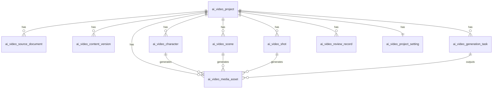

# AI 短剧数据库表设计

版本：v0.1  
状态：待 BOSS 评审  
更新时间：2026-05-21  
适用底座：`D:\code\Han`  
当前阶段：数据库表设计草案，不进入 SQL 实现

## 1. 设计依据

本设计基于：
- `D:\code\AIVideo\docs\设计规划\Han模块边界设计.md`
- `D:\code\AIVideo\docs\设计规划\AI短剧页面设计规划.md`
- `D:\code\Han\docs\02-开发手册.md`
- `D:\code\Han\docs\06-牛马协作总规则.md`
- `D:\code\Han\sql\tiers\full\full-init.sql`
- `D:\code\Han\han-modules\han-ai\domain\po` 下现有 AI 表实体

Han 约束：
- PostgreSQL 为正式主库。
- SQL 初始化只进入 `sql/tiers/{small,medium,full}`。
- 升级脚本进入 `sql/upgrades/postgres/`。
- 第一版 AIVideo 依赖 AI 能力，建议只进入 `full` tier。
- 业务表必须考虑 `tenant_id`、创建人、更新时间、软删除和索引。
- 完整密钥、完整令牌、客户敏感信息不进入普通业务表。

## 2. 命名策略

建议 AIVideo 表统一使用 `ai_video_` 前缀。

原因：
- 与 Han 现有 `ai_model`、`ai_prompt_template`、`ai_token_usage` 保持 AI 领域前缀一致。
- 比 `aivideo_` 更符合 Han 当前 SQL 命名风格。
- 能清晰区分通用 AI 表和短剧业务表。

## 3. 表总览

| 表名 | 归属模块 | 用途 |
| --- | --- | --- |
| `ai_video_project` | `han-aivideo` | 短剧项目主表 |
| `ai_video_source_document` | `han-aivideo` | 原始文档与解析结果 |
| `ai_video_content_version` | `han-aivideo` | 润色稿、剧本、结构化提取等文本版本 |
| `ai_video_character` | `han-aivideo` | 人物资产 |
| `ai_video_scene` | `han-aivideo` | 场景资产 |
| `ai_video_shot` | `han-aivideo` | 分镜资产 |
| `ai_video_media_asset` | `han-aivideo` | 图片、关键帧、视频、成片业务资产 |
| `ai_video_generation_task` | `han-aivideo` | 生成任务业务记录 |
| `ai_video_review_record` | `han-aivideo` | 人工确认、返修、锁定记录 |
| `ai_video_project_setting` | `han-aivideo` | 项目级生成参数快照 |

复用表：
- `ai_model`：模型配置。
- `ai_prompt_template`：Prompt 模板。
- `ai_token_usage`：通用 Token 用量统计。
- `sys_file`：文件存储记录。
- `sys_user`：用户。
- `sys_tenant`：租户。
- `sys_config`：系统参数配置。

## 4. 通用字段约定

除关联表或日志表外，AIVideo 业务表建议包含：

| 字段 | 类型 | 说明 |
| --- | --- | --- |
| `tenant_id` | BIGINT | 租户 ID |
| `create_by` | VARCHAR(64) | 创建人 |
| `create_time` | TIMESTAMP | 创建时间，默认 `CURRENT_TIMESTAMP` |
| `update_by` | VARCHAR(64) | 更新人 |
| `update_time` | TIMESTAMP | 更新时间，默认 `CURRENT_TIMESTAMP` |
| `del_flag` | INT | 软删除，默认 0 |
| `remark` | VARCHAR(500) | 备注，非所有表必须 |

状态字段建议：
- 流程状态使用 `VARCHAR(32)`，因为短剧流程状态比 `CHAR(1)` 更可读。
- 启停状态可继续使用 Han 常见 `CHAR(1)` 或 `SMALLINT`。
- 前端展示状态统一由 VO 转换，数据库不保存中文。

## 5. 表结构草案

### 5.1 `ai_video_project`

用途：短剧项目主表。

| 字段 | 类型 | 说明 |
| --- | --- | --- |
| `project_id` | BIGSERIAL PK | 项目 ID |
| `tenant_id` | BIGINT | 租户 ID |
| `project_name` | VARCHAR(200) | 项目名称 |
| `owner_user_id` | BIGINT | 项目创建人/所有者 |
| `topic_type` | VARCHAR(50) | 题材类型 |
| `target_platform` | VARCHAR(50) | 目标平台 |
| `default_ratio` | VARCHAR(20) | 默认画幅，默认 `9:16` |
| `default_style` | VARCHAR(100) | 默认风格 |
| `default_shot_duration` | INT | 默认镜头秒数，默认 5 |
| `candidate_image_count` | INT | 默认候选图数量，默认 3 |
| `preview_mode` | CHAR(1) | 是否低成本预览，默认 `1` |
| `current_stage` | VARCHAR(32) | 当前阶段 |
| `project_status` | VARCHAR(32) | 项目状态 |
| `budget_limit` | NUMERIC(12,4) | 项目预算上限 |
| `estimated_cost` | NUMERIC(12,4) | 预计成本 |
| `actual_cost` | NUMERIC(12,4) | 实际成本 |
| `summary` | TEXT | 项目简介 |
| `create_by` | VARCHAR(64) | 创建人 |
| `create_time` | TIMESTAMP | 创建时间 |
| `update_by` | VARCHAR(64) | 更新人 |
| `update_time` | TIMESTAMP | 更新时间 |
| `del_flag` | INT | 软删除 |
| `remark` | VARCHAR(500) | 备注 |

建议索引：
- `idx_ai_video_project_tenant`
- `idx_ai_video_project_owner`
- `idx_ai_video_project_status`
- `idx_ai_video_project_update_time`

### 5.2 `ai_video_source_document`

用途：保存上传原文、粘贴文本和解析结果。

| 字段 | 类型 | 说明 |
| --- | --- | --- |
| `document_id` | BIGSERIAL PK | 文档 ID |
| `project_id` | BIGINT | 项目 ID |
| `tenant_id` | BIGINT | 租户 ID |
| `source_type` | VARCHAR(20) | `TEXT`、`TXT`、`MARKDOWN` |
| `file_id` | BIGINT | 关联 `sys_file.id`，粘贴文本可为空 |
| `file_name` | VARCHAR(200) | 原始文件名 |
| `raw_text` | TEXT | 原文文本，超长时可改为文件引用 |
| `parsed_text` | TEXT | 解析后的正文 |
| `chapter_json` | TEXT | 章节结构 JSON |
| `char_count` | BIGINT | 字符数 |
| `parse_status` | VARCHAR(32) | 解析状态 |
| `parse_error` | TEXT | 解析失败原因 |
| `confirmed` | CHAR(1) | 解析结果是否已确认 |
| `create_by` | VARCHAR(64) | 创建人 |
| `create_time` | TIMESTAMP | 创建时间 |
| `update_by` | VARCHAR(64) | 更新人 |
| `update_time` | TIMESTAMP | 更新时间 |
| `del_flag` | INT | 软删除 |

建议索引：
- `idx_ai_video_doc_project`
- `idx_ai_video_doc_tenant`

### 5.3 `ai_video_content_version`

用途：统一保存 AI 生成的文本版本，包括润色稿、剧本、人物提取结果、场景提取结果、分镜提取结果。

| 字段 | 类型 | 说明 |
| --- | --- | --- |
| `version_id` | BIGSERIAL PK | 版本 ID |
| `project_id` | BIGINT | 项目 ID |
| `tenant_id` | BIGINT | 租户 ID |
| `document_id` | BIGINT | 来源文档 ID |
| `content_type` | VARCHAR(32) | `POLISH`、`SCRIPT`、`EXTRACT_CHARACTER`、`EXTRACT_SCENE`、`EXTRACT_SHOT` |
| `version_no` | INT | 版本号 |
| `title` | VARCHAR(200) | 标题 |
| `content_text` | TEXT | Markdown 或正文 |
| `content_json` | TEXT | 结构化 JSON |
| `prompt_template_id` | BIGINT | 关联 `ai_prompt_template.template_id` |
| `custom_prompt` | TEXT | 本次补充提示词 |
| `model_id` | BIGINT | 关联 `ai_model.model_id` |
| `task_id` | BIGINT | 关联生成任务 |
| `selected` | CHAR(1) | 是否选中 |
| `confirm_status` | VARCHAR(32) | 确认状态 |
| `create_by` | VARCHAR(64) | 创建人 |
| `create_time` | TIMESTAMP | 创建时间 |
| `update_by` | VARCHAR(64) | 更新人 |
| `update_time` | TIMESTAMP | 更新时间 |
| `del_flag` | INT | 软删除 |

建议索引：
- `idx_ai_video_content_project_type`
- `idx_ai_video_content_task`
- `idx_ai_video_content_selected`

说明：
- 用统一版本表可以避免为润色稿、剧本、提取结果分别建过多文本表。
- 已确认版本通过 `selected = '1'` 和 `confirm_status = 'APPROVED'` 标记。

### 5.4 `ai_video_character`

用途：人物资产。

| 字段 | 类型 | 说明 |
| --- | --- | --- |
| `character_id` | BIGSERIAL PK | 人物 ID |
| `project_id` | BIGINT | 项目 ID |
| `tenant_id` | BIGINT | 租户 ID |
| `character_name` | VARCHAR(100) | 角色名 |
| `gender` | VARCHAR(20) | 性别 |
| `age_desc` | VARCHAR(50) | 年龄描述 |
| `identity_desc` | VARCHAR(200) | 身份 |
| `personality_tags` | VARCHAR(500) | 性格标签 |
| `story_role` | VARCHAR(100) | 故事功能 |
| `relationship_desc` | TEXT | 人物关系 |
| `appearance` | TEXT | 外貌 |
| `hair_style` | VARCHAR(200) | 发型 |
| `costume` | TEXT | 服装 |
| `color_style` | VARCHAR(200) | 颜色体系 |
| `negative_traits` | TEXT | 禁止漂移特征 |
| `prompt_text` | TEXT | 角色图提示词 |
| `completeness` | VARCHAR(32) | 信息完整度 |
| `missing_fields` | TEXT | 待补字段 JSON |
| `locked_media_id` | BIGINT | 锁定角色主图，关联媒体资产 |
| `confirm_status` | VARCHAR(32) | 确认状态 |
| `sort_order` | INT | 排序 |
| `create_by` | VARCHAR(64) | 创建人 |
| `create_time` | TIMESTAMP | 创建时间 |
| `update_by` | VARCHAR(64) | 更新人 |
| `update_time` | TIMESTAMP | 更新时间 |
| `del_flag` | INT | 软删除 |

建议索引：
- `idx_ai_video_character_project`
- `idx_ai_video_character_locked_media`

### 5.5 `ai_video_scene`

用途：场景资产。

| 字段 | 类型 | 说明 |
| --- | --- | --- |
| `scene_id` | BIGSERIAL PK | 场景 ID |
| `project_id` | BIGINT | 项目 ID |
| `tenant_id` | BIGINT | 租户 ID |
| `scene_name` | VARCHAR(200) | 场景名称 |
| `scene_type` | VARCHAR(100) | 场景类型 |
| `episode_no` | INT | 所属集数，可为空 |
| `time_desc` | VARCHAR(100) | 时间 |
| `weather` | VARCHAR(100) | 天气 |
| `atmosphere` | VARCHAR(200) | 氛围 |
| `visual_features` | TEXT | 视觉特征 |
| `color_tone` | VARCHAR(200) | 色调 |
| `props` | TEXT | 道具 |
| `negative_elements` | TEXT | 禁止出现元素 |
| `prompt_text` | TEXT | 场景图提示词 |
| `completeness` | VARCHAR(32) | 信息完整度 |
| `missing_fields` | TEXT | 待补字段 JSON |
| `locked_media_id` | BIGINT | 锁定场景主图，关联媒体资产 |
| `confirm_status` | VARCHAR(32) | 确认状态 |
| `sort_order` | INT | 排序 |
| `create_by` | VARCHAR(64) | 创建人 |
| `create_time` | TIMESTAMP | 创建时间 |
| `update_by` | VARCHAR(64) | 更新人 |
| `update_time` | TIMESTAMP | 更新时间 |
| `del_flag` | INT | 软删除 |

建议索引：
- `idx_ai_video_scene_project`
- `idx_ai_video_scene_locked_media`

### 5.6 `ai_video_shot`

用途：分镜资产。

| 字段 | 类型 | 说明 |
| --- | --- | --- |
| `shot_id` | BIGSERIAL PK | 分镜 ID |
| `project_id` | BIGINT | 项目 ID |
| `tenant_id` | BIGINT | 租户 ID |
| `episode_no` | INT | 集数 |
| `shot_no` | INT | 镜头序号 |
| `duration_sec` | INT | 镜头时长 |
| `scene_id` | BIGINT | 场景 ID |
| `character_ids` | TEXT | 角色 ID JSON 数组 |
| `shot_type` | VARCHAR(100) | 景别 |
| `camera_position` | VARCHAR(100) | 机位 |
| `camera_movement` | VARCHAR(100) | 运镜 |
| `action_desc` | TEXT | 动作 |
| `dialogue` | TEXT | 台词 |
| `voice_over` | TEXT | 画外音 |
| `emotion` | VARCHAR(200) | 情绪 |
| `prompt_text` | TEXT | 视频生成提示词 |
| `reference_media_ids` | TEXT | 参考图 JSON 数组 |
| `keyframe_media_id` | BIGINT | 关键帧 |
| `video_media_id` | BIGINT | 已选视频 |
| `confirm_status` | VARCHAR(32) | 确认状态 |
| `generation_status` | VARCHAR(32) | 视频生成状态 |
| `sort_order` | INT | 排序 |
| `create_by` | VARCHAR(64) | 创建人 |
| `create_time` | TIMESTAMP | 创建时间 |
| `update_by` | VARCHAR(64) | 更新人 |
| `update_time` | TIMESTAMP | 更新时间 |
| `del_flag` | INT | 软删除 |

建议索引：
- `idx_ai_video_shot_project_episode`
- `idx_ai_video_shot_scene`
- `idx_ai_video_shot_status`

### 5.7 `ai_video_media_asset`

用途：图片、关键帧、视频、成片的业务资产表。文件本体仍由 `sys_file` 管理。

| 字段 | 类型 | 说明 |
| --- | --- | --- |
| `media_id` | BIGSERIAL PK | 媒体资产 ID |
| `project_id` | BIGINT | 项目 ID |
| `tenant_id` | BIGINT | 租户 ID |
| `asset_type` | VARCHAR(32) | `CHARACTER_IMAGE`、`SCENE_IMAGE`、`SHOT_KEYFRAME`、`SHOT_VIDEO`、`FINAL_VIDEO` |
| `biz_type` | VARCHAR(32) | 业务对象类型：`CHARACTER`、`SCENE`、`SHOT`、`PROJECT` |
| `biz_id` | BIGINT | 业务对象 ID |
| `file_id` | BIGINT | 关联 `sys_file.id` |
| `file_url` | VARCHAR(1000) | 快照 URL，便于展示 |
| `thumbnail_file_id` | BIGINT | 缩略图文件 ID |
| `prompt_text` | TEXT | 生成提示词 |
| `negative_prompt` | TEXT | 负面提示词 |
| `model_id` | BIGINT | 使用模型 |
| `task_id` | BIGINT | 生成任务 |
| `params_json` | TEXT | 生成参数 JSON |
| `candidate_no` | INT | 候选序号 |
| `selected` | CHAR(1) | 是否选中 |
| `asset_status` | VARCHAR(32) | 资产状态 |
| `cost_amount` | NUMERIC(12,4) | 成本 |
| `create_by` | VARCHAR(64) | 创建人 |
| `create_time` | TIMESTAMP | 创建时间 |
| `update_by` | VARCHAR(64) | 更新人 |
| `update_time` | TIMESTAMP | 更新时间 |
| `del_flag` | INT | 软删除 |

建议索引：
- `idx_ai_video_media_project`
- `idx_ai_video_media_biz`
- `idx_ai_video_media_file`
- `idx_ai_video_media_selected`

### 5.8 `ai_video_generation_task`

用途：短剧业务层的生成任务记录。底层调度可由 `han-job` 执行，模型调用由 `han-ai` 执行。

| 字段 | 类型 | 说明 |
| --- | --- | --- |
| `task_id` | BIGSERIAL PK | 任务 ID |
| `project_id` | BIGINT | 项目 ID |
| `tenant_id` | BIGINT | 租户 ID |
| `task_type` | VARCHAR(32) | `POLISH`、`SCRIPT`、`CHARACTER_EXTRACT`、`IMAGE`、`VIDEO` 等 |
| `biz_type` | VARCHAR(32) | 业务对象类型 |
| `biz_id` | BIGINT | 业务对象 ID |
| `model_id` | BIGINT | 模型 ID |
| `prompt_template_id` | BIGINT | Prompt 模板 ID |
| `prompt_text` | TEXT | 实际 Prompt |
| `custom_prompt` | TEXT | 补充 Prompt |
| `params_json` | TEXT | 参数 JSON |
| `provider_task_id` | VARCHAR(200) | 火山侧任务 ID |
| `job_id` | BIGINT | 如接入 Han Job，记录 Job ID |
| `task_status` | VARCHAR(32) | 任务状态 |
| `progress` | INT | 进度 |
| `estimated_cost` | NUMERIC(12,4) | 预计成本 |
| `actual_cost` | NUMERIC(12,4) | 实际成本 |
| `token_count` | INT | 文本 Token 数，可为空 |
| `error_code` | VARCHAR(100) | 错误码 |
| `error_message` | TEXT | 错误信息 |
| `started_time` | TIMESTAMP | 开始时间 |
| `finished_time` | TIMESTAMP | 结束时间 |
| `create_by` | VARCHAR(64) | 创建人 |
| `create_time` | TIMESTAMP | 创建时间 |
| `update_by` | VARCHAR(64) | 更新人 |
| `update_time` | TIMESTAMP | 更新时间 |
| `del_flag` | INT | 软删除 |

建议索引：
- `idx_ai_video_task_project`
- `idx_ai_video_task_status`
- `idx_ai_video_task_type`
- `idx_ai_video_task_provider`

### 5.9 `ai_video_review_record`

用途：记录每一步确认、返修、废弃、锁定。

| 字段 | 类型 | 说明 |
| --- | --- | --- |
| `review_id` | BIGSERIAL PK | 确认记录 ID |
| `project_id` | BIGINT | 项目 ID |
| `tenant_id` | BIGINT | 租户 ID |
| `target_type` | VARCHAR(32) | `DOCUMENT`、`CONTENT_VERSION`、`CHARACTER`、`SCENE`、`SHOT`、`MEDIA`、`TASK` |
| `target_id` | BIGINT | 目标 ID |
| `action_type` | VARCHAR(32) | `APPROVE`、`REJECT`、`REGENERATE`、`LOCK`、`DISCARD` |
| `before_status` | VARCHAR(32) | 操作前状态 |
| `after_status` | VARCHAR(32) | 操作后状态 |
| `comment` | TEXT | 确认或返修意见 |
| `extra_prompt` | TEXT | 返修补充提示词 |
| `review_user_id` | BIGINT | 操作人 |
| `review_time` | TIMESTAMP | 操作时间 |
| `create_time` | TIMESTAMP | 创建时间 |

建议索引：
- `idx_ai_video_review_project`
- `idx_ai_video_review_target`
- `idx_ai_video_review_user`

### 5.10 `ai_video_project_setting`

用途：项目级设置快照。全局默认配置可走 `sys_config` 或管理端配置，项目创建后复制一份快照，避免后续全局配置变化影响旧项目。

| 字段 | 类型 | 说明 |
| --- | --- | --- |
| `setting_id` | BIGSERIAL PK | 设置 ID |
| `project_id` | BIGINT | 项目 ID |
| `tenant_id` | BIGINT | 租户 ID |
| `text_model_id` | BIGINT | 默认文本模型 |
| `image_model_id` | BIGINT | 默认图片模型 |
| `video_model_id` | BIGINT | 默认视频模型 |
| `polish_prompt_template_id` | BIGINT | 润色 Prompt |
| `script_prompt_template_id` | BIGINT | 剧本 Prompt |
| `character_prompt_template_id` | BIGINT | 人物 Prompt |
| `scene_prompt_template_id` | BIGINT | 场景 Prompt |
| `shot_prompt_template_id` | BIGINT | 分镜 Prompt |
| `video_prompt_template_id` | BIGINT | 视频 Prompt |
| `default_ratio` | VARCHAR(20) | 默认画幅 |
| `default_resolution` | VARCHAR(50) | 默认清晰度 |
| `default_shot_duration` | INT | 默认镜头时长 |
| `image_candidate_count` | INT | 图片候选数量 |
| `video_candidate_count` | INT | 视频候选数量 |
| `preview_mode` | CHAR(1) | 低成本预览 |
| `content_audit_enabled` | CHAR(1) | 内容审核 |
| `params_json` | TEXT | 其他参数 JSON |
| `create_by` | VARCHAR(64) | 创建人 |
| `create_time` | TIMESTAMP | 创建时间 |
| `update_by` | VARCHAR(64) | 更新人 |
| `update_time` | TIMESTAMP | 更新时间 |

建议索引：
- `idx_ai_video_setting_project`

## 6. 关系图

## 7. 状态枚举建议

### 7.1 项目阶段 `current_stage`
- `DRAFT`
- `DOCUMENT_PARSED`
- `POLISH_CONFIRMED`
- `SCRIPT_CONFIRMED`
- `ASSET_EXTRACTED`
- `IMAGE_READY`
- `VIDEO_READY`
- `DELIVERED`

### 7.2 确认状态 `confirm_status`
- `PENDING`
- `APPROVED`
- `REJECTED`
- `REGENERATE_REQUIRED`
- `LOCKED`
- `DISCARDED`

### 7.3 任务状态 `task_status`
- `WAITING`
- `RUNNING`
- `SUCCESS`
- `FAILED`
- `CANCELED`
- `TIMEOUT`

### 7.4 媒体状态 `asset_status`
- `GENERATING`
- `READY`
- `SELECTED`
- `DISCARDED`
- `FAILED`

## 8. SQL 落位建议

第一版建议：
- 新表进入 `D:\code\Han\sql\tiers\full\full-init.sql`。
- 如需对已部署环境升级，新增脚本进入 `D:\code\Han\sql\upgrades\postgres\`。
- 需要同步更新 `D:\code\Han\sql\README.md`。
- 由于 AIVideo 依赖 `han-ai`，第一版不进入 `small` 和 `medium` tier。

待确认：
- 是否要为 `full` Nacos 增加 `han-aivideo.yml`。
- 是否要在 `sys_menu` 预置 `/studio` 和 `/ai/aivideo` 菜单。
- 是否要在 `ai_prompt_template` 预置短剧默认 Prompt 模板。

## 9. 设计取舍

| 取舍 | 结论 | 原因 |
| --- | --- | --- |
| 是否给润色稿、剧本分别建表 | 暂不单独建表 | 统一用 `ai_video_content_version`，降低第一版复杂度 |
| 是否把图片/视频都存在业务表 | 只存业务引用 | 文件本体复用 `sys_file` |
| 是否直接依赖 `han-job` 表结构 | 暂不强依赖 | 业务任务先有 `ai_video_generation_task`，底层可再接 `han-job` |
| 是否把 Prompt 内容复制到任务表 | 复制实际 Prompt | 保证生成可追溯，模板后续变更不影响历史 |
| 是否把项目设置做快照 | 是 | 避免全局配置变化影响旧项目 |

## 10. 后续接口设计依赖

后端接口草案应围绕这些主对象展开：
- Project
- SourceDocument
- ContentVersion
- Character
- Scene
- Shot
- MediaAsset
- GenerationTask
- ReviewRecord
- ProjectSetting

接口设计时需要保证：
- 普通用户只访问自己的项目。
- 管理员可以查看全部项目和任务。
- 写操作都记录确认或任务记录。
- 生成前必须有成本预估和确认。
- 前端不接触完整 API Key。
