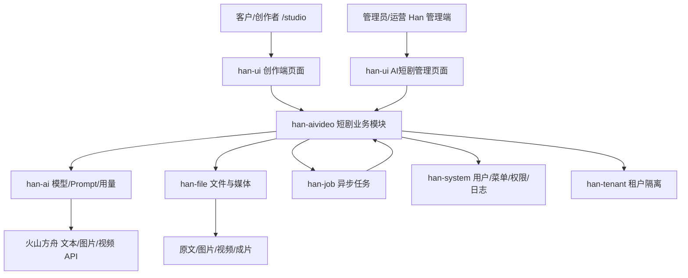
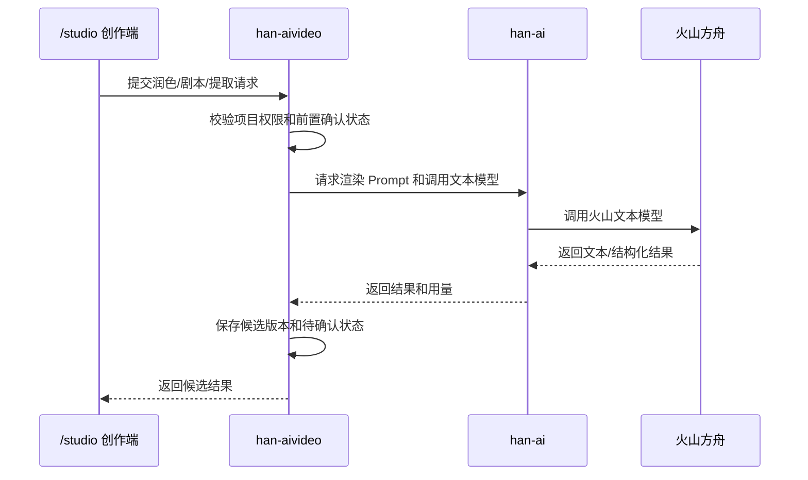
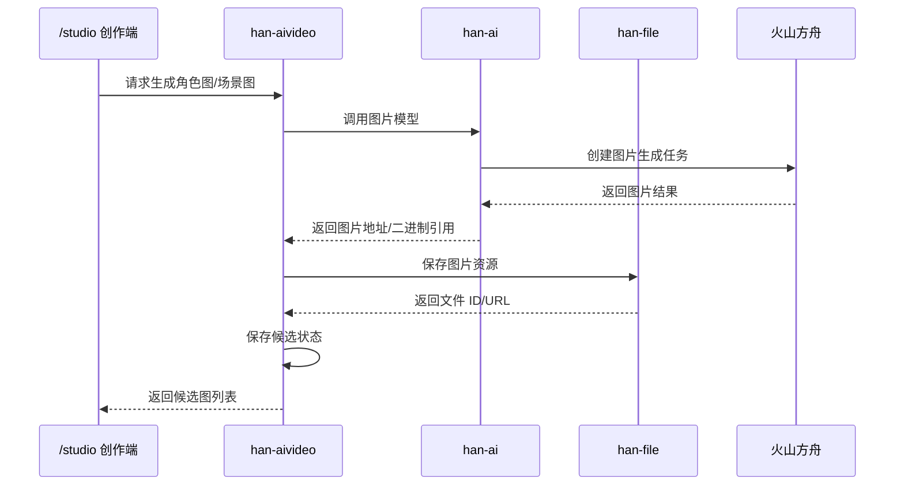
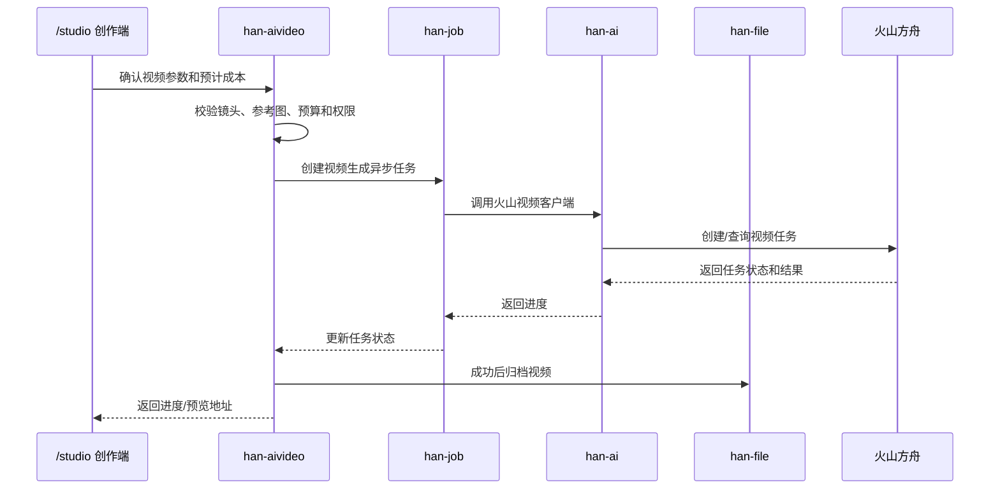

# Han 模块边界设计

版本：v0.1  
状态：待 BOSS 评审  
更新时间：2026-05-21  
适用底座：`D:\code\Han`  
当前阶段：模块边界设计，不进入代码开发

## 1. 设计目标

本设计用于明确 AIVideo 第一版基于 Han 建设时，各类能力应该放在哪个 Han 模块里，哪些能力属于 AI 短剧专用，哪些能力应该反哺 Han 通用底座。

核心目标：
- 避免把短剧业务逻辑污染到 `han-ai`。
- 避免重复造文件、任务、模型、Prompt、权限、成本统计能力。
- 保持第一版开发速度，同时为后续反哺 Han 留清晰边界。
- 为后续数据库表设计、接口设计、开发计划提供模块依据。

## 2. 已确认基础

| 项 | 结论 |
| --- | --- |
| 开发仓库 | 第一版代码落在 `D:\code\Han` |
| 规划资产目录 | `D:\code\AIVideo` 继续保留需求、规则、提示词和设计文档 |
| 新业务模块 | 新增 `han-aivideo` |
| 创作端 | 第一版放在 `han-ui` 的 `/studio` |
| 管理端 | 继续使用 Han 管理端，在 `/ai/aivideo/*` 增加页面 |
| 登录权限 | 复用 Han 登录、租户、用户、角色、权限 |
| 联调环境 | 使用 Han 95 环境，本机主要写代码和基础调试 |

## 3. Han 现状依据

本设计基于当前已读取的 Han 现状：
- `D:\code\Han\AGENTS.md`
- `D:\code\Han\docs\06-牛马协作总规则.md`
- `D:\code\Han\niumma-rules.md`
- `D:\code\Han\docs\02-开发手册.md`
- `D:\code\Han\.codex\rules\20-engineering-baseline.md`
- `D:\code\Han\.codex\rules\60-han-execution.md`
- `D:\code\Han\pom.xml`
- `D:\code\Han\han-modules\pom.xml`
- `D:\code\Han\han-modules\han-ai\pom.xml`
- `D:\code\Han\han-ui\src\router\index.ts`
- `D:\code\Han\han-ui\src\api\ai\index.ts`

代码同步状态：
- 已在 `D:\code\Han` 执行 `git pull --ff-only`。
- 结果：`Already up to date`。
- 当前分支：`master`。

当前 Han 模块包括：
- `han-ai`
- `han-file`
- `han-gen`
- `han-job`
- `han-open`
- `han-system`
- `han-tenant`
- `han-workflow`

Han 正式规则要求：
- 正式文档入口固定为 `docs/`。
- SQL 初始化脚本按 `small`、`medium`、`full` 三档维护。
- 升级脚本进入 `sql/upgrades/postgres/`。
- 95 只能从 `/opt/han/repo/Han` 和 `/opt/han/deploy/{small,medium,full}` 发布。
- Han 后端以 Java 21、Spring Boot、Spring Cloud、Maven 为主。
- Han 前端以 Vue 3、TypeScript、Vite 为主。
- A/I/B 控制器分层必须保留。

开发限制摘要：
- 后端不得新增替代主技术栈或平行架构。
- 新增 JSON 处理优先使用 Jackson，禁止新增 Gson、Fastjson、Fastjson2。
- 服务间调用优先使用 `@HttpExchange`，禁止新增 Feign。
- PO/DTO/Query/VO 转换优先使用 MapStruct 或 Converter 层收口。
- 管理端接口保持 Han 当前 `GET / POST` 风格，不为追求 REST 形式破坏兼容。
- 新模块建议遵守 `controller/admin`、`controller/inner`、`controller/base` 的 A/I/B 分层。
- A 层必须显式权限控制，I 层必须显式内部鉴权，B 层不标 `@RestController`。
- SQL 只能进入 Han 正式 SQL 结构，不能新增散装 SQL。
- secrets、完整密钥、完整令牌不进入 Git。
- 前端不得直接调用火山 API，也不得保存或展示完整 API Key。

## 4. 总体模块关系



原则：
- `han-aivideo` 编排短剧业务流程。
- `han-ai` 提供通用 AI 能力，不保存短剧专属业务状态。
- `han-file` 保存文件与媒体资源。
- `han-job` 承接异步、重试、调度。
- `han-ui` 承接页面入口和交互。
- `han-system` 和 `han-tenant` 提供权限和租户能力。

## 5. 模块职责边界

### 5.1 `han-aivideo`

定位：AI 短剧业务模块。

负责：
- 短剧项目管理。
- 原始文档业务记录。
- 文档解析结果。
- 润色稿版本。
- 短剧剧本版本。
- 人物资产。
- 场景资产。
- 分镜资产。
- 图片候选选择状态。
- 视频生成业务任务。
- 每一步确认、返修、锁定状态。
- 短剧项目级成本预算和消耗聚合。
- 短剧业务接口。
- 调用 `han-ai`、`han-file`、`han-job` 完成底层能力。

不负责：
- 通用模型配置。
- 通用 Prompt 模板底座。
- API Key 存储底座。
- 通用文件存储底座。
- 通用异步任务底座。
- Han 用户、租户、权限体系。

建议包结构：

```text
han-modules/han-aivideo/
  src/main/java/com/han/aivideo/
    controller/
      AivideoProjectController.java
      AivideoWorkbenchController.java
      AivideoAssetController.java
      AivideoVideoController.java
      AivideoTaskController.java
      AivideoSettingController.java
    service/
    service/impl/
    domain/
      po/
      dto/
      vo/
      query/
    mapper/
    converter/
    enums/
    client/
      AiServiceFacade.java
      FileServiceFacade.java
      JobServiceFacade.java
```

A/I/B 边界建议：
- A 层：面向管理端和创作端的外部接口，做权限控制。
- I 层：如后续需要服务间内部调用，再提供内部接口。
- B 层：业务控制器或内部编排层不直接暴露为外部 REST。

### 5.2 `han-ai`

定位：通用 AI 能力底座。

负责：
- AI 模型管理。
- Prompt 模板管理。
- Prompt 变量渲染。
- Token/用量统计。
- 通用 AI 工作流。
- 通用模型连通性测试。
- 火山方舟文本、图片、视频 API 的后端客户端封装。
- 模型调用审计基础记录。

AIVideo 反哺内容：
- `VolcArkTextClient`：文本生成、润色、结构化提取。
- `VolcArkImageClient`：图片生成、角色图、场景图、关键帧。
- `VolcArkVideoClient`：视频生成任务创建、查询、取消、结果解析。
- 模型类型扩展：除 LLM、TTS、STT 等外，可能需要支持 `IMAGE`、`VIDEO`。
- Prompt 模板分类扩展：可增加 `aivideo_polish`、`aivideo_script`、`aivideo_character`、`aivideo_scene`、`aivideo_storyboard`、`aivideo_video`，但模板本身应保持通用可管理。

不负责：
- 短剧项目状态。
- 人物、场景、分镜业务表。
- 候选图选择逻辑。
- 成片交付逻辑。

边界要求：
- API Key 不返回前端。
- 前端不得直接调用火山 API。
- `han-aivideo` 只能通过后端服务调用 `han-ai`。
- 火山模型客户端先放 `han-ai`，后续高并发或多系统复用时再考虑 `han-ai-gateway`。

### 5.3 `han-file`

定位：文件与媒体存储底座。

负责：
- 原文文件上传。
- TXT/Markdown/DOCX/PDF 等源文件存储。
- 角色图、场景图、关键帧存储。
- 视频结果、成片存储。
- 文件访问 URL、权限和生命周期管理。

AIVideo 反哺内容：
- 媒体文件分类。
- 图片/视频预览能力。
- 大文件上传或视频文件访问策略。
- 按项目/租户隔离文件访问。

不负责：
- 分镜业务字段。
- 候选图选择状态。
- 视频生成状态。

### 5.4 `han-job`

定位：异步任务、批量任务和调度底座。

负责：
- 文本生成异步任务。
- 图片生成异步任务。
- 视频生成任务轮询。
- 失败重试。
- 任务取消。
- 任务超时。
- 批量镜头生成调度。

AIVideo 反哺内容：
- AI 任务类型扩展。
- 任务进度查询统一模型。
- 任务失败原因标准化。
- 任务重试和取消的通用能力。

不负责：
- 短剧项目流程状态。
- 人工确认状态。
- 成片验收状态。

### 5.5 `han-ui`

定位：Han 前端工程。

负责：
- `/studio` 创作端入口。
- `/studio/projects` 项目列表。
- `/studio/projects/create` 新建项目。
- `/studio/projects/:id/workbench` 创作工作台。
- `/studio/projects/:id/assets` 资产库。
- `/studio/projects/:id/video` 视频生成。
- `/studio/projects/:id/delivery` 成片交付简版。
- `/ai/aivideo/tasks` 管理端任务监管。
- `/ai/aivideo/settings` 管理端基础配置。

AIVideo 反哺内容：
- 候选图选择组件。
- 任务进度组件。
- Prompt 变量编辑组件。
- 成本预估展示组件。
- 右侧参数/日志面板组件。

不负责：
- 保存完整 API Key。
- 直接调用火山 API。
- 绕过后端权限读取他人项目。

### 5.6 `han-system`

定位：系统管理底座。

负责：
- 用户管理。
- 角色管理。
- 菜单管理。
- 权限码。
- 操作日志。
- 参数配置。

AIVideo 依赖：
- `/studio` 创作端入口的路由权限。
- `/ai/aivideo/*` 管理端菜单权限。
- 管理员与普通用户的基础区分。
- 操作日志记录。

不建议第一版改动：
- 不新增复杂创作角色体系。
- 第一版只区分普通用户和管理员。
- 运营、制片、编剧、视觉审核等细分角色第二阶段再做。

### 5.7 `han-tenant`

定位：租户隔离底座。

负责：
- 租户数据隔离。
- 租户资源配额。
- 租户套餐。

AIVideo 依赖：
- 普通客户只能看自己的项目。
- 后续支持按租户统计成本。
- 后续支持租户级预算和额度。

第一版要求：
- 短剧核心业务表预留 `tenant_id`。
- 查询接口必须遵守 Han 现有租户隔离规则。

### 5.8 `han-workflow`

定位：通用工作流底座。

第一版建议：
- 不强依赖 `han-workflow`。
- AIVideo 的“文档解析 -> 润色 -> 剧本 -> 人物/场景/分镜 -> 图片 -> 视频”先用业务状态机实现。

后续可反哺：
- 如果需要多人审批、跨角色流转、复杂审核，可以考虑接入 `han-workflow`。
- 版权审核、成片审核、预算审批可作为后续工作流场景。

### 5.9 `han-open`

定位：开放平台能力。

第一版建议：
- 不接入。

后续可扩展：
- 对外开放短剧生成 API。
- 给第三方系统创建项目、上传文档、查询任务。
- 通过开放平台管理外部应用调用额度和密钥。

## 6. 能力归属矩阵

| 能力 | 建议归属 | 是否反哺 Han | 说明 |
| --- | --- | --- | --- |
| 短剧项目 | `han-aivideo` | 否 | 短剧业务专属 |
| 原始文档业务记录 | `han-aivideo` | 否 | 文件本体在 `han-file` |
| 文件上传与存储 | `han-file` | 是 | 复用并增强媒体能力 |
| 文档解析编排 | `han-aivideo` | 待确认 | 通用解析能力成熟后可抽到文件/AI 底座 |
| 文本润色 | `han-aivideo` 编排，`han-ai` 调用 | 部分是 | Prompt 调用通用，润色业务专属 |
| 剧本生成 | `han-aivideo` 编排，`han-ai` 调用 | 部分是 | 模型调用通用，剧本结构专属 |
| 人物资产 | `han-aivideo` | 否 | 短剧业务专属 |
| 场景资产 | `han-aivideo` | 否 | 短剧业务专属 |
| 分镜资产 | `han-aivideo` | 否 | 短剧业务专属 |
| Prompt 模板管理 | `han-ai` | 是 | 通用模板底座 |
| 短剧默认 Prompt 内容 | `han-aivideo` 引用 `han-ai` 模板 | 部分是 | 模板可管理，内容属于短剧域 |
| 火山文本客户端 | `han-ai` | 是 | 通用模型能力 |
| 火山图片客户端 | `han-ai` | 是 | 通用模型能力 |
| 火山视频客户端 | `han-ai` | 是 | 通用模型能力 |
| 图片候选选择 | `han-aivideo` + `han-ui` | 组件可反哺 | 业务状态专属，组件通用 |
| 视频生成任务 | `han-aivideo` 编排，`han-job` 执行，`han-ai` 调用 | 部分是 | 任务底座通用 |
| 成本预估 | `han-aivideo` 项目级，`han-ai` 模型级 | 是 | 通用用量和短剧预算分层 |
| 成片交付 | `han-aivideo` + `han-file` | 否 | 短剧业务专属 |
| 管理端任务监管 | `han-ui` + `han-aivideo` | 组件可反哺 | 任务展示组件可复用 |
| 权限 | `han-system` + `han-tenant` | 否 | 复用现有底座 |

## 7. 数据流边界

### 7.1 文本生成链路



### 7.2 图片生成链路



### 7.3 视频生成链路



## 8. 前端边界

### 8.1 创作端 `/studio`

创作端是客户可见页面，应使用独立布局或轻后台布局，避免暴露 Han 管理菜单。

页面：
- `/studio`
- `/studio/projects`
- `/studio/projects/create`
- `/studio/projects/:id/workbench`
- `/studio/projects/:id/assets`
- `/studio/projects/:id/video`
- `/studio/projects/:id/delivery`

### 8.2 管理端 `/ai/aivideo`

管理端归入 Han AI 菜单。

第一版页面：
- `/ai/aivideo/tasks`
- `/ai/aivideo/settings`

第二阶段页面：
- `/ai/aivideo/projects`
- `/ai/aivideo/prompts`
- `/ai/aivideo/costs`
- `/ai/aivideo/review`

## 9. SQL 与部署边界

Han 规则要求 SQL 进入正式结构。

第一版建议：
- `han-aivideo` 初始化表进入 `sql/tiers/full/full-init.sql`。
- 如果 `small`、`medium` 不包含 AI 能力，第一版不强行加入 AIVideo 表。
- 后续升级脚本进入 `sql/upgrades/postgres/`。
- Nacos 配置若新增 `han-aivideo.yml`，应跟随 `full` tier。
- 任意 SQL 变更需要同步 `sql/README.md`。

待后续表设计确认：
- 是否只支持 `full` tier。
- 是否需要在 `medium` tier 保留菜单但隐藏能力。
- AIVideo 表命名前缀建议统一为 `ai_video_` 或 `aivideo_`，表设计阶段再确认。

## 10. 反哺 Han 清单

| 反哺项 | 目标模块 | 优先级 | 说明 |
| --- | --- | --- | --- |
| 火山文本客户端 | `han-ai` | 高 | 润色、剧本、结构化提取依赖 |
| 火山图片客户端 | `han-ai` | 高 | 角色图、场景图、关键帧依赖 |
| 火山视频客户端 | `han-ai` | 高 | 视频生成任务依赖 |
| AI 任务进度模型 | `han-job` | 中 | 视频任务轮询和重试可复用 |
| 媒体文件预览 | `han-file`/`han-ui` | 中 | 图片、视频资产可复用 |
| 候选图选择组件 | `han-ui` | 中 | 角色图/场景图/关键帧共用 |
| Prompt 变量编辑组件 | `han-ui` | 中 | Prompt 模板和临时补充要求共用 |
| 成本预估展示组件 | `han-ui` | 低 | 后续多 AI 应用可复用 |
| 内容风险审核入口 | `han-ai`/`han-aivideo` | 低 | 第二阶段增强 |

## 10.1 Han 技术升级适配候选

AIVideo 开发中，如果出现能提升 Han 底座“技术新、稳定、好用”的通用能力，可以作为 Han 升级适配候选。升级候选必须符合 Han 主技术栈和正式部署规则，不能绕开 Java 21、Spring Boot、Spring Cloud、Vue 3、TypeScript、Vite、PostgreSQL、Nacos 和三档部署结构。

| 升级候选 | 目标模块 | 触发条件 | 验证要求 |
| --- | --- | --- | --- |
| 火山多模态模型客户端标准化 | `han-ai` | 文本/图片/视频调用稳定后 | 模型连通、失败返回、超时、脱敏日志 |
| AI 异步任务状态标准化 | `han-job` / `han-ai` | 视频任务轮询、重试、取消变复杂 | 成功、失败、取消、超时、重试全路径 |
| 媒体预览和访问增强 | `han-file` / `han-ui` | 图片/视频资产增多 | 权限、预览、下载、公开访问边界 |
| Prompt 模板版本和试运行增强 | `han-ai` / `han-ui` | 短剧 Prompt 迭代频繁 | 模板渲染、变量校验、历史版本可追踪 |
| 成本预估和额度拦截 | `han-ai` / `han-tenant` | 图片/视频生成成本需要控制 | 项目、用户、租户维度统计和拦截 |
| 候选选择和任务进度组件 | `han-ui` | 多候选图片/视频选择复用 | 多页面复用、空态、失败态、移动端适配 |
| 95 联调验证脚本增强 | `deploy` / `docs` | 生成链路依赖 95 验证 | 不破坏现有发布入口和回滚口径 |

升级门禁：
- 先记录候选，不静默混入短剧业务实现。
- 先出影响范围、兼容方案、验证方式和回滚方式。
- 涉及依赖、SQL、部署、95 发布或配置变更时，必须单独确认。
- 任何升级不能削弱 Han 已有功能、权限、安全、三档部署和 95 发布链路。

## 11. 第一版不做的拆分

第一版不建议拆：
- 不拆独立 `han-aivideo-ui`。
- 不拆独立 `han-ai-gateway`。
- 不新建独立后端仓库。
- 不新建独立 FastAPI/NestJS 主服务。
- 不强行接入 `han-workflow`。
- 不做开放平台 API。
- 不做全剧批量视频生成。
- 不做配音、字幕、BGM、音效。

## 12. 风险与处理

| 风险 | 影响 | 处理方式 |
| --- | --- | --- |
| `han-ai` 被短剧逻辑污染 | 影响通用 AI 底座 | 只放通用客户端和模板能力，短剧状态放 `han-aivideo` |
| `/studio` 与后台管理菜单混杂 | 客户体验差，权限风险 | 创作端使用独立布局或隐藏后台菜单 |
| 视频生成任务耗时长 | 前端等待超时 | 走 `han-job` 异步任务和轮询 |
| API Key 泄露 | 高安全风险 | 仅后端配置，前端不返回完整密钥 |
| SQL tier 放错 | 影响部署结构 | 遵守 Han SQL 正式入口，优先 full tier |
| 95 发布路径不规范 | 违反 Han 发布规则 | 只从 `/opt/han/repo/Han` 和正式 deploy 目录发布 |

## 13. 后续设计依赖

本模块边界确认后，下一步继续输出：
- `AI短剧数据库表设计.md`
- `AI短剧后端接口草案.md`
- `AI短剧开发计划.md`

其中数据库表设计需要依据本文件决定：
- 哪些表放 `han-aivideo`。
- 哪些字段引用 `han-ai` 的模型和 Prompt。
- 哪些字段引用 `han-file` 的文件 ID。
- 哪些任务引用 `han-job` 或 AIVideo 自有任务记录。
