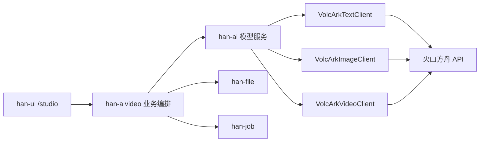
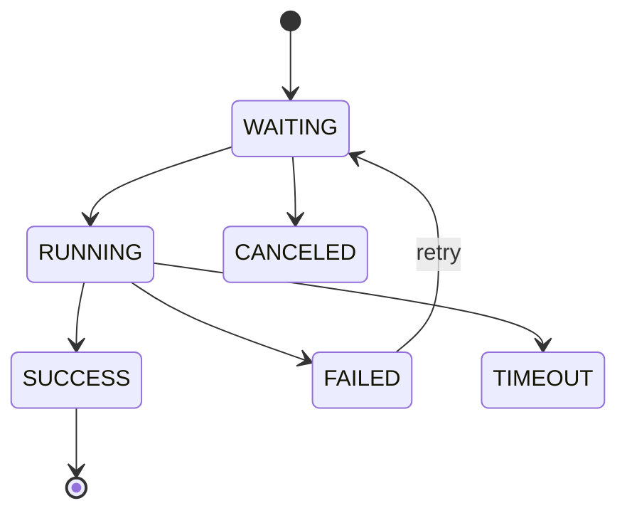

# AI 短剧火山模型调用设计

版本：v0.1  
状态：待 BOSS 评审  
更新时间：2026-05-21  
适用底座：`D:\code\Han`  
当前阶段：模型调用设计，不进入代码开发

## 1. 设计目标

本设计用于明确 AIVideo 如何通过 Han 调用火山方舟/火山引擎的文本、图片、视频能力。

目标：
- 前端不直接调用火山 API。
- 完整 API Key 不进入前端、不进入普通文档。
- 通用模型调用能力反哺 `han-ai`。
- 短剧业务编排留在 `han-aivideo`。
- 视频生成走异步任务，避免前端长时间等待。

## 2. 调用边界

边界：
- `han-aivideo`：决定何时调用、用哪个 Prompt、保存什么业务状态。
- `han-ai`：负责模型配置、API Key 读取、火山客户端、通用调用日志和用量。
- `han-file`：保存生成图片、视频和成片。
- `han-job`：承接耗时视频任务和批量生成。

## 3. Han 技术限制

必须遵守：
- Java 21、Spring Boot、Spring Cloud、Maven。
- JSON 使用 Jackson。
- 不新增 Gson、Fastjson、Fastjson2。
- 服务间调用优先 `@HttpExchange`，禁止新增 Feign。
- 对象转换用 MapStruct 或 Converter。
- secrets 不进入 Git。
- 管理端接口沿用 Han `GET / POST` 风格。

当前 Han 已有：
- `AiOpenAiCompatibleClient`：用于 OpenAI-compatible 文本调用和连通测试。
- `ai_model`：保存模型配置。
- `ai_prompt_template`：保存 Prompt 模板。
- `ai_token_usage`：保存文本 Token 用量。

## 4. 模型配置建议

### 4.1 `ai_model` 扩展

当前 `ai_model.model_type` 已有：
- `LLM`
- `EMBEDDING`
- `RERANK`
- `TTS`
- `STT`

AIVideo 建议增加：
- `IMAGE`
- `VIDEO`

Provider 建议：
- `volcengine`
- 或 `ark`

模型记录建议：
- 文本模型：`model_type = LLM`
- 图片模型：`model_type = IMAGE`
- 视频模型：`model_type = VIDEO`

API Key：
- 优先使用 Han 现有安全策略。
- 文档只记录脱敏信息。
- 95 环境通过环境变量、配置中心或受控配置注入。

### 4.2 配置项

项目级快照进入 `ai_video_project_setting`：
- `text_model_id`
- `image_model_id`
- `video_model_id`
- 各阶段 Prompt 模板 ID。
- 默认比例、清晰度、候选数、低成本预览。

全局默认配置可进入：
- `sys_config`
- 或管理端配置表/配置服务，具体按 Han 现有配置方式确认。

## 5. 文本模型调用

用途：
- 文本润色。
- 短剧剧本生成。
- 人物提取。
- 场景提取。
- 分镜提取。
- 人物/场景信息补全。
- Prompt 优化。

建议客户端：
- 第一版可复用或增强 `AiOpenAiCompatibleClient`。
- 如果火山文本模型兼容 OpenAI Chat Completions，可走统一 OpenAI-compatible 路径。
- 若火山 Responses API 更合适，再新增 `VolcArkTextClient`，但仍放在 `han-ai`。

调用输入：
- `modelId`
- `promptTemplateId`
- `variables`
- `customPrompt`
- `maxTokens`
- `temperature`
- `responseFormat`

输出要求：
- Markdown 供页面展示。
- JSON 供后端入库。
- 建议模型输出 `Markdown + fenced JSON`，后端使用 Jackson 解析 JSON 部分。

失败处理：
- 模型未配置。
- API Key 缺失。
- 返回非 JSON。
- 超时。
- 内容审核失败。
- Token 超限。

## 6. 图片模型调用

用途：
- 角色图。
- 场景图。
- 分镜关键帧。

建议客户端：
- `VolcArkImageClient`，归属 `han-ai`。

输入：
- `modelId`
- `prompt`
- `negativePrompt`
- `ratio`
- `size`
- `candidateCount`
- `seed`
- `referenceImageIds`
- `watermark`

输出：
- 候选图片 URL 或二进制引用。
- 图片生成参数。
- 供应商任务 ID。
- 成本估算或实际成本。

归档：
- 生成结果统一交给 `han-file`。
- `ai_video_media_asset` 保存业务归属、候选序号、选中状态、Prompt 和参数快照。

第一版规则：
- 角色图默认 3 张。
- 场景图默认 3 张。
- 关键帧默认 1 到 3 张。
- 场景图默认禁止人物。

## 7. 视频模型调用

用途：
- 按分镜生成单镜头视频。

建议客户端：
- `VolcArkVideoClient`，归属 `han-ai`。

输入：
- `modelId`
- `prompt`
- `mode`: `TEXT_TO_VIDEO` / `IMAGE_TO_VIDEO`
- `ratio`
- `resolution`
- `durationSec`
- `referenceImageIds`
- `seed`
- `watermark`

输出：
- 火山侧任务 ID。
- 任务状态。
- 进度。
- 视频结果 URL。
- 错误码与错误信息。

第一版规则：
- 只支持选中镜头生成。
- 默认视频候选 1 条。
- 默认低成本预览模式。
- 生成前必须展示预计成本并确认。
- 生成成功后归档到 `han-file`，业务记录进入 `ai_video_media_asset`。

## 8. 异步任务设计

文本：
- 第一版可以同步返回，但仍要保存 `ai_video_generation_task`。
- 长文本可转异步。

图片：
- 如果火山接口同步返回图片，业务层仍保存任务记录。
- 如果火山接口异步返回，按视频方式轮询。

视频：
- 必须异步。
- `han-aivideo` 创建业务任务。
- `han-job` 执行或调度轮询。
- `han-ai` 负责调用火山视频客户端。
- 结果回写 `ai_video_generation_task`。

## 9. Prompt 管理

Prompt 模板归属：
- 通用模板能力放 `han-ai` 的 `ai_prompt_template`。
- AIVideo 默认 Prompt 可以作为内置模板预置。
- 任务实际 Prompt 必须复制到 `ai_video_generation_task.prompt_text`，保证历史可追溯。

模板建议：
- 文本润色。
- 短剧剧本。
- 人物提取与角色图。
- 场景提取与场景图。
- 分镜生成。
- 视频生成。

补充提示词：
- 用户单次输入的补充要求进入 `custom_prompt`。
- 不污染默认模板。
- 优秀结果后续可沉淀为新模板版本，但需要 BOSS 确认。

## 10. 成本与用量

第一版成本策略：
- 生成前估算。
- 生成后记录实际成本。
- 文本成本可参考 Token 记录。
- 图片、视频按模型计费规则记录估算和实际。

数据落点：
- `ai_video_generation_task.estimated_cost`
- `ai_video_generation_task.actual_cost`
- `ai_video_project.estimated_cost`
- `ai_video_project.actual_cost`
- 通用文本 Token 继续使用或扩展 `ai_token_usage`

待确认：
- 火山控制台具体计费规则。
- 图片/视频是否能从 API 返回实际扣费。
- 是否需要按租户额度拦截。

## 11. 安全与审计

必须遵守：
- 前端不接触完整 API Key。
- 错误信息不展示完整请求头。
- 日志不打印完整 Prompt 中的客户敏感内容，必要时截断或脱敏。
- 客户原文、生成图、视频按租户和项目隔离。
- 生成任务记录操作人、模型、Prompt 版本、参数和时间。

## 12. 对 Han 的技术升级适配

火山模型调用能力如果在 AIVideo 中验证稳定，应逐步反哺 Han，而不是只服务短剧模块。

优先升级方向：
- `han-ai` 增加统一多模态模型客户端接口，覆盖文本、图片、视频。
- `han-ai` 模型配置支持 `IMAGE`、`VIDEO` 类型。
- `han-ai` 模型测试能力支持图片/视频模型的最小连通测试。
- `han-job` 或统一任务模型支持 AI 异步任务状态、轮询、取消、重试。
- `han-ui` 增加模型调用失败诊断、任务进度、成本预估通用组件。

升级限制：
- 不引入与 Han 主技术栈冲突的新架构。
- 不绕过 Han 权限、租户、配置和部署规则。
- 不让前端直接接触供应商 API Key。
- 每项升级都要单独给出验证和回滚方案。

## 13. 待确认项

1. 火山文本模型、图片模型、视频模型的最终模型 ID。
2. 火山图片/视频接口是同步、异步还是混合。
3. 火山视频支持的比例、清晰度、时长和参考图数量。
4. 95 环境 API Key 配置方式。
5. 是否需要第一版接入内容安全审核 API，还是先记录风险提示。
