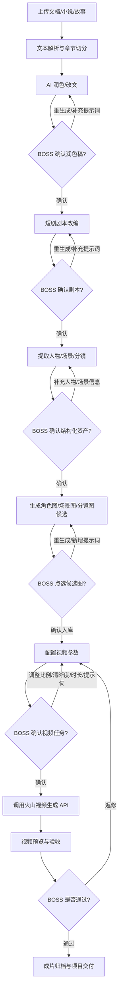
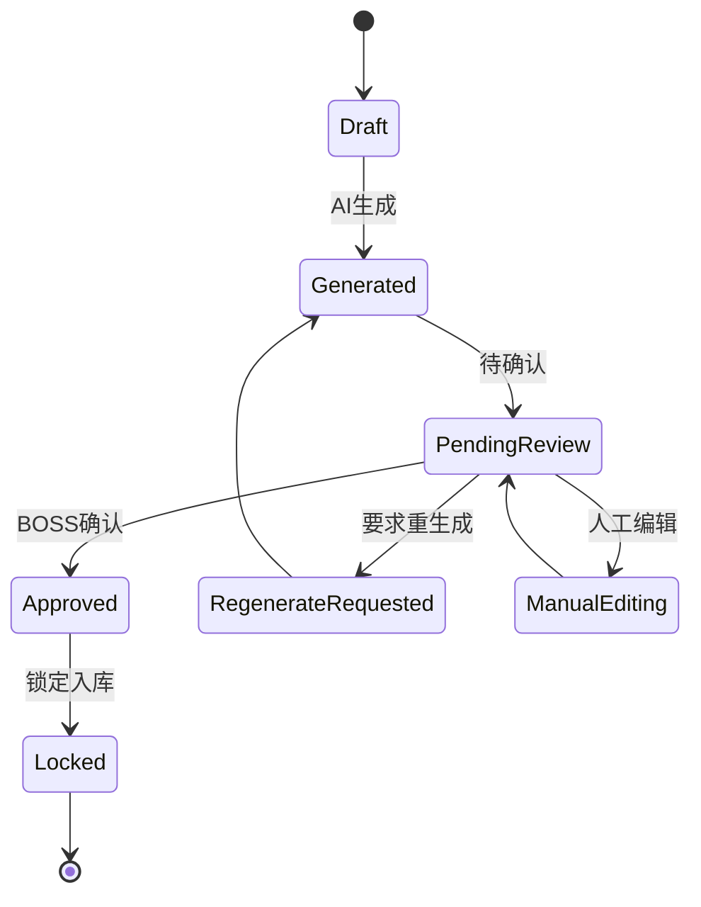
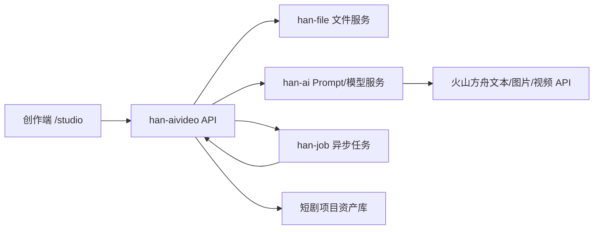

# AI 短剧自动生成系统需求文档

版本：v0.1  
状态：待 BOSS 评审  
更新时间：2026-05-21  
当前阶段：需求规划，不进入开发实现

## 1. 背景

BOSS 希望做一个自动生成 AI 短剧的系统。用户上传一段文档、小说或故事材料后，系统通过大模型完成文本润色、短剧化改编、人物提取、场景提取、分镜提取、角色图生成、场景图生成、分镜提示词生成，最后在人工确认后调用火山引擎模型生成视频。

系统核心不是“一键黑盒生成”，而是“每一步可确认、可重生成、可补充提示词、可选择候选结果、可追踪成本”的 AI 短剧生产工作台。

## 2. 目标

### 2.1 产品目标
- 把长文档、小说、故事文本转成可用于 AI 视频生成的短剧资产包。
- 每一步生成结果都能人工确认、重生成、补充提示词。
- 人物图、场景图、分镜图支持多候选生成和点选确认。
- 视频生成前能选择比例、清晰度、时长、风格、镜头参数。
- 默认接入火山引擎/火山方舟模型能力，优先使用文本生成、图片生成、视频生成能力。

### 2.2 业务目标
- 降低小说/文档改编为短剧的人工成本。
- 形成可复用的短剧项目资产库：原文、润色稿、剧本、角色、场景、分镜、图片、视频任务、成片。
- 支持后续批量生产：同一小说多集拆分、同一角色多场景复用、同一风格模板复用。

### 2.3 非目标
- MVP 阶段不直接做全自动无确认成片。
- MVP 阶段不默认加入 BGM、音效、配音合成，除非 BOSS 后续确认。
- MVP 阶段不承诺所有模型参数都可用，最终以火山控制台模型能力为准。
- MVP 阶段不处理版权授权、真人肖像授权的自动审批，只做记录和风险提示。

## 3. 参考资料

### 3.1 本地提示词资产

| 文件 | 作用 | 后续处理 |
| --- | --- | --- |
| `1-ai改文指令优化.txt` | 小说改文、短视频解说文案润色 | 优化为系统默认“文本润色提示词” |
| `2-电影级纯净场景设计专家.txt` | 提取并生成纯场景设定 | 优化为系统默认“场景提取与场景图提示词” |
| `3-角色构建AI指令词.txt` | 生成角色心理画像和视觉方案 | 优化为系统默认“角色提取与角色图提示词” |
| `4-剧本分镜指令详细版.txt` | 生成 15 秒镜头分镜脚本 | 优化为系统默认“分镜生成提示词” |

### 3.2 火山引擎/火山方舟资料
- 火山方舟提供文本生成、图片生成、视频生成、3D 生成、向量化、批量推理、应用 Bot、提示词指南、模型价格和计费说明等入口。
- 视频生成 API 可用于创建视频生成任务。
- 图片生成 API 可用于角色图、场景图和关键帧生成。
- 火山方舟支持 SDK 接入和兼容 OpenAI SDK 的调用方式，常见基础地址为 `https://ark.cn-beijing.volces.com/api/v3`。
- API Key 应通过环境变量或密钥管理保存，例如 `ARK_API_KEY`。
- 具体模型 ID、可用比例、分辨率、并发、价格和限流需要登录火山控制台确认。

调研归档见：`D:\code\AIVideo\docs\参考材料\火山引擎AI短剧能力调研.md`

## 4. 总体流程



## 5. 用户角色

| 角色 | 权限与职责 |
| --- | --- |
| BOSS/创作者 | 上传原文、确认每一步结果、补充提示词、选择候选图、确认视频生成任务 |
| 编剧编辑 | 审核润色稿、剧本、分集、节奏和钩子 |
| 视觉设计 | 审核人物图、场景图、风格一致性 |
| 运营/制片 | 控制成本、批量任务、成片导出和平台适配 |
| 系统管理员 | 配置火山模型、API Key、限流、用量统计、安全策略 |

## 6. 核心功能需求

### 6.1 项目管理

每个短剧项目应包含：
- 项目名称。
- 原始文档。
- 题材类型：爽文、悬疑、情感、玄幻、都市、科幻、校园等。
- 目标平台：抖音、快手、视频号、小红书、B站等。
- 默认画幅：9:16、16:9、1:1、4:3、3:4。
- 默认风格：写实、电影感、国风、赛博、古装、漫画、短剧竖屏等。
- 目标单集时长。
- 目标镜头时长。
- 当前流程阶段。
- 成本预算与已用额度。

### 6.2 文档上传与解析

支持输入：
- 纯文本粘贴。
- TXT。
- Markdown。
- DOCX。
- PDF。
- 后续可扩展网页 URL、EPUB。

解析要求：
- 保留原文版本。
- 自动识别标题、章节、段落。
- 支持手动调整章节切分。
- 支持选择“整篇处理”或“按章节/集处理”。
- 超长文本需要切片处理，并保留上下文摘要。

确认点：
- 解析完成后展示原文结构。
- BOSS 确认章节/集数划分后，才能进入润色。

### 6.3 文本润色与改文

目标：
- 将原文改成适合短剧或短视频解说的文案。
- 保留原文主线、人物关系、核心冲突。
- 强化开头钩子、节奏、画面感、情绪点。

默认提示词来源：
- 基于 `1-ai改文指令优化.txt` 优化为系统默认模板。

功能要求：
- 可选择润色目标：短视频解说、短剧旁白、剧情对白稿、分集大纲。
- 可选择风格：爽文、悬疑、虐恋、反转、电影旁白、口播解说。
- 可补充本次自定义提示词。
- 可生成多个版本。
- 支持对比原文/润色稿。
- 支持选择一个版本作为“确认润色稿”。

确认点：
- 润色后必须由 BOSS 确认。
- BOSS 可选择通过、重生成、局部重写、追加提示词重生成。

### 6.4 短剧剧本改编

目标：
- 将确认后的润色稿改成短剧剧本或分集文档。

输出内容：
- 剧名建议。
- 故事梗概。
- 分集结构。
- 每集核心冲突。
- 每集开头钩子。
- 每集结尾悬念。
- 旁白。
- 对白。
- 关键动作。
- 画面提示。

功能要求：
- 支持按集数拆分。
- 支持每集目标时长。
- 支持每集镜头数量。
- 支持人设不完整时标记 `待补充`。
- 支持 BOSS 补充人物信息后重新生成。

确认点：
- 剧本确认后才能进入人物/场景/分镜提取。

### 6.5 人物提取与补全

目标：
- 从剧本中提取人物信息，生成角色资产。

字段建议：
- 角色 ID。
- 角色名。
- 性别。
- 年龄。
- 身份。
- 性格标签。
- 故事功能。
- 人物关系。
- 外貌特征。
- 发型。
- 服装。
- 颜色体系。
- 禁止漂移特征。
- 参考提示词。
- 信息完整度。
- 待补充项。

功能要求：
- 自动提取人物。
- 缺失信息自动标记 `待补充`。
- 提供“AI 补全人物信息”按钮。
- BOSS 可手动编辑。
- 支持生成多套人物设定版本。
- 支持锁定角色设定，后续场景和分镜必须引用锁定版本。

确认点：
- 人物信息确认后才能生成角色图。

### 6.6 场景提取与补全

目标：
- 从剧本中提取所有场景，生成场景资产。

默认提示词来源：
- 基于 `2-电影级纯净场景设计专家.txt` 优化为系统默认模板。

字段建议：
- 场景 ID。
- 场景名称。
- 场景类型。
- 所属集数。
- 时间。
- 天气。
- 空间氛围。
- 视觉特征。
- 色调。
- 道具。
- 禁止出现元素。
- 场景图提示词。
- 信息完整度。
- 待补充项。

功能要求：
- 自动提取场景。
- 支持纯场景图规则：无人、无角色、无多余人物。
- 支持 BOSS 补充地点、时代、风格。
- 支持生成多套场景设定版本。

确认点：
- 场景信息确认后才能生成场景图。

### 6.7 分镜提取与生成

目标：
- 将剧本拆成可执行的视频生成分镜。

默认提示词来源：
- 基于 `4-剧本分镜指令详细版.txt` 优化为系统默认模板。

字段建议：
- 分镜 ID。
- 所属项目。
- 所属集数。
- 镜头序号。
- 镜头时长。
- 景别。
- 机位。
- 运镜。
- 角色。
- 场景。
- 动作。
- 台词。
- 画外音。
- 情绪。
- 视频生成提示词。
- 参考图。
- 输出比例。
- 输出清晰度。
- 状态。

功能要求：
- 支持 5 秒、10 秒、15 秒等镜头时长模板。
- 支持台词和画外音分离。
- 支持镜头前后连续性检查。
- 支持分镜手动增删改。
- 支持一键重新生成某个分镜。

确认点：
- 分镜确认后才能进入图片生成和视频任务配置。

### 6.8 角色图生成

默认提示词来源：
- 基于 `3-角色构建AI指令词.txt` 优化为系统默认模板。

功能要求：
- 每个角色可生成 N 张候选图，默认 3 张。
- BOSS 可选择其中 1 张作为角色主图。
- 支持重生成，重生成前可补充提示词。
- 支持锁定角色主图。
- 支持记录生成参数：模型、提示词、比例、种子、时间、成本。

候选图选择状态：
- 待生成。
- 已生成待选择。
- 已选定。
- 已废弃。
- 需重生成。

确认点：
- 角色主图确认后才能作为视频参考资产。

### 6.9 场景图生成

功能要求：
- 每个场景可生成 N 张候选图，默认 3 张。
- BOSS 可选择其中 1 张作为场景主图。
- 支持重生成，重生成前可补充提示词。
- 支持不同画幅：16:9、9:16、1:1、4:3、3:4。
- 纯场景图默认不出现人物。

确认点：
- 场景主图确认后才能作为视频参考资产。

### 6.10 分镜关键帧图生成

功能要求：
- 可选生成每个分镜的关键帧图。
- 支持按镜头批量生成。
- 支持从角色主图、场景主图组合生成关键帧提示词。
- 支持 BOSS 选择关键帧图。

适用场景：
- 提升视频主体一致性。
- 作为图生视频参考图。
- 预览镜头风格是否符合预期。

### 6.11 视频生成

目标：
- 在 BOSS 确认所有前置资产后，调用火山视频生成 API 生成视频。

候选能力：
- 火山方舟视频生成 API。
- Seedance 2.0 系列模型。

视频参数：
- 模型。
- 生成方式：文生视频、图生视频、参考图生视频。
- 比例：9:16、16:9、1:1、4:3、3:4，具体以模型支持为准。
- 清晰度：480p、720p、1080p、2K，具体以模型支持和账号权限为准。
- 时长：按模型支持选择。
- 帧率：待控制台确认。
- 运镜强度：待模型参数确认。
- 随机种子：若模型支持则记录。
- 水印：默认开启或按业务确认。
- 内容安全策略：默认开启审核。

确认点：
- 生成视频前必须展示任务参数和预计成本。
- BOSS 确认后才发起视频生成任务。
- 视频生成后必须进入预览验收。

### 6.12 视频验收与返修

验收项：
- 是否符合剧本。
- 角色是否一致。
- 场景是否一致。
- 分镜是否完整。
- 台词/画外音是否匹配。
- 比例、清晰度、时长是否正确。
- 是否有多余人物、错乱肢体、文字乱码、风格漂移。

返修方式：
- 调整视频提示词后重生成。
- 替换角色图或场景图后重生成。
- 只重生成某个镜头。
- 降低时长或清晰度降低成本。
- 改用文本生成分镜后重新生成关键帧。

## 7. 确认机制

每一步都必须有确认状态。

| 阶段 | 可操作 | 确认后进入 |
| --- | --- | --- |
| 文档解析 | 调整章节、删除无关段落 | 润色 |
| 润色稿 | 通过、重生成、追加提示词、局部重写 | 剧本改编 |
| 剧本 | 通过、重生成、调整集数/节奏 | 人物/场景/分镜提取 |
| 人物资产 | 手动补充、AI 补全、重生成 | 角色图生成 |
| 场景资产 | 手动补充、AI 补全、重生成 | 场景图生成 |
| 分镜资产 | 增删改镜头、重生成分镜 | 关键帧/视频任务 |
| 图片候选 | 点选、重生成、废弃 | 视频参考资产 |
| 视频任务 | 调整比例、清晰度、时长、成本 | 调用视频 API |
| 视频结果 | 通过、返修、重生成 | 成片归档 |

## 8. 多候选生成需求

默认支持：
- 润色稿：1 到 3 个版本。
- 剧本：1 到 3 个版本。
- 角色设定：1 到 3 个版本。
- 角色图：默认 3 张，可配置。
- 场景图：默认 3 张，可配置。
- 分镜图：默认 1 到 3 张，可配置。
- 视频：默认每个镜头 1 条，可配置多个候选。

每个候选必须记录：
- 模型。
- 提示词。
- 补充提示词。
- 参数。
- 生成时间。
- 成本。
- 选择状态。
- 失败原因。

## 9. 默认提示词库规划

后续建议新增 `prompts` 目录，形成系统默认提示词库。当前阶段只规划，不改动原始提示词。

```text
prompts/
  默认提示词/
    01-文本润色提示词.md
    02-短剧剧本生成提示词.md
    03-人物提取与角色图提示词.md
    04-场景提取与场景图提示词.md
    05-分镜生成提示词.md
    06-视频生成提示词.md
  版本记录/
    提示词变更记录.md
```

提示词管理要求：
- 原始提示词保留，不覆盖。
- 优化后的提示词另存为默认模板。
- 每次生成任务记录使用的提示词版本。
- 支持 BOSS 针对单次任务追加提示词，不污染默认模板。
- 支持把优秀任务提示词沉淀为新模板版本。

## 10. 资产目录规划

```text
projects/
  项目ID-项目名/
    00-原始输入/
    01-解析结果/
    02-润色稿/
    03-短剧剧本/
    04-人物资产/
    05-场景资产/
    06-分镜资产/
    07-角色图/
    08-场景图/
    09-分镜关键帧/
    10-视频任务/
    11-成片/
    项目配置.md
    成本记录.md
```

## 11. 数据模型草案

### 11.1 Project
- id
- name
- source_type
- target_platform
- default_style
- default_ratio
- default_resolution
- status
- budget_limit
- created_at
- updated_at

### 11.2 SourceDocument
- id
- project_id
- filename
- file_type
- raw_text_path
- parsed_text_path
- chapter_structure
- status

### 11.3 GenerationStep
- id
- project_id
- step_type
- input_asset_id
- output_asset_id
- prompt_template_id
- custom_prompt
- model
- params
- status
- cost
- created_at

### 11.4 CharacterAsset
- id
- project_id
- name
- identity
- personality
- appearance
- costume
- locked_image_id
- status

### 11.5 SceneAsset
- id
- project_id
- name
- environment_type
- time
- atmosphere
- visual_features
- locked_image_id
- status

### 11.6 ShotAsset
- id
- project_id
- episode_no
- shot_no
- duration
- character_ids
- scene_id
- camera
- action
- dialogue
- voice_over
- prompt
- reference_image_ids
- status

### 11.7 MediaAsset
- id
- project_id
- asset_type
- file_url
- local_path
- prompt
- model
- params
- cost
- selected
- status

## 12. 状态机



## 13. 火山模型接入规划

### 13.1 文本能力
- 用途：润色、剧本生成、人物/场景/分镜提取、提示词优化。
- 候选接口：Chat API、Responses API。
- 建议要求：优先输出 JSON 或 Markdown + JSON 双格式，便于前端展示和后端入库。

### 13.2 图片能力
- 用途：角色图、场景图、分镜关键帧。
- 候选接口：图片生成 API。
- 候选模型：Seedream 系列，具体可用模型以控制台为准。
- 关键参数：数量、比例、尺寸、清晰度、种子、是否水印、参考图。

### 13.3 视频能力
- 用途：按分镜生成短剧视频。
- 候选接口：视频生成 API。
- 候选模型：Seedance 2.0 系列，具体可用模型以控制台为准。
- 关键参数：比例、清晰度、时长、输入文本、参考图、参考视频、任务状态查询。

### 13.4 成本与限流
- 每次生成前估算成本。
- 每次生成后记录实际成本。
- 文本、图片、视频分别统计。
- 支持项目级预算上限。
- 支持“低成本预览模式”：低清晰度、少候选、短时长。
- 支持“正式生成模式”：高分辨率、多候选、完整参数。

### 13.5 技术底座选择：基于 Han 建设

经调研 `D:\code\Han`，建议 AIVideo 不从零新建独立系统，而是以 BOSS 自有的 Han 管理系统作为底座推进。

已确认的 Han 基础能力：
- 后端技术栈：Java 21、Spring Boot 4、Spring Cloud、PostgreSQL、Redis、MyBatis Plus、Spring Authorization Server。
- 前端技术栈：Vue 3、TypeScript、Vite、Element Plus、Pinia、Vue Router。
- 已有模块：`han-ai`、`han-file`、`han-job`、`han-ui` 等。
- `han-ai` 已有模型管理、Prompt 模板、AI 工作流、AI 对话、Token 统计等基础能力。
- `han-file` 可承接原文、图片、视频、参考资产等文件上传和访问。
- `han-job` 可承接图片生成、视频生成、批量分镜等异步任务。
- `han-ui` 已有后台管理入口，可扩展 AI 短剧管理能力。

推荐落地方式：
- 新增短剧业务模块：`han-aivideo`。
- 通用模型、提示词、文件、任务、用量能力优先复用或增强 Han 既有模块。
- 短剧项目、剧本、人物、场景、分镜、候选图、视频任务等业务表归属 `han-aivideo`。
- 不把短剧业务逻辑硬塞进 `han-ai`，避免污染通用 AI 能力。
- 不单独另起 FastAPI/NestJS 作为主系统，除非后续出现明确的高并发、模型网关独立部署或多语言算法服务需求。

推荐模块边界：

| 模块 | 归属 | 说明 |
| --- | --- | --- |
| 短剧项目、集数、剧本、人物、场景、分镜 | `han-aivideo` | 短剧业务专属 |
| 火山文本/图片/视频 API 封装 | 优先 `han-ai` | 属于通用模型调用能力，可反哺 Han |
| Prompt 模板与版本 | `han-ai` + `han-aivideo` | 通用模板进 `han-ai`，短剧默认模板由 `han-aivideo` 引用 |
| 原文、图片、视频、成片文件 | `han-file` | 统一文件存储和访问 |
| 异步生成任务、批量任务 | `han-job` 或 Han 任务体系 | 避免前端长时间等待 |
| 管理后台 | `han-ui` | 模型、提示词、用户、权限、成本、配置 |
| 创作工作台 | MVP 可先在 `han-ui` 增加 `/studio` | 后续可独立为 `han-aivideo-ui` |

### 13.6 后端模型客户端与网关策略

这里提到的“客户端”不是单独部署给用户安装的客户端，而是后端调用火山引擎 API 的 Java 封装类和服务层。

第一阶段推荐：
- 在 `han-ai` 内新增或扩展火山方舟客户端封装。
- 文本能力：`VolcArkTextClient` 或在现有 OpenAI-Compatible 客户端基础上增强。
- 图片能力：`VolcArkImageClient`。
- 视频能力：`VolcArkVideoClient`。
- API Key 只保存在后端环境变量、密钥配置或受控配置中，前端永不接触完整密钥。
- `han-aivideo` 只调用 Han 后端服务，不直接拼接火山 API。

后续满足以下任一条件时，再考虑拆出独立 `han-ai-gateway`：
- 多个业务系统都要复用同一套 AI 调用网关。
- 火山之外还要接入多个图片/视频供应商，并需要统一路由、降级、计费。
- 视频生成并发较高，需要独立限流、排队、熔断和扩缩容。
- 需要把模型调用部署在更严格的网络边界或密钥边界内。

### 13.7 Han 反哺原则

Han 是 BOSS 自有项目，AIVideo 开发过程可以随时反哺 Han。反哺不是额外负担，而是把短剧开发中沉淀出的通用能力及时回流到底座。

判断规则：
- 如果能力只服务 AI 短剧流程，例如剧本、人物、场景、分镜、成片验收，则放在 `han-aivideo`。
- 如果能力可服务所有 AI 应用，例如模型客户端、Prompt 版本管理、任务状态、用量统计、文件预览、异步任务，则优先反哺 Han 通用模块。
- 如果能力涉及密钥、账号、业务私有提示词或短剧私有策略，默认不做通用化，除非 BOSS 确认。

每个设计或开发任务都应标注：
- 是否可反哺 Han。
- 反哺目标模块。
- 是否会影响 Han 现有管理端。
- 是否会影响短剧业务闭环。
- 验证方式。
- 回滚方式。

## 14. 前端页面规划

### 14.0 页面入口与用户端边界

AIVideo 应区分“管理端”和“创作端”，但第一阶段可以共用 Han 的登录、租户、用户、角色和权限体系。

推荐策略：
- 管理端：继续使用 Han 当前 `han-ui` 后台，用于系统管理员、运营、制片管理模型、API Key、Prompt 模板、用户角色、成本统计、任务监控和平台配置。
- 创作端：提供给客户/创作者使用的完整工作台，用于项目创建、文档上传、润色确认、剧本确认、人物/场景/分镜确认、候选图点选、视频参数确认、成片预览和返修。
- MVP 阶段：可先在 `han-ui` 内新增 `/studio` 路由和独立布局，隐藏后台管理菜单，形成“同一前端工程、两个页面入口”。
- 成熟阶段：如果创作端视觉、交互和部署域名与管理端差异较大，再拆成独立 `han-aivideo-ui`，例如 `studio.xxx.com`。

页面边界：

| 端 | 使用者 | 主要页面 | 是否给客户看 |
| --- | --- | --- | --- |
| Han 管理端 | 管理员、运营、制片、技术人员 | 模型管理、Prompt 模板、API Key 配置、任务监控、成本统计、用户权限 | 一般不给普通客户 |
| AIVideo 创作端 | 客户、创作者、编剧、视觉审核人员 | 项目列表、上传、润色确认、剧本确认、人物场景分镜、候选图选择、视频生成、成片预览 | 是 |

登录策略：
- 第一阶段共用 Han 的登录认证和权限体系。
- 用户登录后按角色进入不同入口。
- 普通客户默认进入创作端。
- 管理员和运营可进入管理端，也可切换到创作端查看项目。

### 14.1 项目列表页
- 新建项目。
- 查看项目状态。
- 查看成本。
- 继续上次流程。

### 14.2 文档上传页
- 上传文件。
- 粘贴文本。
- 章节识别。
- 解析预览。
- 确认进入润色。

### 14.3 润色确认页
- 原文/润色稿对比。
- 版本列表。
- 自定义提示词输入。
- 重新生成。
- 确认通过。

### 14.4 剧本确认页
- 分集结构。
- 旁白/对白/动作。
- 钩子和悬念点。
- 版本对比。
- 确认通过。

### 14.5 人物资产页
- 角色表格。
- 缺失字段提示。
- AI 补全按钮。
- 手动编辑。
- 生成角色图。
- 候选图点选。

### 14.6 场景资产页
- 场景表格。
- 纯场景提示词。
- AI 补全按钮。
- 生成场景图。
- 候选图点选。

### 14.7 分镜工作台
- 镜头列表。
- 时间轴。
- 角色/场景绑定。
- 台词/画外音。
- 运镜。
- 关键帧生成。
- 分镜确认。

### 14.8 视频生成页
- 视频参数选择。
- 比例选择：9:16、16:9、1:1、4:3、3:4。
- 清晰度选择。
- 时长选择。
- 成本预估。
- 确认生成。
- 任务进度。
- 预览与返修。

## 15. 后端服务规划

基于 Han 底座后，后端服务不建议另起一套主工程。推荐在 Han 内按模块扩展，保持通用能力和短剧业务能力分层。

| 模块 | 职责 |
| --- | --- |
| `han-aivideo` 文档解析服务 | 解析 TXT/DOCX/PDF/Markdown，生成结构化章节 |
| `han-ai` 提示词服务 | 管理通用 Prompt 模板、版本、变量渲染、任务追加提示词 |
| `han-ai` 火山模型客户端 | 统一封装火山文本/图片/视频接口 |
| `han-aivideo` 生成编排服务 | 编排润色、剧本、人物、场景、分镜、图片、视频流程 |
| `han-job` 或任务服务 | 管理异步任务、重试、失败原因、进度和回调 |
| `han-file` 文件服务 | 管理原文、角色图、场景图、关键帧、视频和成片 |
| `han-aivideo` 资产服务 | 管理角色、场景、分镜、图片、视频业务资产 |
| `han-aivideo` 审核服务 | 管理 BOSS 确认状态、返修意见和锁定状态 |
| `han-ai`/`han-aivideo` 成本服务 | 通用用量进 `han-ai`，短剧项目预算进 `han-aivideo` |
| Han 配置服务 | 模型 ID、API Key、默认参数、限流配置 |

建议后端调用链：



## 16. 安全与合规

- API Key 不进入前端。
- API Key 使用环境变量或密钥管理系统。
- 测试密钥可以按 `docs\环境信息\敏感信息-受控留存.md` 规则脱敏留存。
- 用户上传原文需要版权确认提示。
- 真人肖像、真实人物、品牌 IP 需要授权确认。
- 生成图片和视频建议开启水印或记录 AI 生成标识。
- 视频生成前应做内容风险检查。
- 所有大模型输入输出应记录任务 ID 和审计信息。

### 16.1 Han 底座安全边界
- 所有短剧创作端接口必须走 Han 登录态、租户、角色和权限校验。
- 普通客户只能访问自己的短剧项目和授权素材。
- 管理员可配置模型、Prompt、任务和成本策略，但完整 API Key 不在普通页面明文展示。
- 测试账号、测试密钥、火山 API Key 只允许按 `docs\环境信息\敏感信息-受控留存.md` 脱敏记录。
- 任何反哺 Han 的通用能力，都必须避免把短剧私有提示词、客户原文、生成素材或业务密钥混入通用模块。

## 17. MVP 范围建议

### MVP 0：Han 底座接入与页面入口
- 确认 `han-aivideo` 模块边界。
- 确认创作端 MVP 先放在 `han-ui` 的 `/studio` 路由，还是直接独立前端工程。
- 打通 Han 登录态、权限、菜单/入口和基础项目列表。
- 打通 `han-file` 文件上传和 `han-ai` Prompt 模板引用。
- 打通火山 API Key 配置读取方式，不在前端暴露密钥。

### MVP 1：文档到短剧资产包
- 上传 TXT/Markdown。
- 文本润色。
- 剧本生成。
- 人物/场景/分镜提取。
- 每一步确认和重生成。
- 输出 Markdown 文档包。

### MVP 2：图片生成闭环
- 接入火山图片生成。
- 角色图生成 3 选 1。
- 场景图生成 3 选 1。
- 记录图片提示词、参数、成本。

### MVP 3：视频生成闭环
- 接入火山视频生成。
- 支持单镜头生成。
- 支持比例、清晰度、时长选择。
- 支持任务查询、预览、返修。

### MVP 4：项目资产库和批量生产
- 多集管理。
- 角色/场景复用。
- 批量分镜生成。
- 批量视频任务。
- 成本看板。

## 18. 验收标准

### 18.1 需求验收
- BOSS 能看懂完整流程。
- 每一步确认点清晰。
- 能覆盖润色、剧本、人物、场景、分镜、图片、视频。
- 能体现火山引擎能力映射。
- 能标出待确认模型和成本项。

### 18.2 产品验收
- 上传文档后能生成润色稿。
- 润色稿确认后能生成短剧剧本。
- 剧本确认后能提取人物、场景、分镜。
- 人物和场景能生成多张候选图并点选。
- 视频生成前能配置比例、清晰度、时长。
- 所有生成结果可重生成、可追踪、可回滚。

### 18.3 技术验收
- 大模型调用有统一网关。
- 每个任务有状态机。
- 每个生成任务记录模型、提示词、参数、成本。
- API Key 不出现在前端和普通文档。
- 失败任务有错误信息和重试入口。

### 18.4 Han 底座验收
- AIVideo 的短剧业务模块边界清晰，不污染 Han 通用 AI 能力。
- 创作端和管理端入口清晰，普通客户不会误入后台管理页面。
- 模型调用、文件上传、异步任务、Prompt 模板和用量统计优先复用 Han 既有能力。
- 每个可复用能力都标注是否反哺 Han、反哺到哪个模块、如何验证、如何回滚。
- 不把 API Key、客户原文、私有提示词或短剧业务私有逻辑泄露到不该出现的通用模块。

## 19. 已确认决策与待确认项

### 19.1 已确认决策

| 决策项 | 结论 |
| --- | --- |
| 开发仓库 | 第一版代码放在 `D:\code\Han`，不单独新建开发仓库 |
| 规划资产目录 | `D:\code\AIVideo` 继续保存需求、规则、提示词、参考材料和设计文档 |
| 技术底座 | 基于 Han 建设 |
| 后端模块 | 新增 `han-aivideo` |
| 通用能力反哺 | 通用能力回流 `han-ai`、`han-file`、`han-job`、`han-ui`，短剧业务留在 `han-aivideo` |
| 前端工程 | 第一版继续使用 `han-ui` |
| 创作端入口 | MVP 新增 `/studio`，后续成熟后再考虑拆 `han-aivideo-ui` |
| 管理端 | 继续使用 Han 管理端，第一版做任务监管、任务详情和基础配置 |
| 火山模型客户端 | 第一阶段优先放在 `han-ai`，后续视规模再拆 `han-ai-gateway` |
| 联调环境 | 使用 Han 95 环境联调，本机只写代码、基础调试，不强制本地跑数据库和 Redis |
| 第一版上传格式 | TXT、Markdown、粘贴文本 |
| 默认画幅 | `9:16` |
| 默认镜头时长 | 默认 5 秒，可选 5/10/15 秒 |
| 候选数量 | 角色图 3 张、场景图 3 张、视频 1 条 |
| 视频生成范围 | 第一版只支持选中镜头生成，不直接全剧批量生成 |
| 工作台布局 | 第一版采用左流程、中结果、右参数三栏结构 |
| 人物/场景/分镜页面 | 第一版合并在工作台，不拆独立详情页 |
| 低成本预览 | 默认开启 |
| 音频能力 | 第一版不做配音、字幕、BGM、音效 |
| 权限简化 | 普通用户只看自己的项目，管理员可看全部项目和管理端配置 |

### 19.2 待确认项

1. 火山控制台内最终可用的文本模型、图片模型、视频模型 ID。
2. 火山模型的价格、分辨率、比例、并发、限流和账号权限。
3. Han 95 环境的前端地址、后端地址、文件服务地址和联调账号。
4. 测试 API Key 是否需要脱敏记录到 `docs\环境信息\敏感信息-受控留存.md`。
5. 第一版正式品牌名、Logo、创作端视觉风格。

## 20. 下一步建议

页面设计已沉淀到 `D:\code\AIVideo\docs\设计规划\AI短剧页面设计规划.md`，并已按 BOSS 确认的 6 点收口。

下一步建议继续输出：
- 评审 `D:\code\AIVideo\docs\开发计划\Han MVP 0 开发方案确认稿.md`。
- 确认是否进入 Han MVP 0 代码实现。
- 补充火山模型 ID、95 环境地址和测试账号等待确认项。

已输出设计：
- `D:\code\AIVideo\docs\设计规划\Han模块边界设计.md`
- `D:\code\AIVideo\docs\设计规划\AI短剧数据库表设计.md`
- `D:\code\AIVideo\docs\设计规划\AI短剧后端接口草案.md`
- `D:\code\AIVideo\docs\设计规划\AI短剧火山模型调用设计.md`

已输出开发计划：
- `D:\code\AIVideo\docs\开发计划\AI短剧开发进度表.md`
- `D:\code\AIVideo\docs\开发计划\AI短剧开发计划.md`
- `D:\code\AIVideo\docs\开发计划\Han MVP 0 开发方案确认稿.md`
- `D:\code\AIVideo\docs\开发计划\95联调清单.md`
- `D:\code\AIVideo\docs\开发计划\开发前检查清单.md`

MVP 0 开发方案确认后，才进入 Han 代码实现。
