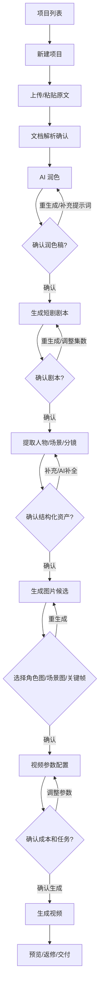
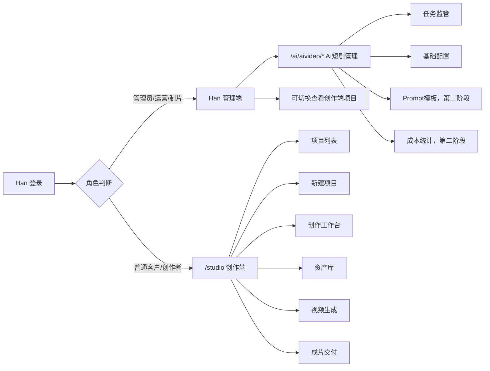

# AI 短剧页面设计规划

版本：v0.3  
状态：页面交互确认稿已按 BOSS 确认收口，下一步进入 Han MVP 0 开发方案确认  
更新时间：2026-05-21  
适用底座：`D:\code\Han`  
当前阶段：页面设计规划，不进入代码开发

## 1. 已确认设计决策

| 决策项 | 已确认方案 |
| --- | --- |
| 开发仓库 | 第一版代码落在 `D:\code\Han`，不单独新建开发仓库 |
| 规划资产目录 | `D:\code\AIVideo` 保留为需求、规则、提示词、参考材料和设计资产目录 |
| 后端模块 | 新增 `han-aivideo`，专门承载 AI 短剧业务 |
| 通用能力 | 通用 AI、文件、任务、前端组件分别反哺 `han-ai`、`han-file`、`han-job`、`han-ui` |
| 前端工程 | 第一版继续使用 `han-ui` |
| 创作端入口 | 新增 `/studio`，作为客户/创作者入口 |
| 管理端入口 | 继续使用 Han 管理端，在 AI 菜单下增加 AI 短剧管理 |
| 登录权限 | 共用 Han 当前登录、租户、角色和权限体系 |
| 联调环境 | 使用 Han 95 环境联调，本机主要写代码和基础调试 |
| 上传格式 | 第一版支持 TXT、Markdown、粘贴文本 |
| 默认画幅 | 第一版默认 `9:16` |
| 默认镜头时长 | 默认 5 秒，可选 5/10/15 秒 |
| 候选数量 | 角色图默认 3 张，场景图默认 3 张，视频默认 1 条 |
| 生成策略 | 默认开启低成本预览模式 |
| 第一阶段目标 | 跑通文档到润色、剧本、人物、场景、分镜的结构化资产闭环 |
| 配音/字幕/BGM | 第一版先不做，第二阶段再规划 |

## 2. 页面总入口

```text
Han 登录
  管理员/运营
    -> Han 管理端
    -> AI短剧管理

  普通客户/创作者
    -> /studio
    -> AI短剧创作端
```

入口原则：
- 普通客户默认进入 `/studio` 创作端，不暴露后台管理菜单。
- 管理员和运营可进入 Han 管理端，也可查看创作端项目。
- 第一版不拆独立 `han-aivideo-ui`。
- 后续如果创作端要独立部署或形成独立品牌，再拆前端工程。

## 3. 创作端路由设计

| 页面 | 路由 | 说明 | 第一版 |
| --- | --- | --- | --- |
| 创作端首页 | `/studio` | 默认跳转到项目列表 | 必做 |
| 项目列表 | `/studio/projects` | 查看、继续、新建项目 | 必做 |
| 新建项目 | `/studio/projects/create` | 填项目信息、上传原文 | 必做 |
| 创作工作台 | `/studio/projects/:id/workbench` | 润色、剧本、人物、场景、分镜确认主流程 | 必做 |
| 资产库 | `/studio/projects/:id/assets` | 查看角色图、场景图、关键帧、视频资产 | 必做 |
| 视频生成 | `/studio/projects/:id/video` | 选择镜头、参数、成本确认、生成任务 | 必做 |
| 成片交付 | `/studio/projects/:id/delivery` | 预览、返修、下载、导出文档包 | 简版 |
| 人物资产详情 | `/studio/projects/:id/characters` | 人物表、补全、角色图选择 | 第二阶段，可先合并到工作台 |
| 场景资产详情 | `/studio/projects/:id/scenes` | 场景表、补全、场景图选择 | 第二阶段，可先合并到工作台 |
| 分镜详情 | `/studio/projects/:id/storyboard` | 分镜列表、镜头编辑 | 第二阶段，可先合并到工作台 |

## 4. 管理端路由设计

| 页面 | 路由 | 说明 | 第一版 |
| --- | --- | --- | --- |
| AI 短剧项目监管 | `/ai/aivideo/projects` | 管理员查看所有短剧项目 | 可后置 |
| 任务监管 | `/ai/aivideo/tasks` | 查看文本、图片、视频生成任务 | 必做 |
| 任务详情 | `/ai/aivideo/tasks/:taskId` | 查看任务输入、输出、参数、错误、重试记录 | 必做 |
| 基础配置 | `/ai/aivideo/settings` | 默认模型、比例、候选数量、预览模式 | 必做 |
| Prompt 模板 | `/ai/aivideo/prompts` | 管理短剧默认提示词 | 第二阶段 |
| 成本统计 | `/ai/aivideo/costs` | 项目/用户/模型成本 | 第二阶段 |
| 风险审核 | `/ai/aivideo/review` | 版权、真人、品牌、敏感内容审核 | 第二阶段 |

第一版管理端目标：
- 能看生成任务。
- 能看任务详情，包括输入、输出、模型参数、失败原因和重试记录。
- 能配置基础参数。
- 能排查失败原因。
- 不追求复杂运营看板。

## 5. 创作端主流程



流程约束：
- 每一步都必须有确认状态。
- 未确认前不能进入下一步正式生成。
- 每次重生成都记录 Prompt、补充要求、模型、参数、成本和版本。
- 视频生成前必须展示预计成本并二次确认。

## 6. 创作工作台布局

第一版工作台采用三栏布局。

```text
┌──────────────────────────────────────────────┐
│ 顶部：项目名 / 当前阶段 / 成本 / 保存状态       │
├──────────────┬────────────────┬──────────────┤
│ 左侧流程步骤  │ 中间主编辑区     │ 右侧参数区     │
│              │                │              │
│ 1 文档解析    │ 原文/结果对比     │ 模型           │
│ 2 文本润色    │ 版本列表         │ Prompt版本     │
│ 3 短剧剧本    │ 编辑/确认内容     │ 补充提示词     │
│ 4 人物资产    │ 候选结果         │ 预计成本       │
│ 5 场景资产    │ 确认按钮         │ 生成历史       │
│ 6 分镜资产    │ 重生成按钮       │ 风险提示       │
│ 7 图片生成    │                │ 操作日志       │
│ 8 视频生成    │                │              │
└──────────────┴────────────────┴──────────────┘
```

布局原则：
- 左侧只负责流程导航和状态，不堆复杂内容。
- 中间负责当前阶段的主要确认、编辑、对比和候选选择。
- 右侧负责模型参数、Prompt、成本、日志和风险提示。
- 人物、场景、分镜第一版先合并在工作台中，后续数据量增大再拆独立页面。

## 7. 流程状态设计

| 状态 | 含义 |
| --- | --- |
| 未开始 | 当前步骤还不能操作 |
| 可开始 | 前置步骤已确认 |
| 生成中 | AI 正在生成 |
| 待确认 | 有结果，需要用户确认 |
| 已确认 | 当前步骤锁定，可进入下一步 |
| 需返修 | 用户要求重生成或修改 |
| 失败 | 生成失败，可查看原因和重试 |
| 已废弃 | 候选版本或候选素材不再使用 |

## 8. 页面字段设计

### 8.1 项目列表页

| 字段 | 说明 |
| --- | --- |
| 项目名称 | 用户自定义 |
| 题材类型 | 爽文、悬疑、情感、玄幻等 |
| 目标平台 | 抖音、快手、视频号等 |
| 当前阶段 | 润色、剧本、人物、视频等 |
| 项目状态 | 草稿、待确认、生成中、已完成 |
| 已用成本 | 文本/图片/视频累计 |
| 最近更新时间 | 用于排序 |
| 操作 | 继续、复制、归档；删除第一版先不做 |

### 8.2 新建项目页

| 字段 | 默认建议 |
| --- | --- |
| 项目名称 | 必填 |
| 题材类型 | 可选 |
| 目标平台 | 抖音 |
| 默认画幅 | `9:16` |
| 默认风格 | 写实/电影感 |
| 单集目标时长 | 可选 |
| 镜头默认时长 | 5 秒 |
| 候选图数量 | 3 |
| 低成本预览模式 | 默认开启 |
| 原文输入 | TXT/Markdown/粘贴文本 |

### 8.3 润色确认区

| 功能 | 说明 |
| --- | --- |
| 原文对比 | 左原文，右润色稿 |
| 版本切换 | 1 到 3 个候选 |
| 补充提示词 | 本次生成临时要求 |
| 重新生成 | 生成新版本 |
| 局部重写 | 第二阶段可做 |
| 确认润色稿 | 锁定进入剧本 |

### 8.4 剧本确认区

| 功能 | 说明 |
| --- | --- |
| 分集结构 | 展示每集标题、钩子、冲突 |
| 剧本文本 | 旁白、对白、动作、画面提示 |
| 调整集数 | 第一版做简单参数 |
| 重新生成 | 支持补充提示词 |
| 确认剧本 | 锁定进入资产提取 |

### 8.5 人物资产区

| 字段 | 说明 |
| --- | --- |
| 角色名 | 自动提取，可编辑 |
| 身份 | 主角、反派、配角等 |
| 性格标签 | 多标签 |
| 外貌 | 可 AI 补全 |
| 服装 | 可 AI 补全 |
| 禁止漂移特征 | 用于保持一致性 |
| 信息完整度 | 完整/待补充 |
| 角色图候选 | 默认 3 张 |
| 主图 | 选择后锁定 |

### 8.6 场景资产区

| 字段 | 说明 |
| --- | --- |
| 场景名称 | 自动提取 |
| 场景类型 | 室内、街道、宫殿、办公室等 |
| 时间 | 白天、夜晚、黄昏 |
| 天气 | 晴、雨、雪等 |
| 氛围 | 压抑、浪漫、紧张等 |
| 色调 | 冷色、暖色、霓虹等 |
| 禁止元素 | 默认禁止人物 |
| 场景图候选 | 默认 3 张 |
| 主图 | 选择后锁定 |

### 8.7 分镜资产区

| 字段 | 说明 |
| --- | --- |
| 集数 | 第几集 |
| 镜头号 | 顺序 |
| 时长 | 5/10/15 秒 |
| 景别 | 远景、中景、近景、特写 |
| 机位 | 平视、俯拍、仰拍等 |
| 运镜 | 推、拉、摇、移、跟 |
| 角色 | 绑定人物资产 |
| 场景 | 绑定场景资产 |
| 动作 | 镜头内动作 |
| 台词 | 角色说的话 |
| 画外音 | 旁白 |
| 视频提示词 | 用于视频生成 |
| 关键帧 | 可生成/选择 |

### 8.8 视频生成页

| 字段 | 默认建议 |
| --- | --- |
| 生成范围 | 单镜头/选中镜头 |
| 生成方式 | 图生视频优先 |
| 比例 | `9:16` |
| 清晰度 | 低成本预览先低清晰度，正式再提高 |
| 时长 | 跟随分镜 |
| 模型 | 火山控制台确认 |
| 参考图 | 角色图、场景图、关键帧 |
| 预计成本 | 生成前展示 |
| 确认生成 | 必须二次确认 |
| 任务进度 | 等待、生成中、成功、失败 |
| 返修 | 调整提示词/参数后重生成 |

## 9. 管理端页面设计

### 9.1 任务监管页

路由：`/ai/aivideo/tasks`

| 字段 | 说明 |
| --- | --- |
| 任务 ID | 文本/图片/视频任务 |
| 项目 | 所属短剧项目 |
| 用户/租户 | 谁发起的 |
| 任务类型 | 润色、剧本、角色图、视频等 |
| 模型 | 使用哪个模型 |
| 状态 | 排队、生成中、成功、失败 |
| 成本 | 实际或估算 |
| 错误信息 | 失败时展示 |
| 操作 | 查看详情、重试、取消 |

### 9.2 基础配置页

路由：`/ai/aivideo/settings`

| 配置 | 建议默认 |
| --- | --- |
| 默认画幅 | `9:16` |
| 角色图候选数量 | 3 |
| 场景图候选数量 | 3 |
| 视频候选数量 | 1 |
| 低成本预览模式 | 开启 |
| 默认镜头时长 | 5 秒 |
| 文本模型 | 待火山控制台确认 |
| 图片模型 | 待火山控制台确认 |
| 视频模型 | 待火山控制台确认 |
| 单项目预算上限 | 可选 |
| 内容审核 | 开启 |

## 10. 权限设计

第一版先简化权限。

| 角色 | 创作端 | 管理端 |
| --- | --- | --- |
| 普通用户 | 只能看自己的 `/studio` 项目 | 不可进入 |
| 管理员 | 可看所有项目 | 可进入全部管理端配置 |
| 运营/制片 | 第二阶段细分 | 第二阶段细分 |
| 编剧/视觉审核 | 第二阶段细分 | 不进入管理端 |

第一版后端权限要求：
- 所有创作端接口必须校验登录态。
- 普通用户只能访问自己的项目。
- 管理员可以查看全部项目和任务。
- API Key 不返回前端。

## 11. 第一版开发顺序建议

```text
第 1 步：路由和入口
  /studio
  /studio/projects
  /studio/projects/create
  /studio/projects/:id/workbench

第 2 步：项目和文档上传
  创建项目
  上传/粘贴文本
  保存原文
  展示解析结果

第 3 步：AI 文本链路
  润色
  剧本
  人物/场景/分镜提取
  每一步确认和重生成

第 4 步：图片链路
  角色图 3 选 1
  场景图 3 选 1
  资产库

第 5 步：视频链路
  视频参数确认
  调用火山任务
  查询进度
  预览结果

第 6 步：管理端补齐
  任务监管
  基础配置
  成本和日志
```

## 12. 页面交互确认稿 v0.2

本节用于让 BOSS 在进入 Han 代码开发前确认页面长相、操作节奏和边界。当前仍是设计确认，不代表已经进入实现。

### 12.1 页面分区总图



确认点：
- 普通客户只看 `/studio`，不看 Han 后台菜单。
- 管理员继续使用 Han 管理端，不单独做一套后台。
- 第一版创作端仍在 `han-ui` 内实现，后续成熟后再考虑拆 `han-aivideo-ui`。

### 12.2 创作端一级导航建议

```text
/studio
  顶部：Logo / 项目切换 / 当前账号 / 消息
  左侧：项目、资产、视频、交付
  主区：当前页面内容
```

第一版建议不要做营销首页，登录后直接进入项目列表。这样更适合工具型系统，也能少绕一步。

| 导航 | 第一版表现 | 说明 |
| --- | --- | --- |
| 项目 | 默认入口 | 项目列表、新建项目、继续项目 |
| 资产 | 项目内入口 | 角色图、场景图、关键帧、视频素材 |
| 视频 | 项目内入口 | 选择镜头、配置参数、发起视频任务 |
| 交付 | 简版入口 | 预览、下载、导出文档包 |

### 12.3 项目列表页草图

```text
┌──────────────────────────────────────────────┐
│ 项目列表                         [+ 新建项目] │
├──────────────────────────────────────────────┤
│ 筛选：状态 / 题材 / 平台 / 最近更新            │
├──────────────────────────────────────────────┤
│ 项目名      阶段      状态      成本    操作   │
│ 逆袭短剧01  剧本确认  待确认    12.3   继续   │
│ 悬疑短剧02  图片生成  生成中    35.8   查看   │
└──────────────────────────────────────────────┘
```

交互要求：
- 新建项目是主按钮。
- 项目状态必须能一眼看出停在哪一步。
- 删除第一版先不做，避免误删资产；可以做归档。
- 普通用户只能看到自己的项目，管理员在管理端看全量。

### 12.4 新建项目页草图

```text
┌──────────────────────────────────────────────┐
│ 新建 AI 短剧项目                              │
├──────────────────────┬───────────────────────┤
│ 基础信息              │ 默认生成参数           │
│ 项目名称              │ 画幅：9:16             │
│ 题材类型              │ 镜头时长：5 秒          │
│ 目标平台              │ 候选图：3 张            │
│ 风格                  │ 低成本预览：开启        │
├──────────────────────┴───────────────────────┤
│ 原文输入：粘贴文本 / 上传 TXT / Markdown       │
│ [保存草稿]                         [解析原文] │
└──────────────────────────────────────────────┘
```

确认点：
- 第一版只支持 TXT、Markdown、粘贴文本。
- DOCX/PDF 可以在第二阶段接入，避免第一版解析风险过大。
- `解析原文` 后必须进入“文档解析确认”，不能直接润色。

### 12.5 创作工作台草图

```text
┌────────────────────────────────────────────────────────┐
│ 项目名 / 当前阶段 / 预计成本 / 保存状态 / 返回项目列表   │
├──────────────┬────────────────────────┬────────────────┤
│ 流程步骤      │ 当前结果区              │ 参数与历史       │
│              │                        │                │
│ 1 文档解析    │ 原文结构 / 章节拆分      │ 模型             │
│ 2 文本润色    │ 原文 vs 润色稿          │ Prompt版本       │
│ 3 短剧剧本    │ 分集 / 对白 / 旁白      │ 补充提示词       │
│ 4 人物资产    │ 人物表 / 缺失项         │ 生成次数         │
│ 5 场景资产    │ 场景表 / 纯场景约束     │ 预计成本         │
│ 6 分镜资产    │ 镜头列表 / 视频提示词   │ 失败原因         │
│ 7 图片生成    │ 候选图 3 选 1           │ 操作日志         │
│ 8 视频生成    │ 任务参数 / 预览结果     │ 风险提示         │
└──────────────┴────────────────────────┴────────────────┘
```

工作台交互原则：
- 左侧流程只做导航和状态展示，不堆表单。
- 中间是当前阶段的主要编辑、对比、候选选择。
- 右侧固定放模型、Prompt、成本、历史、风险。
- 每个步骤都有 `重新生成`、`补充提示词`、`确认通过` 三类核心动作。
- 下一步按钮只有当前步骤 `已确认` 后才可用。

### 12.6 每一步确认弹窗

所有关键确认都使用统一确认弹窗，避免误操作。

| 阶段 | 确认标题 | 弹窗必须展示 |
| --- | --- | --- |
| 文档解析 | 确认章节/原文结构 | 章节数、文本长度、是否截断 |
| 润色稿 | 确认润色稿 | 版本号、使用 Prompt、是否覆盖上一步结果 |
| 剧本 | 确认短剧剧本 | 集数、镜头估算、主要人物 |
| 人物/场景/分镜 | 确认结构化资产 | 缺失字段数量、待补充项 |
| 图片候选 | 确认主图 | 候选图、主图、是否锁定 |
| 视频任务 | 确认生成视频 | 模型、比例、清晰度、时长、预计成本 |

统一按钮：
- `取消`：关闭弹窗，不改变状态。
- `返回修改`：回到当前步骤编辑。
- `确认并锁定`：写入确认状态，允许进入下一步。

### 12.7 图片候选选择草图

```text
┌──────────────────────────────────────────────┐
│ 角色：林晚                                  │
├──────────────┬──────────────┬──────────────┤
│ 候选图 A      │ 候选图 B      │ 候选图 C      │
│ [选择主图]    │ [选择主图]    │ [选择主图]    │
└──────────────┴──────────────┴──────────────┘
补充提示词：__________________________________
[重新生成 3 张]                  [确认所选主图]
```

候选图规则：
- 默认生成 3 张。
- 用户必须点选 1 张主图。
- 选中后可锁定，后续视频引用锁定主图。
- 重新生成不删除旧候选，旧候选标记为 `已废弃` 或 `未选中`。

### 12.8 视频生成页草图

```text
┌──────────────────────────────────────────────┐
│ 视频生成                                    │
├──────────────────────┬───────────────────────┤
│ 镜头列表              │ 生成参数               │
│ EP01-S001             │ 比例：9:16             │
│ EP01-S002             │ 清晰度：预览/高清       │
│ EP01-S003             │ 时长：跟随分镜          │
│                      │ 参考图：角色/场景/关键帧 │
├──────────────────────┴───────────────────────┤
│ 预计成本：待模型价格确认                       │
│ [保存参数]                         [确认生成] │
└──────────────────────────────────────────────┘
```

视频生成门禁：
- 只能选择已确认分镜。
- 视频任务发起前必须展示参数和预计成本。
- API Key 不进前端。
- 第一版优先单镜头生成，不做整剧批量生成。

### 12.9 管理端页面草图

任务监管页：

```text
┌──────────────────────────────────────────────┐
│ AI短剧任务监管                               │
├──────────────────────────────────────────────┤
│ 筛选：任务类型 / 状态 / 用户 / 时间 / 模型     │
├──────────────────────────────────────────────┤
│ 任务ID  项目  用户  类型  状态  成本  操作    │
│ T001    P01   U01   视频  失败  8.2   详情    │
└──────────────────────────────────────────────┘
```

任务详情页：

```text
┌──────────────────────────────────────────────┐
│ 任务详情：T001                               │
├──────────────────────┬───────────────────────┤
│ 基础信息              │ 运行信息               │
│ 项目 / 用户 / 租户     │ 模型 / Provider任务ID   │
│ 任务类型 / 状态        │ 开始时间 / 结束时间     │
│ 预计成本 / 实际成本    │ 错误码 / 错误信息       │
├──────────────────────┴───────────────────────┤
│ 输入 Prompt / 参数 JSON / 输出摘要 / 关联资产  │
│ [返回列表]                         [重试任务] │
└──────────────────────────────────────────────┘
```

基础配置页：

```text
┌──────────────────────────────────────────────┐
│ AI短剧基础配置                               │
├──────────────────────┬───────────────────────┤
│ 默认参数              │ 模型配置               │
│ 默认画幅              │ 文本模型 ID             │
│ 候选图数量            │ 图片模型 ID             │
│ 默认镜头时长          │ 视频模型 ID             │
│ 低成本预览            │ 内容审核开关            │
└──────────────────────┴───────────────────────┘
```

管理端确认点：
- 第一版只做任务监管、任务详情和基础配置。
- Prompt 模板、成本统计、风险审核第二阶段再做。
- 完整 API Key 不能在页面明文展示。

## 13. 设计确认后的文件影响范围

如果 BOSS 确认本页面设计，后续进入开发时预计影响：

| 模块 | 预计文件范围 | 改动性质 | 是否可反哺 Han |
| --- | --- | --- | --- |
| `han-ui` | 路由、菜单、页面组件、API 调用封装 | 创作端和管理端页面 | 部分可反哺：候选选择器、任务进度、成本提示 |
| `han-aivideo` | 项目、资产、确认状态、任务编排接口 | 短剧专用业务 | 否，主要短剧专用 |
| `han-ai` | 火山模型客户端、Prompt 模板引用 | 通用 AI 能力 | 是 |
| `han-file` | 原文、图片、视频文件引用 | 文件媒体能力 | 是或复用 |
| `han-job` | 视频任务轮询、失败重试 | 异步任务能力 | 待确认 |

不动范围：
- 不改 Han 登录主流程。
- 不改 Han 主技术栈。
- 不拆独立前端工程。
- 不在前端保存火山 API Key。
- 不做整剧批量生产、配音、字幕、BGM。

## 14. 验收方式

页面设计验收：
- BOSS 能确认普通客户从登录到 `/studio` 的主流程。
- BOSS 能确认管理员在 Han 管理端看到的页面范围。
- BOSS 能确认每一步都有人工确认、重生成和补充提示词入口。
- BOSS 能确认视频生成前有参数和成本二次确认。

开发后验收：
- 普通用户只能看到自己的项目。
- 管理员能进入 `/ai/aivideo/tasks` 和 `/ai/aivideo/settings`。
- `/studio/projects/create` 能保存项目和原文。
- 工作台能显示流程状态，不允许跳过未确认步骤。
- 图片候选能 3 选 1，并记录选中状态。
- 视频任务发起前能展示模型、比例、清晰度、时长和预计成本。
- 前端构建通过，无明显控制台错误。

## 15. 风险与回滚

| 风险 | 影响 | 处理方式 |
| --- | --- | --- |
| `/studio` 和后台布局差异大 | `han-ui` 内可能需要独立布局 | 第一版做轻量独立 layout，不拆工程 |
| 图片/视频模型参数受火山控制台限制 | 页面选项可能需要动态收口 | 模型能力进入配置，不写死 |
| 成本预估不准 | 生成前提示可能误导 | 未拿到价格前标记为估算或待确认 |
| 工作台状态机复杂 | 容易出现跳步或锁定错误 | 后端保存确认状态，前端只做展示和操作 |
| 通用组件反哺影响 Han | 可能影响现有页面 | 先短剧内使用，稳定后再抽公共组件 |

回滚思路：
- 页面开发未合并前，撤销对应分支。
- 已合并但未发布时，回滚前端路由和菜单入口。
- 已发布后，先关闭菜单/路由入口，再回滚代码。
- 通用组件反哺必须独立提交或可独立回滚，避免和短剧业务绑定。

## 16. 已确认结论与下一步

BOSS 已确认按以下 6 点执行：

1. 普通客户默认进入 `/studio` 项目列表，不做营销首页。
2. 创作工作台采用“左流程、中结果、右参数”的三栏结构。
3. 人物、场景、分镜第一版先合并在工作台，不拆独立详情页。
4. 第一版管理端做 `任务监管`、`任务详情` 和 `基础配置`。
5. 视频生成第一版只做单镜头/选中镜头，不做整剧批量生成。
6. 下一步进入 Han MVP 0 开发方案确认，但不直接写代码。

下一步输出：
- `D:\code\AIVideo\docs\开发计划\Han MVP 0 开发方案确认稿.md`

该确认稿通过后，才允许进入 `D:\code\Han` 的 MVP 0 代码实现。
