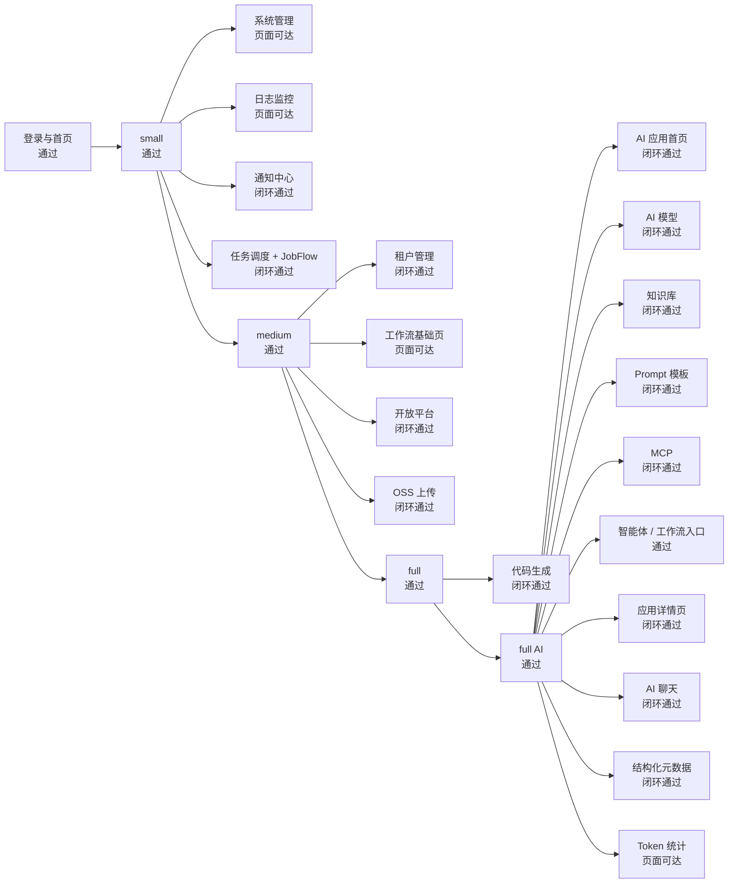
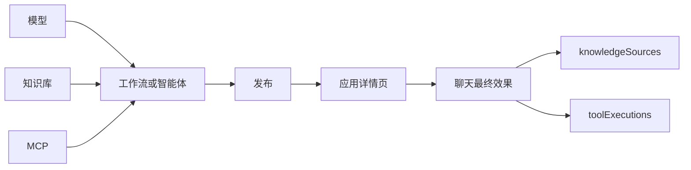
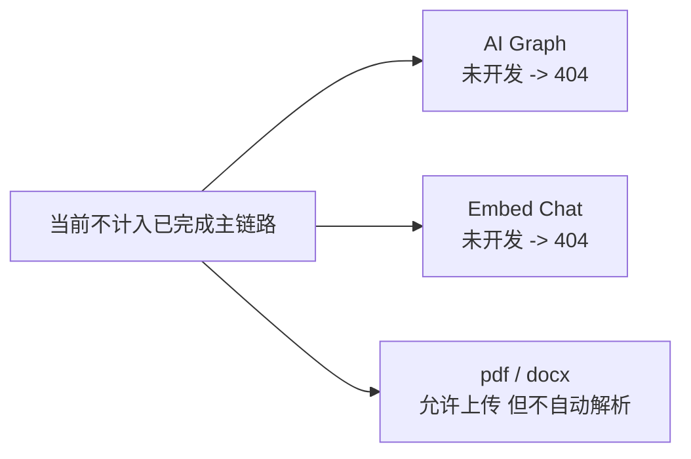

# Han 从零到最终效果老板看板版

## 1. 当前结论

截至 `2026-04-08`，当前已经真实测绿的主链路是：

- `small` 主链路：通过
- `medium` 主链路：通过
- `full` 主链路：通过
- `full AI` 主链路：通过

当前页面级健康回归结果：

- `small 16 passed`
- `medium 25 passed`
- `full 35 passed`

当前 AI 专项回归结果：

- `full AI 25 passed`

## 2. 一眼总览

## 3. 分层看板

| 层级 | 功能组 | 当前状态 | 说明 |
| --- | --- | --- | --- |
| 登录 | 登录页、验证码、后台首页、用户菜单 | 通过 | 三档均已验证 |
| `small` | 系统管理页组 | 页面可达 | `user/role/menu/dept/post/dict/config` |
| `small` | 日志监控页组 | 页面可达 | `operlog/loginlog/online/server/cache-monitor` |
| `small` | 通知中心 | 闭环通过 | 列表、单条已读、全部已读、未读数 |
| `small` | 任务调度 | 闭环通过 | 列表、日志、暂停、恢复、立即执行、删除 |
| `small` | JobFlow 监控 | 闭环通过 | `health/metrics/config` |
| `medium` | 租户管理 | 闭环通过 | 租户、套餐、配额 |
| `medium` | 工作流基础页组 | 页面可达 | `definition/instance/todo/done` |
| `medium` | 开放平台 | 闭环通过 | 创建、编辑、启停、重置密钥、删除 |
| `medium` | OSS 配置与上传 | 闭环通过 | 配置、启用、真实上传、URL 可访问 |
| `full` | 代码生成 | 闭环通过 | 导入表、预览、ZIP 下载、清理 |
| `full AI` | AI 应用首页 | 闭环通过 | 统计卡、列表、创建入口 |
| `full AI` | AI 模型 | 闭环通过 | 凭证、测试连通、编辑保留原值 |
| `full AI` | 知识库 | 闭环通过 | 创建、上传、索引、命中测试、多文档增删 |
| `full AI` | Prompt 模板 | 闭环通过 | 创建、预览、编辑、内置模板保护 |
| `full AI` | MCP | 闭环通过 | 创建、刷新工具、元数据展示 |
| `full AI` | 智能体 / 工作流入口 | 通过 | 入口跳转与页面可达已验证 |
| `full AI` | 应用详情页 | 闭环通过 | 概览、设置、调试、发布、访问入口、日志 |
| `full AI` | AI 聊天 | 闭环通过 | 发送、停止、重试、编辑后重试、刷新恢复 |
| `full AI` | 结构化元数据 | 闭环通过 | `knowledgeSources` + `toolExecutions` |
| `full AI` | Token 统计 | 页面可达 | 页面级健康回归已覆盖 |

## 4. 演示顺序

如果只演示一轮，建议按这个顺序：

1. 登录与首页
2. `small`：通知中心 -> 任务调度
3. `medium`：租户管理 -> 开放平台 -> OSS 上传
4. `full`：代码生成
5. `full AI`：模型 -> 知识库 -> MCP -> 工作流 -> 发布 -> 应用详情 -> 聊天 -> 结构化元数据

## 5. AI 最终效果最短路径

一句话：

- `模型 -> 知识库 / MCP -> 工作流或智能体 -> 发布 -> 聊天`

## 6. 当前边界

## 7. 结论

当前可以对外明确表达为：

- 三档主链路已经收口
- `full AI` 主链路已经收口
- 未开发和部分开发边界仍保持诚实标注，没有混报完成
