# Han 从零到最终效果全功能流程图

## 1. 说明

这份文档是 [从零到最终效果.md](/D:/code/Han/docs/从零到最终效果.md) 和 [从零到最终效果-流程图.md](/D:/code/Han/docs/从零到最终效果-流程图.md) 的细化版。

目标不是只画总链路，而是把当前已经测绿的功能模块按层拆开，细到每个功能组。

阅读口径：

- `已测绿-页面可达`：页面已真实打开，且页面级健康回归确认没有 `4xx / 5xx / 业务 code != 200`
- `已测绿-闭环通过`：不只是页面能开，还完成了真实业务操作
- 只写当前已经通过的能力
- 未开发或部分开发能力单独列边界，不混进主链路

## 2. 全功能总览

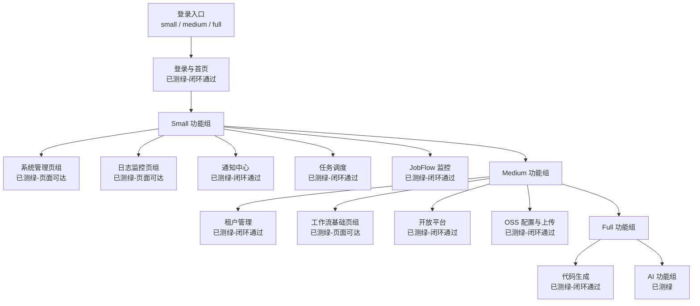

## 3. 登录与首页

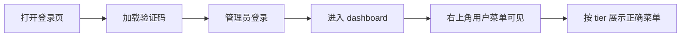

当前状态：

- `small / medium / full` 已测绿-闭环通过

对应通过证据：

- [auth-login.spec.ts](/D:/code/Han/han-ui/tests/e2e/specs/auth-login.spec.ts)
- [runtime-sidebar.spec.ts](/D:/code/Han/han-ui/tests/e2e/specs/runtime-sidebar.spec.ts)

## 4. Small 全功能流程

### 4.1 Small 总图

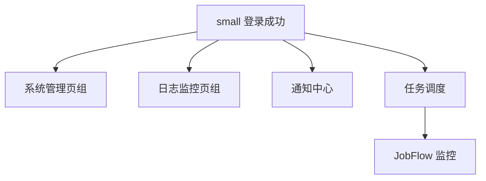

### 4.2 系统管理页组

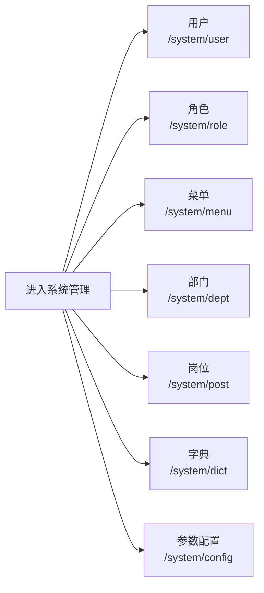

当前状态：

- 已测绿-页面可达

对应通过证据：

- [tier-page-health.spec.ts](/D:/code/Han/han-ui/tests/e2e/specs/tier-page-health.spec.ts)

### 4.3 日志监控页组

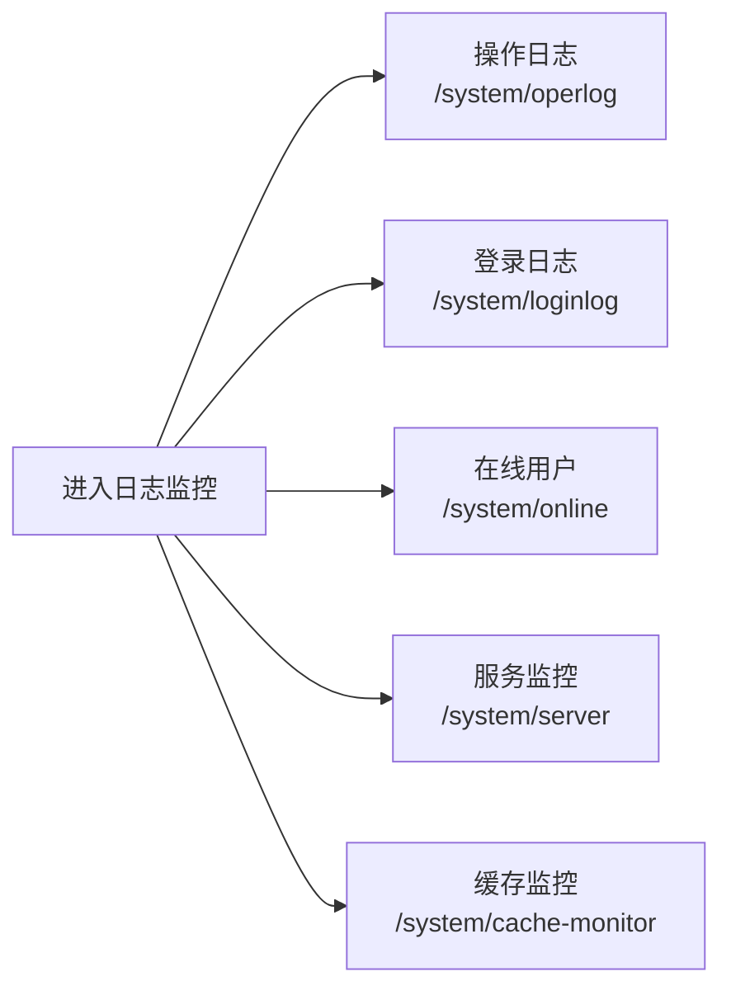

当前状态：

- 已测绿-页面可达

对应通过证据：

- [tier-page-health.spec.ts](/D:/code/Han/han-ui/tests/e2e/specs/tier-page-health.spec.ts)

### 4.4 通知中心

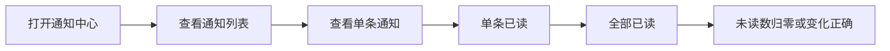

当前状态：

- 已测绿-闭环通过

对应通过证据：

- [notice-center.spec.ts](/D:/code/Han/han-ui/tests/e2e/specs/notice-center.spec.ts)

### 4.5 任务调度

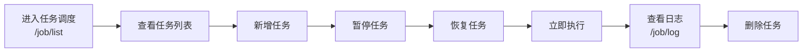

当前状态：

- 已测绿-闭环通过

对应通过证据：

- [job-core.spec.ts](/D:/code/Han/han-ui/tests/e2e/specs/job-core.spec.ts)
- [job-ui.spec.ts](/D:/code/Han/han-ui/tests/e2e/specs/job-ui.spec.ts)

### 4.6 JobFlow 监控

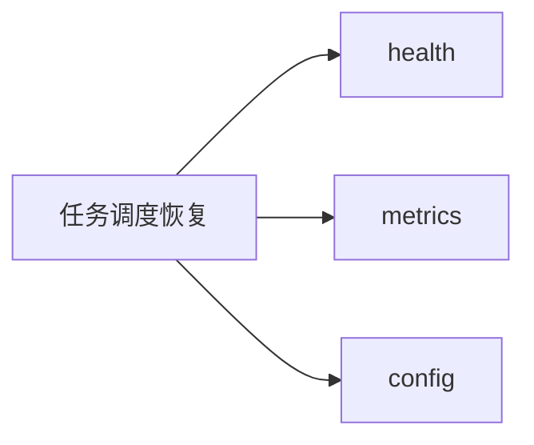

当前状态：

- 已测绿-闭环通过

对应通过证据：

- [job-core.spec.ts](/D:/code/Han/han-ui/tests/e2e/specs/job-core.spec.ts)

## 5. Medium 全功能流程

### 5.1 Medium 总图

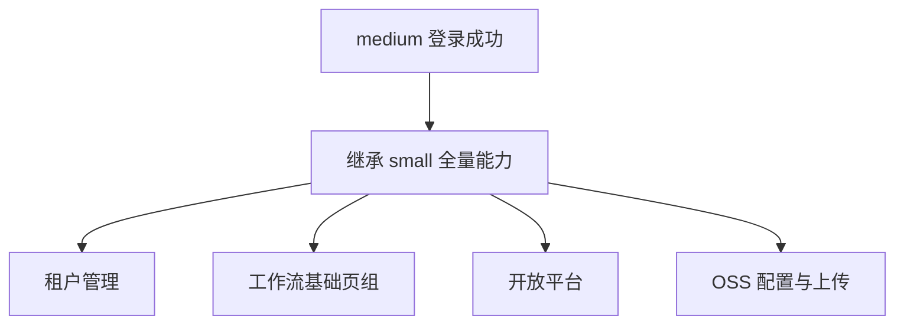

### 5.2 租户管理

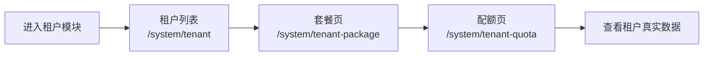

当前状态：

- 已测绿-闭环通过

对应通过证据：

- [tenant-pages.spec.ts](/D:/code/Han/han-ui/tests/e2e/specs/tenant-pages.spec.ts)

### 5.3 工作流基础页组

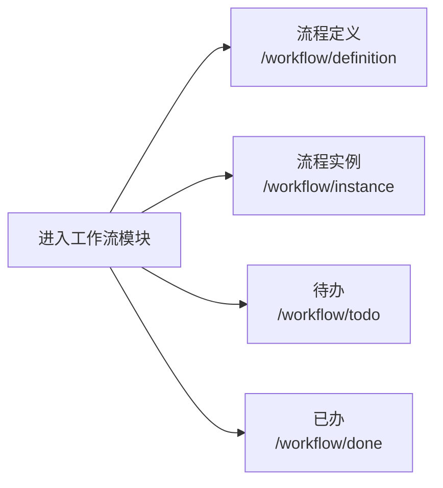

当前状态：

- 已测绿-页面可达

对应通过证据：

- [tier-page-health.spec.ts](/D:/code/Han/han-ui/tests/e2e/specs/tier-page-health.spec.ts)

### 5.4 开放平台

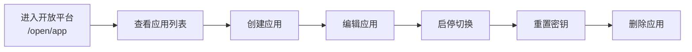

当前状态：

- 已测绿-闭环通过

对应通过证据：

- [open-app.spec.ts](/D:/code/Han/han-ui/tests/e2e/specs/open-app.spec.ts)

### 5.5 OSS 配置与上传

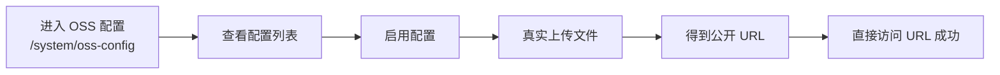

当前状态：

- 已测绿-闭环通过

对应通过证据：

- [oss-config.spec.ts](/D:/code/Han/han-ui/tests/e2e/specs/oss-config.spec.ts)

## 6. Full 全功能流程

### 6.1 Full 总图

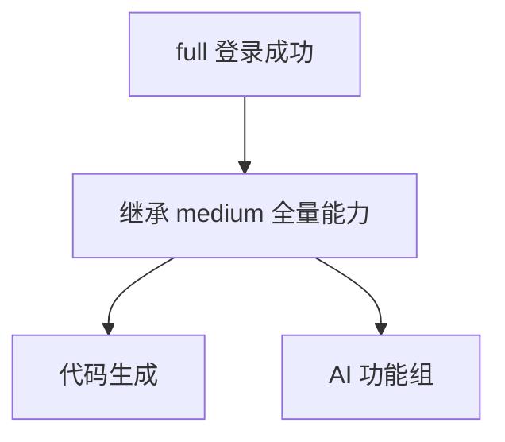

### 6.2 代码生成

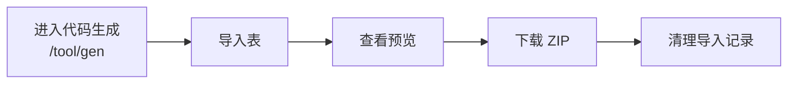

当前状态：

- 已测绿-闭环通过

对应通过证据：

- [gen-core.spec.ts](/D:/code/Han/han-ui/tests/e2e/specs/gen-core.spec.ts)

## 7. Full AI 全功能流程

### 7.1 AI 总图

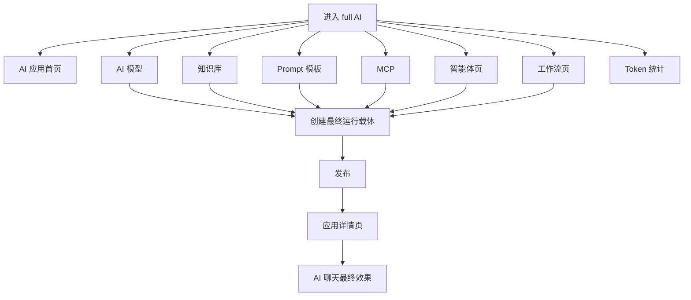

### 7.2 AI 应用首页

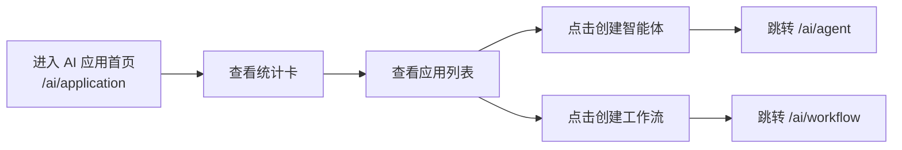

当前状态：

- 已测绿-闭环通过

对应通过证据：

- [ai-application.spec.ts](/D:/code/Han/han-ui/tests/e2e/specs/ai-application.spec.ts)

### 7.3 AI 模型

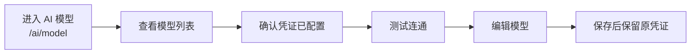

当前状态：

- 已测绿-闭环通过

对应通过证据：

- [ai-model.spec.ts](/D:/code/Han/han-ui/tests/e2e/specs/ai-model.spec.ts)

### 7.4 知识库

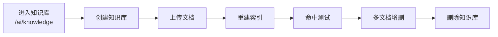

当前状态：

- 已测绿-闭环通过

对应通过证据：

- [ai-admin-deep.spec.ts](/D:/code/Han/han-ui/tests/e2e/specs/ai-admin-deep.spec.ts)
- [ai-admin-lifecycle.spec.ts](/D:/code/Han/han-ui/tests/e2e/specs/ai-admin-lifecycle.spec.ts)
- [ai-admin-extended.spec.ts](/D:/code/Han/han-ui/tests/e2e/specs/ai-admin-extended.spec.ts)

### 7.5 Prompt 模板

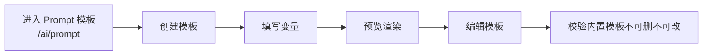

当前状态：

- 已测绿-闭环通过

对应通过证据：

- [ai-admin-deep.spec.ts](/D:/code/Han/han-ui/tests/e2e/specs/ai-admin-deep.spec.ts)
- [ai-admin-lifecycle.spec.ts](/D:/code/Han/han-ui/tests/e2e/specs/ai-admin-lifecycle.spec.ts)
- [ai-admin-extended.spec.ts](/D:/code/Han/han-ui/tests/e2e/specs/ai-admin-extended.spec.ts)

### 7.6 MCP

```mermaid
flowchart LR
    A["进入 MCP<br/>/ai/mcp"] --> B["创建服务"]
    B --> C["刷新工具"]
    C --> D["查看工具列表"]
    D --> E["查看元数据类型"]
    E --> F["sse / stdio / streamable_http"]
```

当前状态：

- 已测绿-闭环通过

对应通过证据：

- [ai-admin-deep.spec.ts](/D:/code/Han/han-ui/tests/e2e/specs/ai-admin-deep.spec.ts)
- [ai-admin-lifecycle.spec.ts](/D:/code/Han/han-ui/tests/e2e/specs/ai-admin-lifecycle.spec.ts)
- [ai-admin-extended.spec.ts](/D:/code/Han/han-ui/tests/e2e/specs/ai-admin-extended.spec.ts)

### 7.7 智能体与工作流入口

```mermaid
flowchart LR
    A["AI 应用首页"] --> B["创建智能体入口"]
    A --> C["创建工作流入口"]
    B --> D["/ai/agent 页面可达"]
    C --> E["/ai/workflow 页面可达"]
    D --> F["绑定模型"]
    E --> G["绑定模型"]
    F --> H["按需绑定知识库和 MCP"]
    G --> H
```

当前状态：

- 已测绿
- 入口跳转已闭环通过
- 页面可达已通过

对应通过证据：

- [ai-application.spec.ts](/D:/code/Han/han-ui/tests/e2e/specs/ai-application.spec.ts)
- [tier-page-health.spec.ts](/D:/code/Han/han-ui/tests/e2e/specs/tier-page-health.spec.ts)

### 7.8 应用详情页

```mermaid
flowchart LR
    A["进入应用详情页"] --> B["概览"]
    B --> C["设置"]
    C --> D["调试"]
    D --> E["发布面板"]
    E --> F["访问入口"]
    F --> G["日志面板"]
    G --> H["从日志跳转聊天页"]
```

当前状态：

- 已测绿-闭环通过

对应通过证据：

- [ai-application-detail.spec.ts](/D:/code/Han/han-ui/tests/e2e/specs/ai-application-detail.spec.ts)

### 7.9 AI 聊天

```mermaid
flowchart LR
    A["进入 AI 聊天<br/>/ai/chat"] --> B["发送消息"]
    B --> C["停止生成"]
    C --> D["重新生成"]
    D --> E["编辑后重新生成"]
    E --> F["刷新页面恢复会话"]
```

当前状态：

- 已测绿-闭环通过

对应通过证据：

- [ai-full.spec.ts](/D:/code/Han/han-ui/tests/e2e/specs/ai-full.spec.ts)
- [ai-chat-edge.spec.ts](/D:/code/Han/han-ui/tests/e2e/specs/ai-chat-edge.spec.ts)

### 7.10 结构化元数据最终效果

```mermaid
flowchart LR
    A["模型"] --> D["工作流"]
    B["知识库"] --> D
    C["MCP"] --> D
    D --> E["发布"]
    E --> F["聊天问答"]
    F --> G["knowledgeSources"]
    F --> H["toolExecutions"]
```

当前状态：

- 已测绿-闭环通过

对应通过证据：

- [ai-chat-structured-meta.spec.ts](/D:/code/Han/han-ui/tests/e2e/specs/ai-chat-structured-meta.spec.ts)

### 7.11 Token 统计

```mermaid
flowchart LR
    A["进入 Token 统计<br/>/ai/token"] --> B["模型统计可见"]
    A --> C["用户统计可见"]
    A --> D["按日统计可见"]
```

当前状态：

- 已测绿-页面可达

对应通过证据：

- [ai-token.spec.ts](/D:/code/Han/han-ui/tests/e2e/specs/ai-token.spec.ts)
- [tier-page-health.spec.ts](/D:/code/Han/han-ui/tests/e2e/specs/tier-page-health.spec.ts)

## 8. 当前边界

```mermaid
flowchart LR
    A["当前边界"] --> B["AI Graph<br/>未开发 -> 404"]
    A --> C["Embed Chat<br/>未开发 -> 404"]
    A --> D["pdf / docx<br/>可上传 但不自动解析"]
```

## 9. 当前测试基线

- 页面级健康回归：
  - `small 16 passed`
  - `medium 25 passed`
  - `full 35 passed`
- Full AI 专项：
  - `25 passed`

## 10. 一句话结论

如果你要按“每个功能”顺着测，当前最稳的顺序就是：

`登录与首页 -> small 系统管理 / 日志监控 / 通知中心 / 任务调度 -> medium 租户 / 工作流 / 开放平台 / OSS -> full 代码生成 -> full AI 应用首页 / 模型 / 知识库 / Prompt / MCP / 智能体与工作流 / 发布 / 应用详情 / 聊天 / Token`
