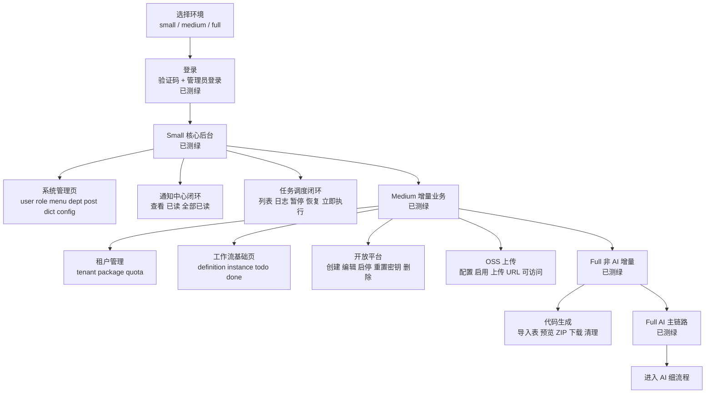
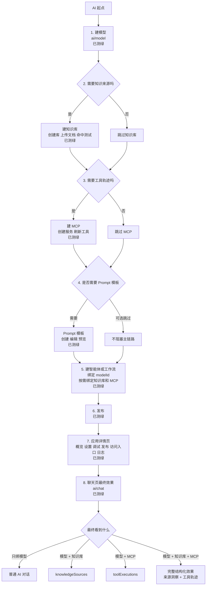
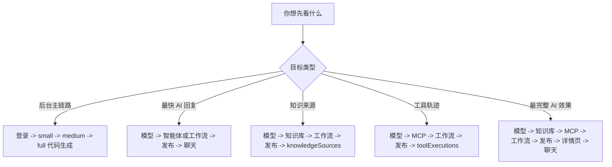
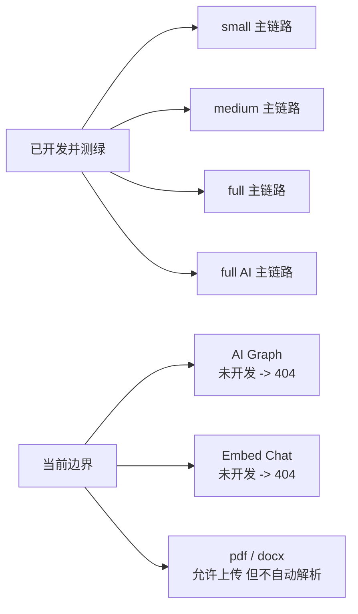

# Han 从零到最终效果流程图

## 1. 使用说明

这份图是根据 [从零到最终效果.md](/D:/code/Han/docs/从零到最终效果.md) 进一步压成可视化流程图的版本。

阅读口径：

- 只画当前已经开发并且已经测绿的主链路
- `medium` 继承 `small`
- `full` 继承 `medium`
- AI 单独拆出细流程，避免总图过于拥挤

## 2. 全项目总流程

## 3. AI 从零到最终效果

## 4. 按目标选最短路径

## 5. 当前边界

## 6. 当前测试口径

- 页面级健康回归：
  - `small 16 passed`
  - `medium 25 passed`
  - `full 35 passed`
- Full AI 专项：
  - `25 passed`
- 这份图中的“已测绿”指的是当前真环境已验证通过，不是只靠静态路由判断
